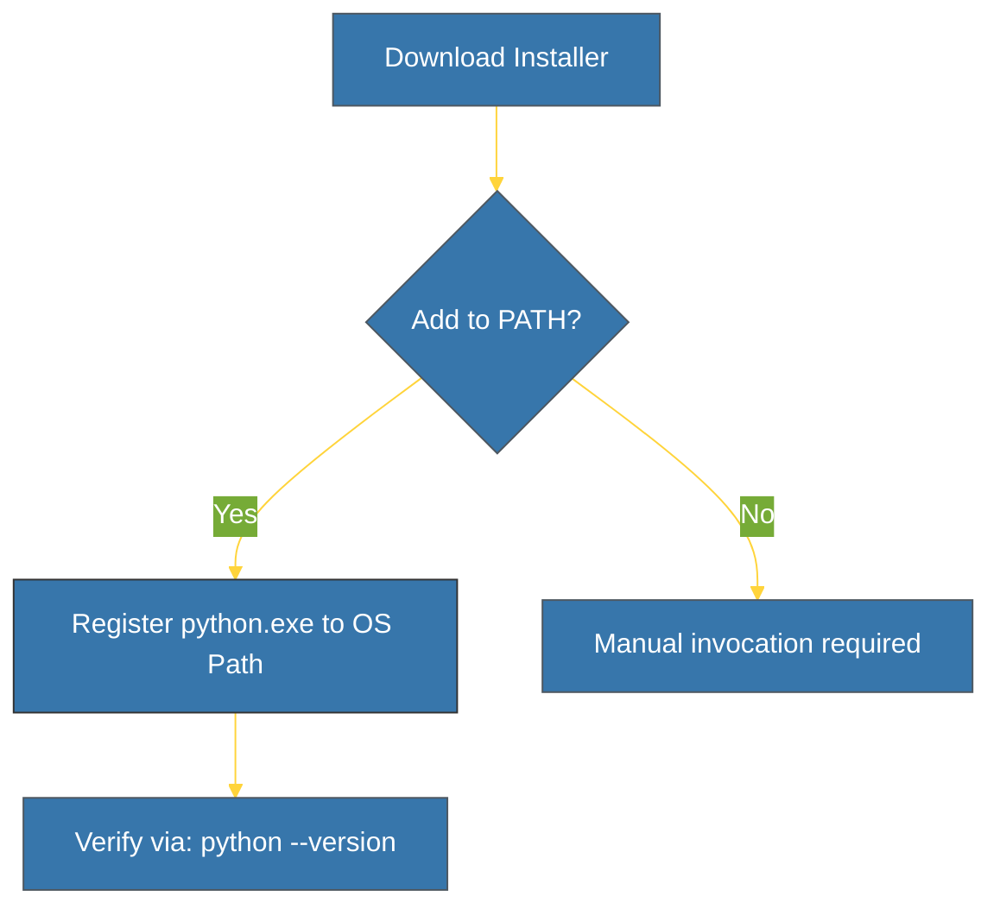

# CH-01: Installation (The CPython Engine) [x] Complete

> **"Installing Python correctly is half the battle won."**

Bab ini memandu Anda melalui proses menginstal **CPython** — implementasi referensi standar dari bahasa Python. Kita akan memastikan interpreter terinstal dengan benar dan dapat diakses melalui antarmuka baris perintah (CLI).

---

## 🌐 Source Hub (Authority)
- **Primary Source**: [Python Downloads](https://www.python.org/downloads/)
- **Strategic Blueprint**: [RAK-02 Foundation](file:///i:/Workspace/Workspace-Syahputrawork/learning-matrix-blueprint/01-Language-Hubs/Python-Knowledge-Base.md)

---

## 🧠 The Essence (Narrative)
Instalasi Python bukan sekadar menyalin file eksekusi ke komputer. Inti dari proses ini adalah mendaftarkan lokasi biner Python ke dalam **Environment Variables (PATH)** sistem operasi Anda. Tanpa ini, sistem tidak akan mengenali perintah `python`. Kita juga harus memilih antara menggunakan "Official Installer" (GUI) atau "Version Manager" seperti `pyenv` untuk fleksibilitas tingkat lanjut.

---

## 🎨 Visual Logic (Installation Flow)



---

## 🛠️ Step-by-Step Guide

### 1. Windows Installation
- Unduh installer dari `python.org`.
- **PENTING**: Centang kotak **"Add Python to PATH"** sebelum menekan *Install Now*.
- Rekomendasi: Gunakan *Custom Installation* untuk menyertakan `pip` dan dokumentasi.

### 2. Linux (Ubuntu/Debian)
Sebagian besar Linux sudah menyertakan Python. Untuk versi terbaru:
```bash
sudo apt update
sudo apt install python3
```

### 3. macOS
Disarankan menggunakan **Homebrew**:
```bash
brew install python
```

---

## ⚠️ Pitfalls
- **Conflicting Versions**: Memiliki banyak versi Python tanpa manajemen yang jelas dapat menyebabkan `pip` menginstal paket ke folder yang salah.
- **Missing PATH**: Gejala: Error `python is not recognized as an internal or external command`. Solusi: Re-install dan centang "Add to PATH" atau tambahkan manual di System Variables.

---
*Back to [BK-01 Python Interpreters](../README.md)*
