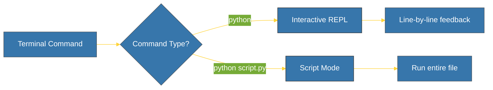

# CH-02: CLI Interacting (The Gateway) [x] Complete

> **"Code is meant to be run, and CLI is its first home."**

Bab ini mendemonstrasikan cara berinteraksi dengan interpreter Python melalui antarmuka baris perintah (CLI). Kita akan belajar menggunakan REPL untuk eksperimen cepat dan cara mengeksekusi file skrip `.py`.

---

## 🌐 Source Hub (Authority)
- **Primary Source**: [Python Tutorial - Interpreter Usage](https://docs.python.org/3/tutorial/interpreter.html)
- **Strategic Blueprint**: [RAK-02 Foundation](file:///i:/Workspace/Workspace-Syahputrawork/learning-matrix-blueprint/01-Language-Hubs/Python-Knowledge-Base.md)

---

## 🧠 The Essence (Narrative)
Baris perintah adalah jembatan tercepat antara ide dan eksekusi. Python menawarkan dua mode utama: **Interactive Mode (REPL)** — tempat Anda mengetik satu baris kode dan langsung melihat hasilnya — serta **Script Mode** — tempat Python membaca dan menjalankan file lengkap dari disk. Memahami perbedaan antara perintah `python` (sering dikaitkan ke Python 2 pada sistem legacy) dan `python3` adalah krusial bagi kejelasan alur kerja.

---

## 🎨 Visual Logic (Execution Modes)



---

## 🛠️ Step-by-Step Guide

### 1. Memulai REPL (Read-Eval-Print-Loop)
Buka terminal dan ketik:
```bash
python
# atau jika di Linux/macOS
python3
```
Keluar dengan mengetik `exit()` atau pintasan `Ctrl+Z` (Windows) / `Ctrl+D` (Unix).

### 2. Mengeksekusi Skrip
Buat file `hello.py` dan jalankan lewat terminal:
```bash
python hello.py
```

### 3. Mengecek Informasi Interpreter
Di dalam Python, Anda dapat memverifikasi lokasi eksekusi:
```python
import sys
print(sys.executable) # Lokasi biner Python
print(sys.version)    # Versi lengkap
```

---

## ⚠️ Pitfalls
- **Command Alias Confusion**: Pada beberapa sistem, `python` masih mengarah ke Python 2 (EoL). Selalu gunakan `python3` atau `python --version` untuk verifikasi.
- **File Not Found Error**: Pastikan terminal berada di direktori yang sama dengan file `.py` Anda (Gunakan perintah `cd` untuk navigasi).

---
*Back to [BK-01 Python Interpreters](../README.md)*
