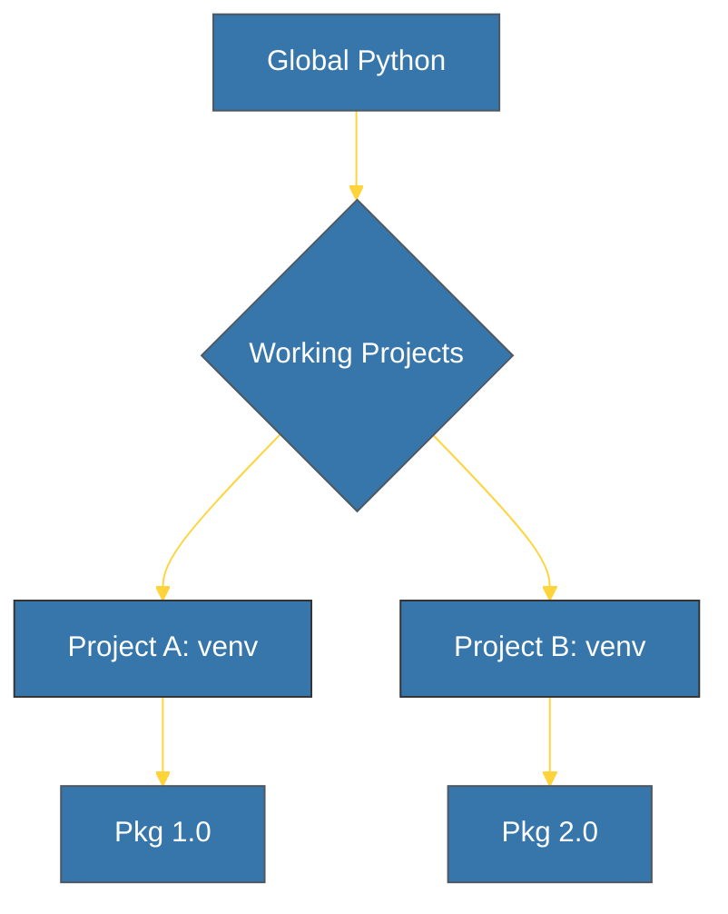

# CH-01: Isolation Principle (The Isolated Nest) [x] Complete

> **"A project's dependencies should never leak into another."**

Bab ini membedah konsep **Isolasi Lingkungan** dalam Python. Kita akan memahami mengapa menggunakan satu instalasi Python global untuk semua proyek adalah resep bencana teknis, dan bagaimana *Virtual Environments* memberikan solusi elegan untuk masalah ini.

---

## 🌐 Source Hub (Authority)
- **Primary Source**: [Python Tutorial - Virtual Environments](https://docs.python.org/3/tutorial/venv.html)
- **Strategic Blueprint**: [RAK-02 Foundation](file:///i:/Workspace/Workspace-Syahputrawork/learning-matrix-blueprint/01-Language-Hubs/Python-Knowledge-Base.md)

---

## 🧠 The Essence (Narrative)
Secara default, Python menginstal paket pihak ketiga ke dalam folder `site-packages` global. Masalah muncul ketika Proyek A membutuhkan `Django 3.2` dan Proyek B membutuhkan `Django 4.0`. Menginstal salah satunya akan menimpa yang lain di level global. 

**Virtual Environment (venv)** menciptakan folder terisolasi yang berisi salinan interpreter Python sendiri dan folder `site-packages` sendiri. Dengan cara ini, setiap proyek memiliki "gelembung" eksekusi yang independen dan tidak saling menginterferensi.

---

## 🎨 Visual Logic (Isolation Concept)

---

## 🛠️ Key Concepts
1. **Dependency Conflict**: Situasi di mana dua modul membutuhkan versi berbeda dari library yang sama.
2. **Site-Packages**: Folder tempat Python menyimpan library eksternal.
3. **bin/Scripts**: Folder di dalam venv yang menyimpan salinan file eksekusi Python.

---

## ⚠️ Pitfalls
- **Global Pollution**: Menginstal paket menggunakan `sudo pip install` atau tanpa venv akan mengotori sistem operasi dan dapat merusak tool sistem yang bergantung pada versi Python tertentu.
- **Forgot to Activate**: Menjalankan kode tanpa mengaktifkan venv akan menyebabkan error `ModuleNotFoundError` karena Python akan mencari di folder global, bukan di folder proyek.

---
*Back to [BK-02 Virtual Environments](../README.md)*
