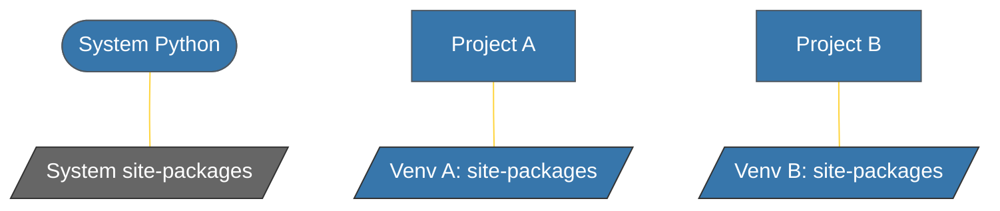

# BK-02: Virtual Environments (Isolasi Proyek) [x] Complete

> **"Global is for systems; Local is for developers."**

Buku ini membedah konsep **Isolasi Dependensi** melalui Virtual Environments (`venv`). Kita akan mempelajari mengapa instalasi paket secara global adalah "dosa" dalam pengembangan profesional dan bagaimana Python mengelola struktur `site-packages` yang terisolasi untuk setiap proyek.

---

## 🌐 Source Hub (Authority)
- **Primary Source**: [Python Docs - Creating Virtual Environments](https://docs.python.org/3/library/venv.html)
- **Strategic Blueprint**: [RAK-02 Foundation](file:///i:/Workspace/Workspace-Syahputrawork/learning-matrix-blueprint/01-Language-Hubs/Python-Knowledge-Base.md)

---

## 🧠 The Essence (Narrative)
Virtual Environment adalah direktori mandiri yang berisi salinan interpreter Python dan struktur folder untuk pustaka pihak ketiga. Dengan menggunakan `venv`, Anda dapat menginstal `Django 3.0` untuk Proyek A dan `Django 4.0` untuk Proyek B di mesin yang sama tanpa ada konflik. Ini menjamin **Reproducibility** — kode yang berjalan di mesin Anda akan berjalan sama di mesin rekan tim atau server produksi.

---

## 🎨 Visual Logic (Isolation Principle)

---

## 📑 Daftar Bab (The Syllabus)

| Bab | Fokus | Spesifikasi |
| :--- | :--- | :--- |
| **[CH-01_IsolationPrinciple](./CH-01_IsolationPrinciple/)** | Concept | Why we isolate and how venv works. |
| **[CH-02_VenvHandling](./CH-02_VenvHandling/)** | Execution | Creation, Activation, and Deactivation. |

---

## ⚠️ Pitfalls
- **Activation Blindness**: Jangan lupa untuk meng-**aktifkan** venv sebelum menginstal paket atau menjalankan kode. Jika tidak, perintah `pip install` mungkin akan mencoba menginstal paket ke folder sistem (yang seringkali membutuhkan hak akses admin dan merusak dependensi sistem OS).
- **Git Ignore**: Jangan pernah memasukkan folder virtual environment (`venv/`, `.venv/`) ke dalam Git. Venv bersifat lokal dan sekali pakai; simpanlah daftarnya di `requirements.txt`.

---
*Back to [SR-01 Environment Setup](../README.md)*
