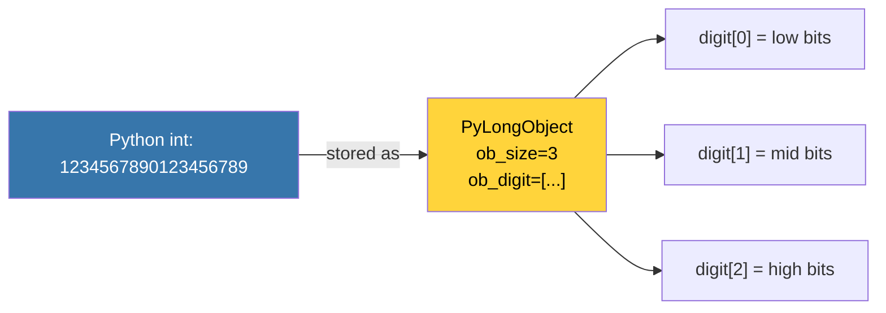

# Numbers: int, float, complex — Di Balik Angka Python

**"In Python, integers are not just numbers — they are unlimited precision objects."**
*Memahami mengapa `2 ** 100` bekerja sempurna di Python, tapi overflow di C.*

> [!IMPORTANT]
> **Source Link**: [Python Docs — Numeric Types](https://docs.python.org/3/library/stdtypes.html#numeric-types-int-float-complex) | [CPython Objects — longobject.c](https://github.com/python/cpython/blob/main/Objects/longobject.c)

---

## 1. Definisi & Konsep (The Logic)

Python memiliki tiga tipe numerik bawaan:
- **`int`**: *Arbitrary-precision integer* — tidak ada overflow. CPython mengimplementasikan ini dengan struktur data **digit array** dalam C.
- **`float`**: Implementasi langsung dari **IEEE 754 double-precision** (64-bit). Bukan angka nyata — ini estimasi biner.
- **`complex`**: Dua float digabungkan (`real + imag`).

### Terminologi Utama (Senior Terms)

| Istilah | Makna Teknis |
|---|---|
| **Arbitrary Precision** | `int` Python tidak punya batas ukuran — dibatasi hanya oleh RAM. |
| **IEEE 754** | Standar representasi float di CPU. `0.1 + 0.2 != 0.3` adalah konsekuensi standar ini. |
| **`ob_digit[]`** | Array internal CPython untuk menyimpan digit integer besar dalam basis 2^30. |
| **Small Integer Cache** | CPython melakukan caching pre-alokasi untuk integer -5 hingga 256 — `a is b` menjadi `True`. |

---

## 2. Rasionalitas (Why & How?)

### Mengapa `int` Python Tidak Overflow?

Di C, `int` adalah 32 atau 64 bit — ia meluap (overflow) saat melampaui batasnya. Python `int` adalah **heap-allocated object** yang bisa tumbuh secara dinamis. CPython menyimpannya sebagai array digit dalam basis **2^30**, sehingga angka sebesar apapun bisa direpresentasikan selama RAM cukup.



### Mengapa `0.1 + 0.2 != 0.3`?

Karena `float` adalah biner, bukan desimal. `0.1` direpresentasikan sebagai `0.1000000000000000055511...` dalam IEEE 754. Ini bukan bug Python — ini perilaku fundamental IEEE 754 yang dipakai oleh semua bahasa pemrograman modern.

### Small Integer Cache

```python
a = 256; b = 256; print(a is b)   # True  — cached!
a = 257; b = 257; print(a is b)   # False — new object each time
```

CPython pre-allocates integer objects dari **-5 hingga 256** untuk efisiensi. `is` mengecek identitas objek (pointer), bukan nilai.

---

## 3. Mekanisme Detil (Under the Hood)

### Konversi Tipe Otomatis (Numeric Tower)

Python mengikuti konsep **Numeric Tower** (PEP 3141):
```
int → float → complex
```
Saat dua tipe berbeda beroperasi, Python mempromosikan ke tipe yang lebih tinggi:
```python
1 + 2.0   # int + float → float (2.0 promoted)
2 + 3j    # int + complex → complex
```

### `sys.getsizeof(n)` — Membuktikan Pertumbuhan int

```python
import sys
for n in [0, 10**10, 10**100, 10**1000]:
    print(f"{n:.2e}: {sys.getsizeof(n)} bytes")
# 0: 24 bytes, 10^10: 32 bytes, 10^100: 72 bytes, 10^1000: 468 bytes
```

---

## 4. Lab Praktis (The Examples)

Lihat pembuktian kode fungsional di [`examples/`](./examples/).

| File | Topik |
|---|---|
| `01_int_internals.py` | Small integer cache, `is` vs `==`, `sys.getsizeof()` |
| `02_float_precision.py` | IEEE 754, `0.1+0.2`, `decimal` module, `math.isclose()` |
| `03_numeric_operations.py` | Bitwise ops, numeric tower promotion, `divmod()` |

---
*Back to [BK-01_Primitives](../README.md)*
