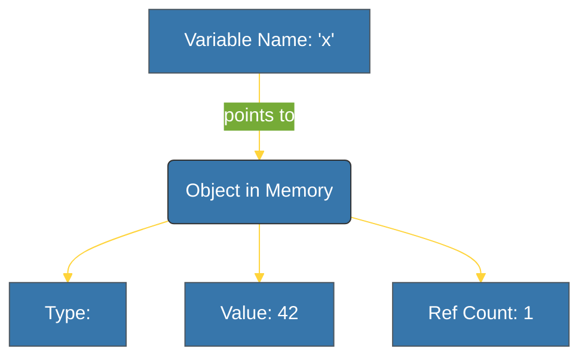

# BK-01: Primitives (The Immutable Atoms) [x] Complete

> **"Everything in Python is an object, but not everything is mutable."**

Buku ini membedah tipe data primitif yang menjadi blok bangun dasar dalam Python. Fokus utama kita adalah memahami sifat **Immutability** dan bagaimana CPython mengelola objek sederhana ini di dalam memori.

---

## 🌐 Source Hub (Authority)
- **Primary Source**: [Python Standard Library - Built-in Types](https://docs.python.org/3/library/stdtypes.html)
- **Strategic Blueprint**: [RAK-02 Foundation](file:///i:/Workspace/Workspace-Syahputrawork/learning-matrix-blueprint/01-Language-Hubs/Python-Knowledge-Base.md)

---

## 🧠 The Essence (Narrative)
Dalam Python, tipe data "sederhana" seperti `int`, `float`, dan `str` sebenarnya adalah objek kompleks di level C. Mengetahui bahwa mereka **Immutable** (tidak dapat diubah setelah dibuat) adalah kunci untuk memahami performa dan keamanan data. Ketika kita melakukan `x = x + 1`, kita tidak mengubah nilai objek lama, melainkan membuat objek baru di alamat memori yang berbeda.

---

## 🎨 Visual Logic (Mermaid)

---

## 📑 Daftar Bab (The Syllabus)

| Bab | Fokus | Spesifikasi |
| :--- | :--- | :--- |
| **[CH-01_Numbers](./CH-01_Numbers/)** | Integers & Floats | CPython `PyObject` structure for numbers. |
| **[CH-02_Strings](./CH-02_Strings/)** | Textual Data | Interning mechanism & indexing. |
| **[CH-03_Booleans](./CH-03_Booleans/)** | Logic Elements | Singleton instances of True/False. |

---

## ⚠️ Pitfalls
- **Memory Overhead**: Karena setiap primitif adalah objek, penggunaan miliaran integer kecil dapat memakan memori lebih besar dibanding array di bahasa C.
- **Identity vs Equality**: Pentingnya membedakan `is` (identitas memori) dan `==` (kesamaan nilai).

---
*Back to [SR-02 Data Types](../README.md)*
