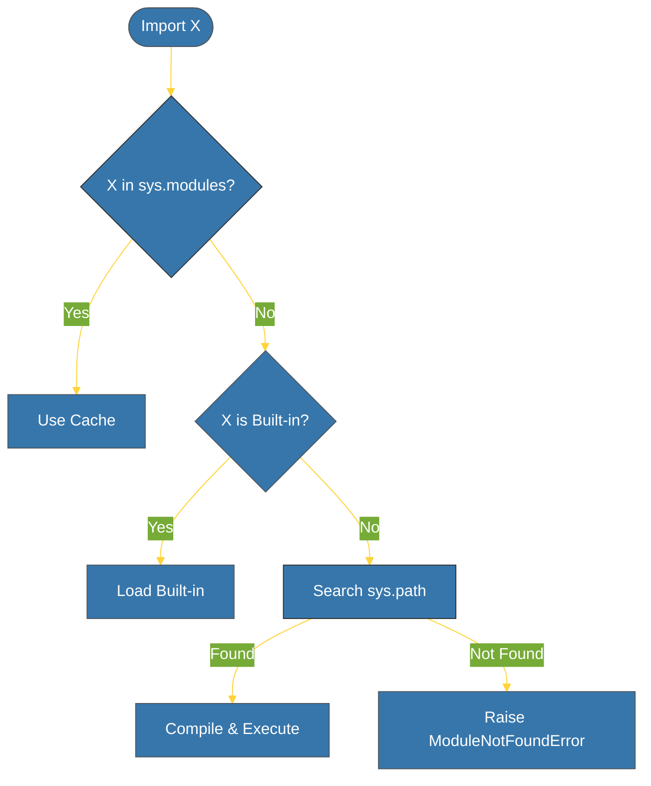

# CH-02: Import System (The Search Mechanics) [x] Complete

> **"Importing is not just reading a file; it is a complex search and execution process."**

Bab ini membedah mekanisme internal sistem **Import** dalam Python. Kita akan mempelajari bagaimana Python menemukan modul di disk, peran variabel `sys.path`, serta bagaimana Python mengelola cache modul yang sudah dimuat.

---

## 🌐 Source Hub (Authority)
- **Primary Source**: [Python Docs - The Import System](https://docs.python.org/3/reference/import.html)
- **Strategic Blueprint**: [RAK-02 Foundation](file:///i:/Workspace/Workspace-Syahputrawork/learning-matrix-blueprint/01-Language-Hubs/Python-Knowledge-Base.md)

---

## 🧠 The Essence (Narrative)
Saat Anda memanggil `import my_mod`, Python melakukan pencarian berurutan:
1. Mengecek **`sys.modules`**: Jika modul sudah pernah di-import (cached), Python langsung menggunakannya.
2. Mengecek **Built-in Modules**: Mencari modul bawaan (seperti `sys`, `math`).
3. Mengecek **`sys.path`**: Mencari file di daftar lokasi direktori (termasuk folder saat ini, `PYTHONPATH`, dan folder instalasi standard library).
Jika ditemukan, Python mengonversi kode tersebut menjadi *Bytecode* (disimpan di `__pycache__`) dan mengeksekusinya untuk mengisi namespace modul tersebut.

---

## 🎨 Visual Logic (Import Search Chain)



---

## 🛠️ Inspecting `sys.path`

Anda dapat melihat di mana Python mencari modul dengan:
```python
import sys
for path in sys.path:
    print(path)
```
Lokasi pertama dalam `sys.path` biasanya adalah direktori tempat skrip utama berada.

---

## ⚠️ Pitfalls
- **Circular Imports**: Terjadi jika Modul A meng-import Modul B, dan Modul B juga meng-import Modul A. Ini sering menyebabkan `ImportError` atau perilaku atribut yang `None`. 
  - *Solusi*: Refaktor kode (pindahkan fungsi ke modul ketiga) atau gunakan *Lazy Import* (import di dalam fungsi).
- **Shadowing Standard Library**: Jangan membuat file bernama `random.py` atau `json.py` di folder proyek Anda. Karena folder saat ini diprioritaskan dalam `sys.path`, Python akan meng-import file Anda dan gagal menemukan fungsi bawaan yang dibutuhkan.

---
*Back to [BK-01 Foundations & Modules](../README.md)*
