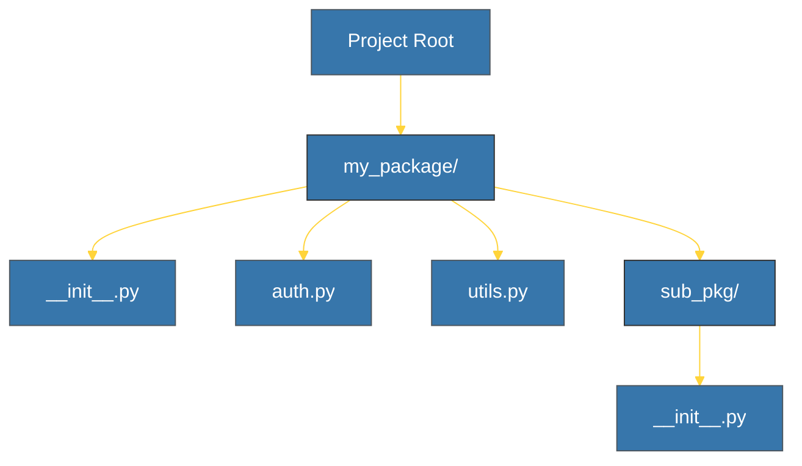

# CH-01: Package Structure (Composite Units) [x] Complete

> **"A package is a way of structuring Python’s module namespace by using 'dotted module names'."**

Bab ini membedah bagaimana mengelompokkan beberapa modul ke dalam sebuah **Paket** (Folder). Kita akan mempelajari peran penting berkas `__init__.py` dan bagaimana mengendalikan apa yang diekspos oleh sebuah paket ke dunia luar.

---

## 🌐 Source Hub (Authority)
- **Primary Source**: [Python Docs - Packages](https://docs.python.org/3/tutorial/modules.html#packages)
- **PEP 420**: [Implicit Namespace Packages](https://peps.python.org/pep-0420/)
- **Strategic Blueprint**: [RAK-02 Foundation](file:///i:/Workspace/Workspace-Syahputrawork/learning-matrix-blueprint/01-Language-Hubs/Python-Knowledge-Base.md)

---

## 🧠 The Essence (Narrative)
Paket adalah direktori yang berisi modul-modul dan (biasanya) satu berkas spesial bernama **`__init__.py`**. Direktori ini memungkinkan Anda meng-import modul menggunakan notasi titik (misal: `import library.auth.login`). Berkas `__init__.py` dijalankan saat paket atau salah satu modul di dalamnya di-import pertama kali. Anda bisa menggunakan berkas ini untuk mengatur inisialisasi paket atau menentukan API publik paket via variabel **`__all__`**.

---

## 🎨 Visual Logic (Directory Hierarchy)



---

## 🛠️ The `__all__` Variable
Untuk mengendalikan apa yang di-import saat seseorang memanggil `from package import *`, definisikan list `__all__` di `__init__.py`:
```python
# __init__.py
__all__ = ["auth_function", "UserClass"]
```

---

## ⚠️ Pitfalls
- **Fat `__init__.py`**: Jangan letakkan terlalu banyak logika bisnis di dalam `__init__.py`. Gunakan hanya untuk inisialisasi ringan atau melakukan "re-export" (mengambil fungsi dari modul dalam ke level paket) agar API lebih bersih.
- **Python 3.3+ Namespace Packages**: Sejak Python 3.3, folder tanpa `__init__.py` tetap dianggap sebagai paket (*Namespace Package*). Namun, untuk paket reguler dalam proyek yang terstruktur, tetap disarankan menyertakan `__init__.py` agar eksplisit.

---
*Back to [BK-02 Packages & Organization](../README.md)*
