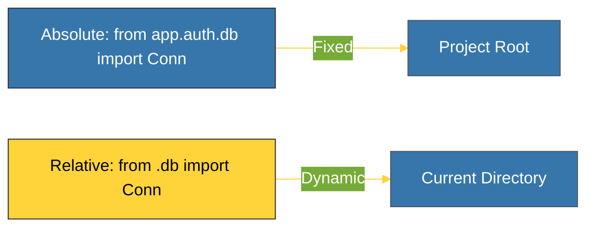

# CH-02: Absolute & Relative Imports (The Navigation) [x] Complete

> **"How you reference your modules determines how portable and predictable your project structure becomes."**

Bab ini membedah teknik navigasi antar paket menggunakan dua jenis pencarian: **Absolute Imports** (Rujukan Lengkap) dan **Relative Imports** (Rujukan Berbasis Posisi). Kita akan mempelajari mana yang lebih aman untuk proyek skala besar.

---

## 🌐 Source Hub (Authority)
- **Primary Source**: [Python Docs - Intra-package Imports](https://docs.python.org/3/tutorial/modules.html#intra-package-imports)
- **PEP 8**: [Imports Layout & Style](https://peps.python.org/pep-0008/#imports)
- **Strategic Blueprint**: [RAK-02 Foundation](file:///i:/Workspace/Workspace-Syahputrawork/learning-matrix-blueprint/01-Language-Hubs/Python-Knowledge-Base.md)

---

## 🧠 The Essence (Narrative)
1. **Absolute Imports**: Menggunakan rujukan lengkap dari *Root* proyek (misal: `from my_app.auth.login import User`). Ini adalah cara paling aman dan direkomendasikan karena rujukan tetap valid di mana pun modul tersebut dipanggil dalam proyek.
2. **Relative Imports**: Menggunakan titik (`.`) untuk merujuk ke modul dalam paket yang sama (misal: `from . import utils` atau `from ..sub import mod`). Ini berguna untuk memindahkan paket secara utuh tanpa mengubah struktur import internalnya, namun hanya bisa bekerja jika modul tersebut dijalankan sebagai bagian dari sebuah paket.

---

## 🎨 Visual Logic (Import Path Comparison)



---

## 🛠️ Implementation Examples

### 1. Absolute Import (Recommended)
```python
from my_package.auth.core import handle_auth
from my_package.utils.logger import log_debug
```

### 2. Relative Import
```python
# Berada di dalam my_package/auth/login.py
from .core import handle_auth # Local sibling
from ..utils.logger import log_debug # Parent's sibling
```

---

## ⚠️ Pitfalls
- **"Attempted relative import with no known parent package"**: Error ini sering terjadi saat Anda mencoba menjalankan modul yang mengandung *Relative Import* secara langsung sebagai skrip (`python my_mod.py`). Python membutuhkan konteks *parent package* untuk menghitung rujukan titik. 
  - *Solusi*: Jalankan paket Anda dari root menggunakan tanda `-m` (misal: `python -m my_package.auth.login`).
- **Circular Confusion**: Relative imports seringkali membuat *Circular Import* lebih sulit dideteksi secara visual. Pastikan struktur dependensi Anda selalu bersifat hirarki (atas ke bawah).

---
*Back to [BK-02 Packages & Organization](../README.md)*
