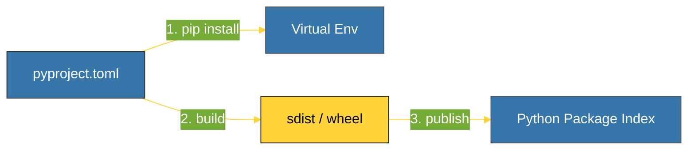

# CH-01: Metadata & Layout (Modern Distribution) [x] Complete

> **"A project's metadata is the identity card of your code in the Python ecosystem."**

Bab ini membedah standar **Distribusi Modern** dalam Python. Kita akan mempelajari bagaimana menggunakan berkas **`pyproject.toml`** sebagai pusat konfigurasi proyek dan memahami struktur direktori **`src/` layout** yang direkomendasikan untuk paket profesional.

---

## 🌐 Source Hub (Authority)
- **Primary Source**: [Declaring Project Metadata (PyPA)](https://packaging.python.org/en/latest/specifications/declaring-project-metadata/)
- **PEP 518**: [pyproject.toml Specification](https://peps.python.org/pep-0518/)
- **Strategic Blueprint**: [RAK-02 Foundation](file:///i:/Workspace/Workspace-Syahputrawork/learning-matrix-blueprint/01-Language-Hubs/Python-Knowledge-Base.md)

---

## 🧠 The Essence (Narrative)
Dulu, Python menggunakan `setup.py` yang bersifat imperatif (berisi kode Python). Kini, standar industri beralih ke **`pyproject.toml`** yang bersifat deklaratif. Berkas ini berfungsi sebagai *Single Source of Truth* untuk mendefinisikan dependensi, versi Python yang dibutuhkan, hingga pengaturan alat bantu (seperti Black, Isort, atau Pytest). Selain itu, penggunaan struktur **`src/`** (di mana kode inti diletakkan dalam folder `src/`) membantu mencegah import yang tidak sengaja dari file di root proyek saat pengujian.

---

## 🎨 Visual Logic (Build Pipeline)



---

## 🛠️ Implementation: Modern Project Layout

```text
my_project/
├── pyproject.toml
├── README.md
├── tests/
└── src/
    └── my_package/
        ├── __init__.py
        └── core.py
```

---

## ⚠️ Pitfalls
- **Missing Build-System**: Lupa mendefinisikan `[build-system]` dalam `pyproject.toml` akan membuat paket Anda tidak bisa di-build oleh alat standar seperti `pip` atau `build`.
- **Mixing Layouts**: Jangan mencampur struktur lama (paket di root) dengan struktur baru (`src/` layout) dalam satu proyek tanpa alasan yang sangat kuat, karena ini akan membingungkan sistem build.

---
*Back to [BK-03 Modern Packaging](../README.md)*
