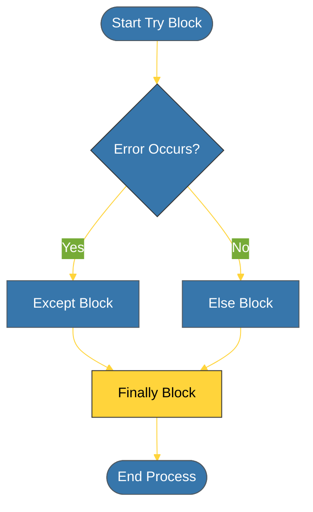

# CH-01: Try-Except-Else-Finally (The Execution Pipeline) [x] Complete

> **"A try block without an except is like a leap of faith without a safety net."**

Bab ini membedah sintaks dasar dan alur eksekusi pipa penanganan kesalahan dalam Python. Kita akan mempelajari bagaimana menangkap error secara spesifik dan menggunakan blok `else` serta `finally` untuk mengelola alur program yang tangguh.

---

## 🌐 Source Hub (Authority)
- **Primary Source**: [Python Docs - Errors and Exceptions](https://docs.python.org/3/tutorial/errors.html)
- **Strategic Blueprint**: [RAK-02 Foundation](file:///i:/Workspace/Workspace-Syahputrawork/learning-matrix-blueprint/01-Language-Hubs/Python-Knowledge-Base.md)

---

## 🧠 The Essence (Narrative)
Penanganan eksepsi memungkinkan program untuk menangani situasi tak terduga (seperti file tidak ditemukan atau pembagian dengan nol) tanpa harus berhenti (*crash*). Python menyediakan struktur empat blok:
1. **`try`**: Tempat kode yang berisiko menimbulkan error diletakkan.
2. **`except`**: Tempat logika penanganan error jika eksepsi terjadi.
3. **`else`**: Bagian yang dijalankan HANYA jika TIDAK ADA eksepsi yang terjadi di blok `try`.
4. **`finally`**: Bagian yang SELALU dijalankan, baik terjadi error maupun tidak (biasanya untuk pembersihan sumber daya).

---

## 🎨 Visual Logic (Execution Flow)



---

## 🛠️ Implementation Template

```python
try:
    result = 10 / int(input("Enter divisor: "))
except ZeroDivisionError:
    print("❌ Error: Cannot divide by zero!")
except ValueError:
    print("❌ Error: Please enter a valid number!")
else:
    print(f"✅ Success! Result is {result}")
finally:
    print("🧹 Cleanup: Execution attempt finished.")
```

---

## ⚠️ Pitfalls
- **Bare `except:`**: Jangan pernah menggunakan `except:` kosong tanpa menentukan tipe eksepsi. Ini akan menangkap seluruh error (termasuk `KeyboardInterrupt`), yang membuat bug sulit dilacak. Selalu tangkap eksepsi sespesifik mungkin.
- **Logic in `try`**: Hindari meletakkan terlalu banyak logika di dalam blok `try`. Hanya letakkan baris kode yang benar-benar berisiko menimbulkan eksepsi agar blok `except` tidak menangkap error yang tidak relevan.

---
*Back to [BK-01 Foundations_Exceptions](../README.md)*
