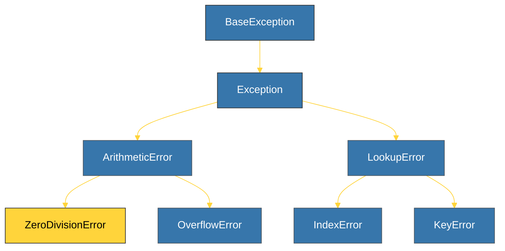

# CH-02: Exception Hierarchy (Ancestry of Errors) [x] Complete

> **"All exceptions in Python are objects, and like all objects, they belong to a hierarchy."**

Bab ini membedah silsilah **Hierarki Eksepsi** bawaan Python. Memahami hirarki ini sangat krusial agar Anda tahu urutan yang benar dalam menulis blok `except`, dari yang paling spesifik hingga yang paling umum.

---

## 🌐 Source Hub (Authority)
- **Primary Source**: [Python Docs - Built-in Exceptions](https://docs.python.org/3/library/exceptions.html#exception-hierarchy)
- **Strategic Blueprint**: [RAK-02 Foundation](file:///i:/Workspace/Workspace-Syahputrawork/learning-matrix-blueprint/01-Language-Hubs/Python-Knowledge-Base.md)

---

## 🧠 The Essence (Narrative)
Seluruh eksepsi dalam Python diturunkan dari kelas **`BaseException`**. Namun, untuk penanganan error aplikasi biasa, kita hampir selalu menggunakan kelas **`Exception`** sebagai akar utama. Di bawahnya terdapat kategori besar seperti `ArithmeticError`, `LookupError`, dan `RuntimeError`. Prinsip utamanya adalah: **Tangkap yang paling spesifik dulu, baru yang umum.** Jika Anda menangkap `Exception` di awal, maka eksepsi spesifik seperti `ZeroDivisionError` di bawahnya tidak akan pernah dijalankan.

---

## 🎨 Visual Logic (Partial Tree)



---

## 🛠️ Catch Order Principle

```python
try:
    # Logic code
    pass
except ZeroDivisionError:
    # 1. Specific catch (Correct order)
    print("Zero Division!")
except ArithmeticError:
    # 2. General parent catch (Backup)
    print("Arithmetic Error!")
except Exception:
    # 3. Root catch (Final safety net)
    print("Something else went wrong!")
```

---

## ⚠️ Pitfalls
- **The "Unreachable" Exception**: Jika Anda menukar urutan kode di atas (misal menaruh `ArithmeticError` sebelum `ZeroDivisionError`), maka `ZeroDivisionError` tidak akan pernah dijalankan karena ia sudah ditangkap oleh induknya terlebih dahulu.
- **`BaseException` usage**: Jangan pernah menangkap `BaseException` secara langsung di kode aplikasi. Ini akan menangkap eksepsi sistem seperti `SystemExit` dan `KeyboardInterrupt` yang seharusnya dibiarkan agar pengguna bisa menghentikan program (misal via Ctrl+C).

---
*Back to [BK-01 Foundations_Exceptions](../README.md)*
