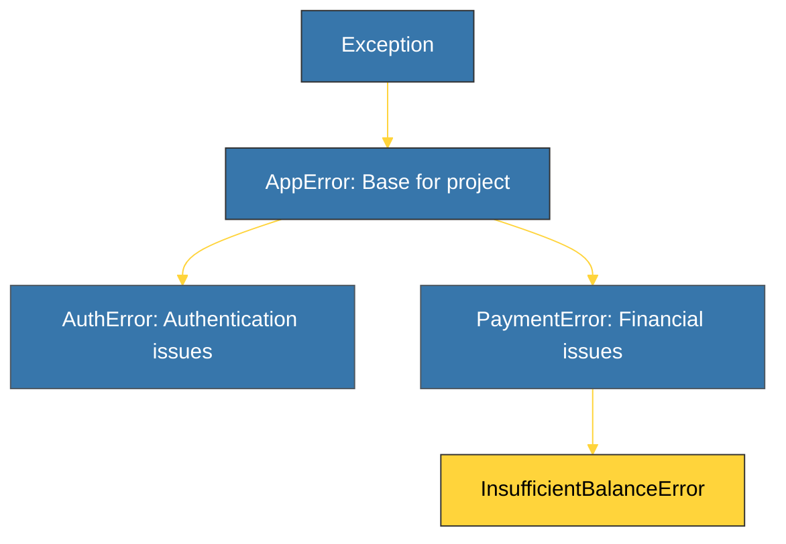

# CH-01: Custom Exceptions (Domain Specific Errors) [x] Complete

> **"Built-in exceptions are great for Python, but custom exceptions are essential for your business logic."**

Bab ini membedah bagaimana menciptakan **Eksepsi Kustom** sendiri. Kita akan mempelajari mengapa menggunakan error yang spesifik bagi domain bisnis (seperti `BalanceInsufficientError`) jauh lebih baik daripada menggunakan error umum (seperti `ValueError`).

---

## 🌐 Source Hub (Authority)
- **Primary Source**: [Python Docs - User-defined Exceptions](https://docs.python.org/3/tutorial/errors.html#user-defined-exceptions)
- **Strategic Blueprint**: [RAK-02 Foundation](file:///i:/Workspace/Workspace-Syahputrawork/learning-matrix-blueprint/01-Language-Hubs/Python-Knowledge-Base.md)

---

## 🧠 The Essence (Narrative)
Python memungkinkan kita untuk membuat kelas eksepsi baru dengan cara mewarisi kelas **`Exception`**. Dengan memiliki eksepsi kustom, pengembang lain yang menggunakan modul Anda dapat menangkap error yang sangat spesifik yang relevan dengan logika aplikasi Anda. Ini membuat kode penanganan error menjadi lebih deskriptif dan mudah didebug. Selalu gunakan akhiran *Error* pada nama kelas eksepsi kustom Anda untuk mengikuti konvensi Python.

---

## 🎨 Visual Logic (Custom Hierarchy)



---

## 🛠️ Definition & Usage

```python
class InsufficientBalanceError(Exception):
    """Exception raised for errors in withdrawal when balance is low."""
    def __init__(self, balance, amount):
        self.message = f"Attempted to withdraw {amount} with balance {balance}"
        super().__init__(self.message)

# Usage
def execute_payment(balance, amount):
    if amount > balance:
        raise InsufficientBalanceError(balance, amount)
    return balance - amount
```

---

## ⚠️ Pitfalls
- **Inheriting from `BaseException`**: Jangan pernah mewarisi eksepsi kustom dari `BaseException`. Selalu gunakan `Exception`. Mewarisi `BaseException` dapat menyebabkan eksepsi Anda tidak tertangkap oleh blok `except Exception:` umum, yang bisa merusak alur aplikasi.
- **Over-complication**: Jangan membuat eksepsi kustom untuk setiap kemungkinan kesalahan kecil. Jika eksepsi bawaan Python sudah cukup representatif (misal: `ValueError` untuk input yang salah), gunakan yang sudah ada.

---
*Back to [BK-02 CustomExceptions_Guards](../README.md)*
