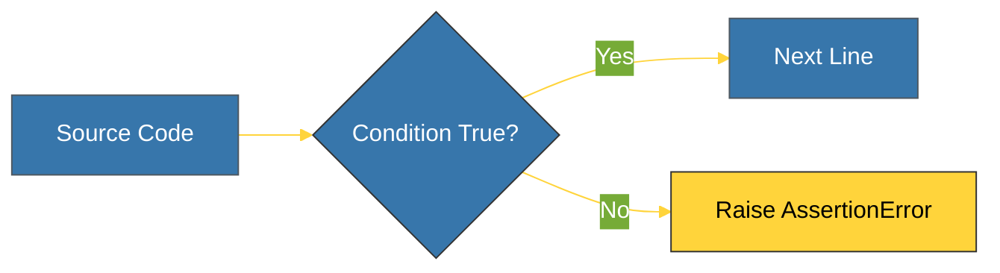

# CH-02: Assertions (Internal Integrity Guard) [x] Complete

> **"Assertions are for debugging the code; Exceptions are for handling the environment."**

Bab ini membedah penggunaan **Assertions (`assert`)** sebagai alat bantu audit internal selama pengembangan. Kita akan mempelajari bagaimana menggunakan asersi untuk memverifikasi asumsi dalam kode Anda dan mengapa asersi tidak boleh digunakan untuk logika produksi.

---

## 🌐 Source Hub (Authority)
- **Primary Source**: [Python Docs - The assert statement](https://docs.python.org/3/reference/simple_stmts.html#the-assert-statement)
- **Strategic Blueprint**: [RAK-02 Foundation](file:///i:/Workspace/Workspace-Syahputrawork/learning-matrix-blueprint/01-Language-Hubs/Python-Knowledge-Base.md)

---

## 🧠 The Essence (Narrative)
Asersi adalah cara bagi pengembang untuk menyatakan: "Saya yakin kondisi ini harus benar di titik ini." Jika kondisi tersebut salah, Python akan melempar `AssertionError`. Asersi sangat berguna untuk menangkap bug logika sejak dini. Namun, perlu diingat bahwa asersi dapat dinonaktifkan secara global saat menjalankan Python dengan tanda optimasi (`-O` atau `-OO`). Karena itu, asersi **bukan** pengganti untuk validasi data atau penanganan error di lingkungan produksi.

---

## 🎨 Visual Logic (Assertion Flow)



---

## 🛠️ Usage Syntax

```python
def apply_discount(price, discount):
    updated_price = price * (1 - discount)
    
    # Internal Audit: Price should never be negative
    assert updated_price >= 0, "⚠️ Negative price detected!"
    
    return updated_price

print(apply_discount(100, 0.2)) # Works
# print(apply_discount(100, 1.5)) # Raises AssertionError
```

---

## ⚠️ Pitfalls
- **Input Validation**: Jangan gunakan asersi untuk memvalidasi input dari pengguna atau data dari database. Gunakan `if` statement dan lempar `ValueError` atau eksepsi spesifik lainnya. Karena jika program dijalankan dalam mode produksi (`-O`), asersi akan dihapus, dan validasi input Anda akan hilang.
- **Side Effects**: Hindari meletakkan kode yang memiliki efek samping (seperti memodifikasi variabel) di dalam asersi. Jika asersi dinonaktifkan, kode tersebut tidak akan dijalankan, yang bisa merusak logika program Anda.

---
*Back to [BK-02 CustomExceptions_Guards](../README.md)*
