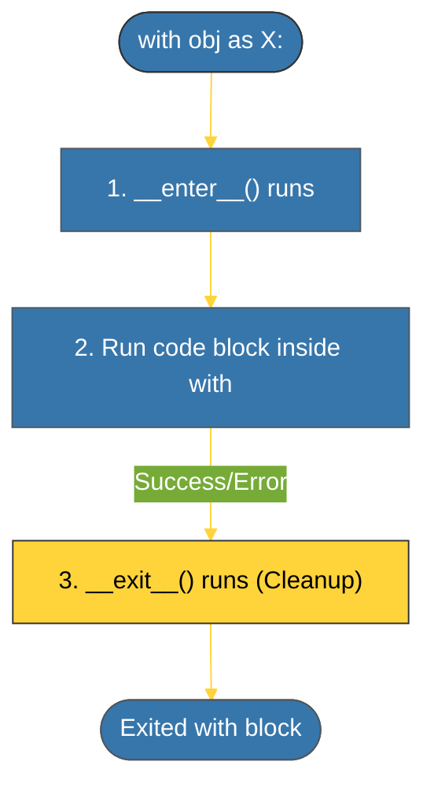

# CH-01: The With Statement (Resource Safety) [x] Complete

> **"The 'with' statement ensures that resources are properly cleaned up, even if an error occurs mid-stream."**

Bab ini membedah **Manajer Konteks (*Context Managers*)** dan perintah **`with`**. Kita akan mempelajari bagaimana Python mengotomatisasi pembukaan dan penutupan sumber daya (seperti file, koneksi jaringan, atau database) melalui protokol `__enter__` dan `__exit__`.

---

## 🌐 Source Hub (Authority)
- **Primary Source**: [Python Docs - Context Managers](https://docs.python.org/3/reference/datamodel.html#context-managers)
- **Strategic Blueprint**: [RAK-02 Foundation](file:///i:/Workspace/Workspace-Syahputrawork/learning-matrix-blueprint/01-Language-Hubs/Python-Knowledge-Base.md)

---

## 🧠 The Essence (Narrative)
Secara tradisional, kita harus menggunakan `try-finally` untuk memastikan file ditutup (misal: `f.close()`). Dengan perintah `with`, Python menangani ini secara otomatis. Objek yang digunakan setelah `with` harus mematuhi **Protokol Manajer Konteks**:
1. **`__enter__(self)`**: Dijalankan saat memasuki blok `with`. Kembaliannya diikat ke variabel setelah kata kunci `as`.
2. **`__exit__(self, exc_type, exc_val, exc_tb)`**: SELALU dijalankan saat keluar dari blok `with`, meskipun terjadi error di dalamnya. Blok ini bertanggung jawab membersihkan sumber daya.

---

## 🎨 Visual Logic (Context Lifecycle)



---

## 🛠️ Custom Class Implementation

```python
class FileManager:
    def __init__(self, filename):
        self.filename = filename

    def __enter__(self):
        print(f"Opening {self.filename}")
        # Return the resource
        return self

    def __exit__(self, exc_type, exc_val, exc_tb):
        print(f"Closing {self.filename}")
        # Logic for handling exceptions can go here

with FileManager("test.txt") as f:
    print("Working with file...")
```

---

## ⚠️ Pitfalls
- **Suppression Error**: Di dalam metode `__exit__`, jika Anda ingin "menelan" (*suppress*) eksepsi agar tidak naik ke atas, Anda harus mengembalikan `True`. Jika Anda mengembalikan `False` (default), eksepsi akan dilempar ulang setelah blok `finally`.
- **Resource Leakage**: Jangan pernah mengandalkan *Garbage Collector* untuk menutup sumber daya eksternal. Selalu gunakan `with` statement untuk menjamin keamanan penutupan.

---
*Back to [BK-03 ContextManagers](../README.md)*
