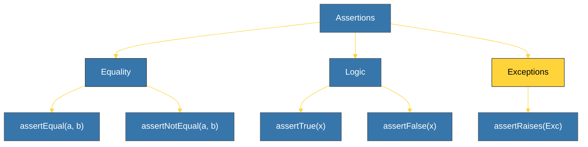

# CH-02: Standard Assertions (Verification Methods) [x] Complete

> **"A test without an assertion is not a test; it's just a program running."**

Bab ini membedah berbagai metode **Assertions** yang tersedia dalam pustaka `unittest`. Kita akan mempelajari bagaimana memverifikasi kesamaan nilai, keberadaan elemen, hingga memastikan bahwa fungsi kita melempar eksepsi yang benar saat terjadi kegagalan.

---

## 🌐 Source Hub (Authority)
- **Primary Source**: [Python Docs - unittest Assert Methods](https://docs.python.org/3/library/unittest.html#assert-methods)
- **Strategic Blueprint**: [RAK-02 Foundation](file:///i:/Workspace/Workspace-Syahputrawork/learning-matrix-blueprint/01-Language-Hubs/Python-Knowledge-Base.md)

---

## 🧠 The Essence (Narrative)
Metode asersi adalah inti dari setiap test case. Meskipun Python memiliki perintah `assert` mentah, `unittest` menyediakan serangkaian metode `self.assert...()` yang memberikan pesan error jauh lebih informatif jika pengujian gagal. Misalnya, `self.assertEqual(a, b)` akan menunjukkan perbedaan nilai secara spesifik, sedangkan `assert a == b` hanya akan memberikan `AssertionError` tanpa detail tambahan.

---

## 🎨 Visual Logic (Assertion Matrix)



---

## 🛠️ Common Usage Examples

### 1. Equality & Membership
```python
self.assertEqual(sum([1, 2]), 3)
self.assertIn("apple", ["apple", "banana"])
```

### 2. Exception Handling (Checking for Errors)
```python
# Memastikan fungsi melempar ZeroDivisionError saat divisor = 0
with self.assertRaises(ZeroDivisionError):
    10 / 0
```

---

## ⚠️ Pitfalls
- **Informative Failures**: Hindari menggunakan `assert a == b` di dalam unit test. Gunakan `self.assertEqual(a, b)` agar Anda mendapatkan diff yang jelas saat tes gagal (terutama sangat membantu saat membandingkan list atau dictionary yang besar).
- **Rounding Errors**: Untuk membandingkan angka floating point (decimal), gunakan **`self.assertAlmostEqual(a, b, places=X)`** daripada `assertEqual` untuk menghindari kegagalan tes karena ketidakakuratan presisi biner kecil.

---
*Back to [BK-01 Unittest_Builtin](../README.md)*
