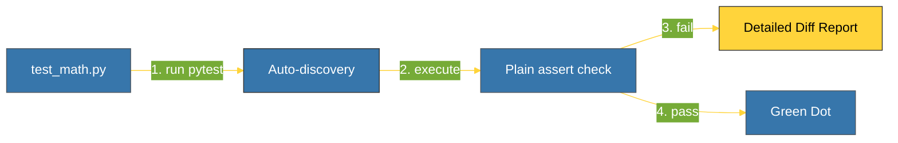

# CH-01: Functional Testing (The Modern Runner) [x] Complete

> **"Pytest makes it easy to write small tests, yet scales to support complex functional testing."**

Bab ini membedah **`pytest`**, standar industri untuk pengujian Python modern. Kita akan mempelajari mengapa pendekatan fungsional (bebas kelas) lebih disukai, bagaimana `pytest` memperkuat perintah `assert` standar, dan cara menjalankan test suite secara efisien.

---

## 🌐 Source Hub (Authority)
- **Primary Source**: [Pytest Documentation](https://docs.pytest.org/)
- **Strategic Blueprint**: [RAK-02 Foundation](file:///i:/Workspace/Workspace-Syahputrawork/learning-matrix-blueprint/01-Language-Hubs/Python-Knowledge-Base.md)

---

## 🧠 The Essence (Narrative)
Berbeda dengan `unittest` yang berbasis kelas (boilerplate tinggi), `pytest` memungkinkan Anda menulis tes sebagai fungsi biasa. Kekuatan utamanya terletak pada **Assertion Rewriting**: Anda cukup menggunakan perintah `assert` bawaan Python, dan `pytest` akan secara otomatis mencegatnya untuk memberikan laporan detail tentang nilai variabel yang menyebabkan kegagalan. Tes menjadi lebih bersih, lebih sedikit baris kode, dan lebih mudah dibaca.

---

## 🎨 Visual Logic (Pytest Workflow)



---

## 🛠️ Comparison: Unittest vs Pytest

### Unittest Style (Verbose)
```python
def test_add(self):
    self.assertEqual(add(2, 2), 4)
```

### Pytest Style (Clean)
```python
def test_add():
    assert add(2, 2) == 4
```

---

## ⚠️ Pitfalls
- **Test Discovery**: `pytest` mencari file yang diawali dengan `test_*.py` atau diakhiri dengan `*_test.py`. Jika nama file Anda tidak sesuai pola ini, `pytest` tidak akan menemukannya secara otomatis.
- **Plain Assert Only**: Hindari menggunakan metode `self.assert...` di dalam fungsi pytest. Kekuatan `pytest` justru ada pada penyederhanaan ke `assert` tunggal. Menggunakan gaya lama hanya akan menambah kompleksitas tanpa keuntungan tambahan.

---
*Back to [BK-02_Pytest_Modern](../README.md)*
