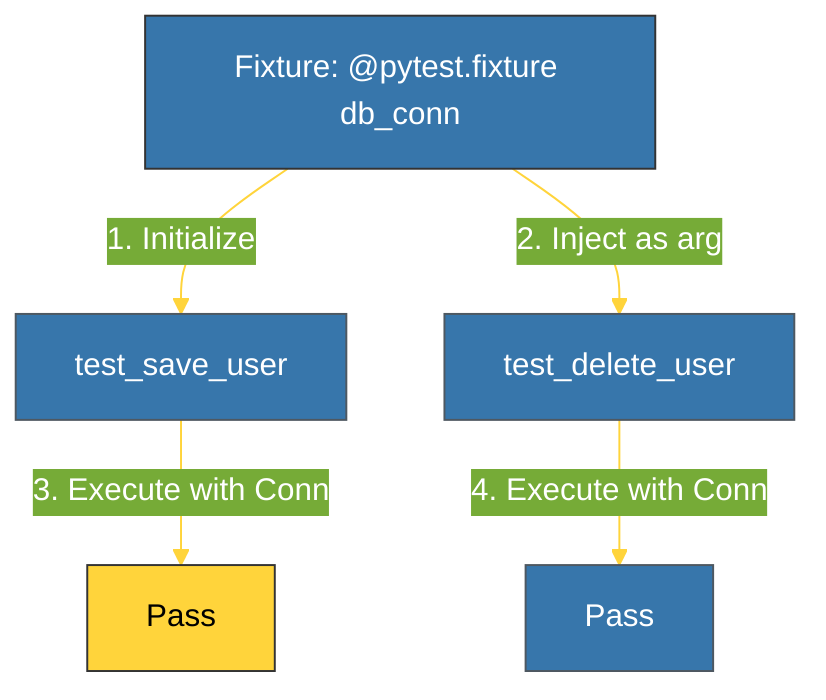

# CH-02: Fixtures & Parametrization (Reusable Logic) [x] Complete

> **"Fixtures provide a fixed baseline so that tests can be executed reliably."**

Bab ini membedah dua fitur paling kuat dalam `pytest`: **Fixtures** untuk mengelola dependensi dan **Parametrization** untuk menjalankan satu tes dengan berbagai set data. Kita akan mempelajari bagaimana mengurangi duplikasi kode dan meningkatkan cakupan pengujian dengan cara yang bersih.

---

## 🌐 Source Hub (Authority)
- **Primary Source**: [Pytest - About Fixtures](https://docs.pytest.org/en/latest/explanation/fixtures.html)
- **Primary Source**: [Pytest - Parametrize](https://docs.pytest.org/en/latest/how-to/parametrize.html)
- **Strategic Blueprint**: [RAK-02 Foundation](file:///i:/Workspace/Workspace-Syahputrawork/learning-matrix-blueprint/01-Language-Hubs/Python-Knowledge-Base.md)

---

## 🧠 The Essence (Narrative)
1. **Fixtures**: Daripada menggunakan `setUp` dan `tearDown` di setiap kelas, `pytest` menggunakan **Dependency Injection**. Sebuah fungsi didekorasi dengan `@pytest.fixture` dan dikirimkan sebagai argumen ke fungsi tes. `pytest` akan mengelola siklus hidupnya.
2. **Parametrization**: Menggunakan dekorator `@pytest.mark.parametrize`, Anda dapat menjalankan fungsi tes yang sama berulang kali dengan input data yang berbeda (seperti sebuah loop di level framework), sehingga memastikan berbagai skenario (tepi atau normal) teruji tanpa menulis banyak fungsi.

---

## 🎨 Visual Logic (Fixture Injection)



---

## 🛠️ Implementation Examples

### 1. Fixture with Scope
```python
import pytest

@pytest.fixture(scope="module")
def db():
    print("\n   [SETUP] Init DB")
    yield {"status": "connected"} # Object used in test
    print("\n   [TEARDOWN] Close DB")

def test_db_status(db):
    assert db["status"] == "connected"
```

### 2. Parametrization (Multiple Data Sets)
```python
@pytest.mark.parametrize("a, b, expected", [
    (1, 2, 3),
    (10, 20, 30),
    (0, 0, 0),
])
def test_add(a, b, expected):
    assert a + b == expected
```

---

## ⚠️ Pitfalls
- **Scope Confusion**: Secara default, scope fixture adalah **`function`** (dijalankan ulang di SETIAP tes). Jika inisialisasi sangat berat (seperti koneksi DB), ubah scope ke **`module`** atau **`session`** agar hanya dijalankan sekali.
- **Fixture Over-injection**: Jangan memasukkan terlalu banyak fixture ke satu fungsi tes tunggal. Ini membuat tes sulit dibaca dan dipahami alurnya. Jika Anda butuh terlalu banyak fixture, pertimbangkan untuk menyederhanakan kode yang sedang diuji.

---
*Back to [BK-02_Pytest_Modern](../README.md)*
