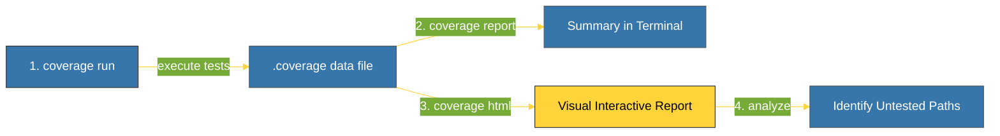

# CH-02: Code Coverage (Quality Metrics) [x] Complete

> **"Code coverage is a useful tool for finding untested parts of your codebase, but it's a poor measure of test quality."**

Bab ini membedah **Code Coverage**, sebuah metrik untuk mengukur seberapa banyak baris kode Anda yang telah dieksekusi oleh test suite. Kita akan mempelajari cara menggunakan alat bantu `coverage.py` untuk mengidentifikasi celah pengujian dalam proyek Anda.

---

## 🌐 Source Hub (Authority)
- **Primary Source**: [Coverage.py Documentation](https://coverage.readthedocs.io/)
- **Strategic Blueprint**: [RAK-02 Foundation](file:///i:/Workspace/Workspace-Syahputrawork/learning-matrix-blueprint/01-Language-Hubs/Python-Knowledge-Base.md)

---

## 🧠 The Essence (Narrative)
**Code Coverage** memberikan visibilitas terhadap "titik buta" dalam pengujian Anda. Dengan menjalankan tes melalui *Coverage Runner*, Anda akan mendapatkan laporan (biasanya dalam persen) yang menunjukkan baris mana yang terlewati dan baris mana yang tidak pernah tersentuh oleh tes apapun. Laporan ini bisa dalam bentuk teks di terminal atau halaman HTML interaktif yang menyorot baris kode secara visual.

---

## 🎨 Visual Logic (Coverage Cycle)



---

## 🛠️ Typical Workflow Commands

```bash
# 1. Jalankan pengujian dan kumpulkan data
coverage run -m pytest

# 2. Tampilkan ringkasan di terminal
coverage report -m

# 3. Hasilkan laporan visual yang detail
coverage html
```

---

## ⚠️ Pitfalls
- **The 100% Trap**: Jangan terobsesi mengejar angka 100% coverage. Cakupan 100% tidak menjamin kode Anda bebas bug; itu hanya berarti setiap baris telah dijalankan. Kualitas asersi (*Assertions*) jauh lebih penting daripada sekadar melewati baris kode.
- **Testing Logic vs. Path**: Coverage mengukur baris, bukan logika. Pastikan Anda mengetes berbagai skenario input (normatif, batas, dan error) meskipun semuanya melalui baris kode yang sama.

---
*Back to [BK-03_Mocking_Strategy](../README.md)*
