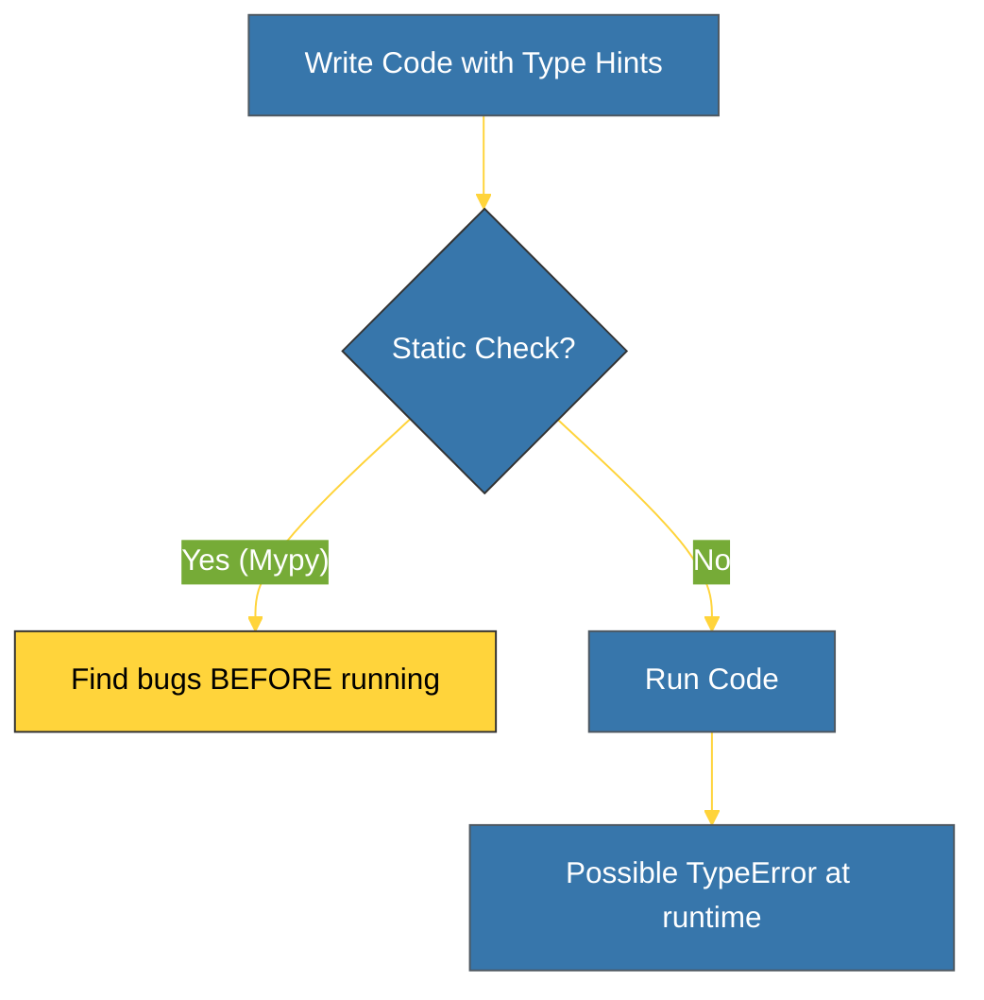

# SR-10: Typing Hints (Static Semantics) [x] Complete

> **"Explicit typing is better than implicit guessing."**

Sub-Rak ini mengeksplorasi sistem **Type Hinting** modern dalam Python. Sejak PEP 484, Python berpindah dari bahasa yang murni dinamis menjadi bahasa yang mendukung *Static Type Checking* untuk meningkatkan keandalan kode, dokumentasi aktif, dan dukungan IDE yang lebih baik.

---

## 🌍 Landscape (Daftar Buku)

| Buku | Fokus | Deskripsi |
| :--- | :--- | :--- |
| **BK-01_BasicAnnotations** | Dasar Typing | Mengetahui `Optional`, `Any`, `List`, `Dict`. |
| **BK-02_TypeSafetyMypy** | Verifikasi Statis | Menggunakan alat bantu seperti Mypy/Pyright. |

---

## 🎯 Key Learning Goals
- Memahami beda antara *Dynamic Typing* (Runtime) dan *Static Type Checking*.
- Mampu membubuhkan *Type Annotations* pada variabel, parameter, dan hasil fungsi.
- Menggunakan `typing` module untuk struktur data kompleks.
- Mengetahui cara melakukan audit tipe menggunakan **Mypy**.

---

## 🎨 Visual Logic (Static vs Dynamic)

---

## 🧪 Prasyarat Teknis
- Pemahaman fungsi dan variabel dasar.
- Instalasi `mypy` (pip install mypy).

---
*Back to [Rak-02 Foundation](../README.md)*
