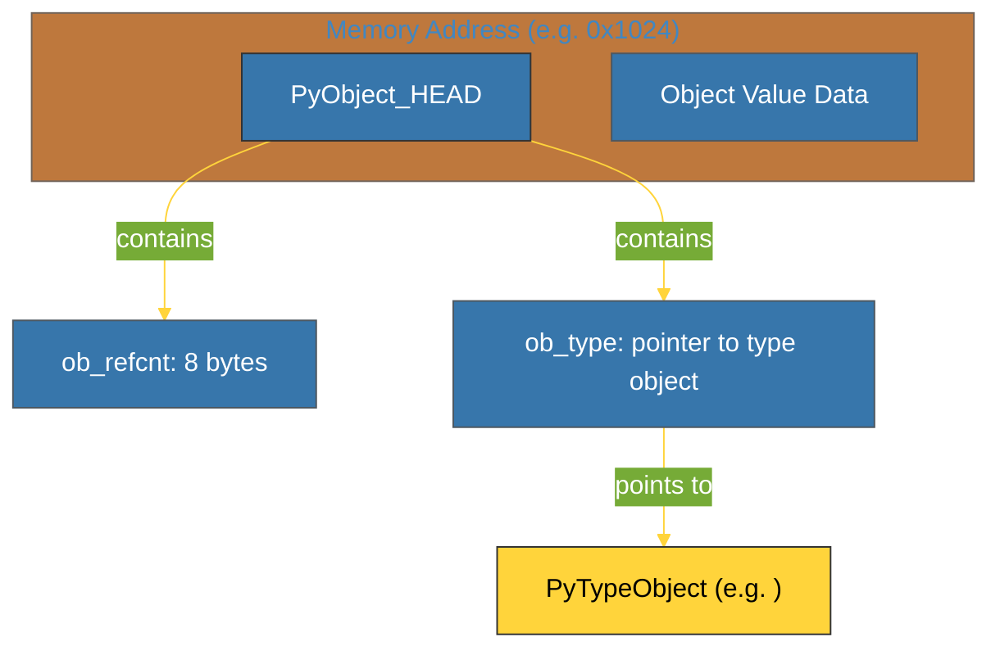

# BK-01: PyObject Structure (Anatomi Objek C) [x] Complete

> **"In CPython, every object is a struct. Understanding the header is understanding Python."**

Buku ini membedah **PyObject**, struktur data dasar di level C yang menjadi jantung dari setiap objek di Python. Kita akan mempelajari bagaimana CPython merepresentasikan data di memori, dari angka kecil hingga objek paling kompleks, melalui mekanisme **Object Header**.

---

## 🌐 Source Hub (Authority)
- **Primary Source**: [CPython Source - Include/object.h](https://github.com/python/cpython/blob/main/Include/object.h)
- **Primary Source**: [Python C-API - Objects & Reference Counts](https://docs.python.org/3/c-api/intro.html#objects-types-and-reference-counts)
- **Strategic Blueprint**: [RAK-04 Core Mechanics](file:///i:/Workspace/Workspace-Syahputrawork/01-Language-Hubs-Workspace/Python-Knowledge-Base/RAK-04-core-mechanics/README.md)

---

## 🧠 The Essence (Narrative)
Di level Python, kita melihat `x = 42` sebagai variabel sederhana. Namun di balik layar (level C), `42` adalah sebuah **Struct** yang kompleks. Setiap objek di CPython memiliki "identitas" yang sama di bagian kepalanya (Header), yang disebut `PyObject`. Header ini berisi dua hal krusial:
1.  **`ob_refcnt`**: Berapa banyak variabel yang menunjuk ke objek ini (untuk Manajemen Memori).
2.  **`ob_type`**: Pointer ke objek lain yang mendefinisikan tipe data objek ini (untuk Dinamisme).
Inilah alasan mengapa kita bisa memanggil `.lower()` pada string atau `append()` pada list; interpreter melihat `ob_type` untuk mengetahui metode apa yang tersedia.

---

## 🎨 Visual Logic (PyObject Memory Layout)



---

## 🛠️ Anatomy: Under the Hood (C Struct)
```c
/* Simplified C Representation */
typedef struct _object {
    _PyObject_HEAD_EXTRA
    Py_ssize_t ob_refcnt;  /* Reference count (e.g. 1) */
    struct _typeobject *ob_type; /* Pointer to Type Object (e.g. &PyLong_Type) */
} PyObject;
```

---

## ⚠️ Pitfalls
- **Memory Overhead**: Karena setiap integer atau string adalah *Object Struct* (bukan hanya data mentah), Python memakan memori lebih besar dibandingkan bahasa tingkat rendah seperti C atau Rust. Integer sederhana di Python bisa memakan waktu 28 bytes, sementara di C hanya 4 bytes.
- **Small Int Caching**: CPython melakukan optimasi dengan melakukan *pre-allocate* (cache) untuk integer kecil antara `-5` hingga `256`. Itulah mengapa `a = 10; b = 10; a is b` bernilai `True`, namun untuk angka besar bisa bernilai `False`.

---
*Back to [SR-01 Data Model](../README.md)*
