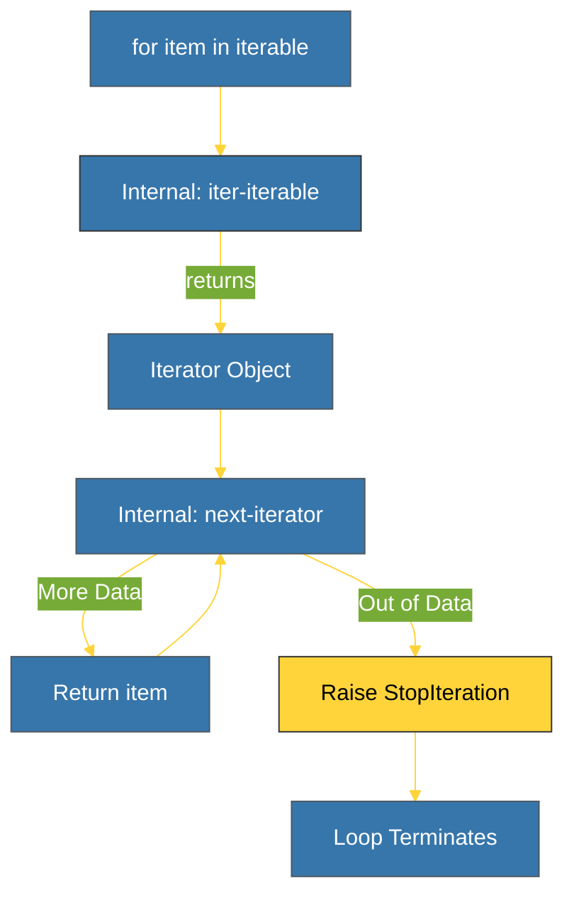

# BK-01: Iterators & Iterables (Protokol Iterasi) [x] Complete

> **"Iterators are the engine of Python's data processing. They allow us to process infinite data with finite memory."**

Buku ini membedah **Protokol Iterasi**, salah satu pilar utama Python yang memungkinkan penggunaan loop `for`, list comprehension, dan pemrosesan data "malas" (*Lazy Evaluation*). Kita akan mempelajari perbedaan krusial antara Iterable dan Iterator.

---

## 🌐 Source Hub (Authority)
- **Primary Source**: [Python Docs - Iterators](https://docs.python.org/3/c-api/iter.html)
- **Strategic Blueprint**: [RAK-04 Core Mechanics](file:///i:/Workspace/Workspace-Syahputrawork/01-Language-Hubs-Workspace/Python-Knowledge-Base/RAK-04-core-mechanics/README.md)

---

## 🧠 The Essence (Narrative)
Pernahkah Anda bertanya bagaimana `for x in list` bekerja? Python tidak hanya "mengintip" indeks satu per satu. Ia menggunakan protokol dua tahap:
1.  **Iterable**: Objek yang mengimplementasikan `__iter__` untuk menghasilkan Iterator (misal: `list`, `str`).
2.  **Iterator**: Objek yang mengimplementasikan `__next__` untuk menghasilkan nilai berikutnya, atau melempar `StopIteration` saat data habis.
Keuntungan utama protokol ini adalah **Lazy Evaluation**. Kita bisa membuat objek yang menghasilkan jutaan angka tanpa harus menyimpannya di memori sekaligus.

---

## 🎨 Visual Logic (Iterator Protocol Flow)



---

## 🛠️ Implementation: Custom Iterator
```python
class Countdown:
    def __init__(self, start):
        self.count = start
    def __iter__(self):
        return self
    def __next__(self):
        if self.count <= 0:
            raise StopIteration
        self.count -= 1
        return self.count + 1
```

---

## ⚠️ Pitfalls
- **One-way Ticket**: Kebanyakan iterator hanya bisa digunakan satu kali. Setelah `StopIteration` dilempar, iterator tersebut "habis" (*exhausted*). Jika Anda mencoba melakukan loop lagi, ia akan langsung berhenti.
- **Infinite Loops**: Jika Anda lupa mengimplementasikan kondisi berhenti (`StopIteration`), loop `for` akan berjalan selamanya, memakan CPU hingga program dihentikan paksa.

---
*Back to [SR-02 Protocols](../README.md)*
