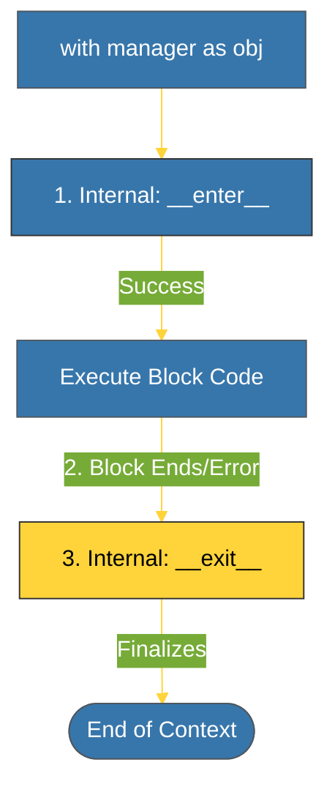

# BK-02: Context Managers (Protokol Pengelolaan Sumber Daya) [x] Complete

> **"Context managers are the guardians of your system's resources. They ensure that what is opened is always closed."**

Buku ini membedah **Context Manager Protocol**, mekanisme yang sangat elegan untuk mengelola siklus hidup sumber daya eksternal (seperti file, koneksi database, atau lock). Kita akan mempelajari bagaimana pernyataan `with` diimplementasikan di balik layar.

---

## 🌐 Source Hub (Authority)
- **Primary Source**: [Python Docs - Context Managers](https://docs.python.org/3/reference/datamodel.html#context-managers)
- **Strategic Blueprint**: [RAK-04 Core Mechanics](file:///i:/Workspace/Workspace-Syahputrawork/01-Language-Hubs-Workspace/Python-Knowledge-Base/RAK-04-core-mechanics/README.md)

---

## 🧠 The Essence (Narrative)
Secara historis, mengelola file membutuhkan blok `try-finally` yang panjang untuk menjamin file tetap ditutup meskipun ada error. Masalahnya: kode menjadi kotor dan sulit dibaca. Solusi Python adalah **Context Manager**. Dengan mengimplementasikan protokol ini, objek Anda dapat digunakan dalam blok `with`. CPython akan secara otomatis memanggil `__enter__` di awal blok dan menjamin `__exit__` dipanggil di akhir blok (bahkan jika terjadi eksepsi). Ini adalah standar keamanan industri untuk manajemen sumber daya.

---

## 🎨 Visual Logic (Context Manager Lifecycle)



---

## 🛠️ Implementation: Custom Context Manager
```python
class DatabaseConnection:
    def __enter__(self):
        print("   [DB] Connecting...")
        return self
    def __exit__(self, exc_type, exc_val, exc_tb):
        print("   [DB] Closing connection.")
        # If exc_type is not None, an error occurred
        return False # Propagate exceptions
```

---

## ⚠️ Pitfalls
- **Exception Swallowing**: Jika `__exit__` mengembalikan `True`, Python akan "menelan" (*swallow*) eksepsi yang terjadi di dalam blok `with`, menyebabkannya menghilang begitu saja. Pastikan Anda hanya mengembalikan `True` jika Anda benar-benar menangani eksepsinya secara sadar.
- **Fail Early**: Jika `__enter__` gagal (melempar error), maka `__exit__` **TIDAK AKAN** dipanggil. Pastikan inisialisasi kritis dilakukan dengan hati-hati atau dipecah menjadi beberapa tahap.

---
*Back to [SR-02 Protocols](../README.md)*
