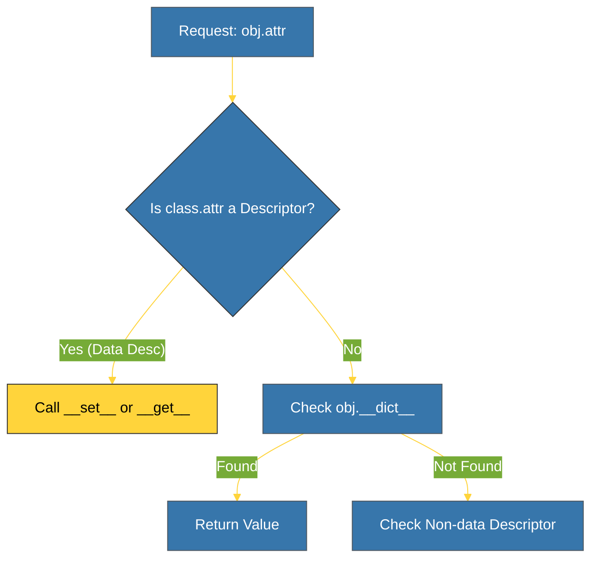

# BK-01: Descriptor Protocol (Kontrol Atribut) [x] Complete

> **"Descriptors are the power tools of Python's object system. They are the magic behind properties, methods, and classmethods."**

Buku ini membedah **Descriptor Protocol**, mekanisme tingkat rendah yang memungkinkan pengembang untuk membajak (intercept) akses atribut pada sebuah objek. Kita akan mempelajari bagaimana protokol ini menjadi tulang punggung dari fitur-fitur seperti `@property`, `@classmethod`, dan bahkan bagaimana fungsi diubah menjadi *bound methods*.

---

## 🌐 Source Hub (Authority)
- **Primary Source**: [Python Docs - Descriptor How-To Guide](https://docs.python.org/3/howto/descriptor.html)
- **Strategic Blueprint**: [RAK-04 Core Mechanics](file:///i:/Workspace/Workspace-Syahputrawork/01-Language-Hubs-Workspace/Python-Knowledge-Base/RAK-04-core-mechanics/README.md)

---

## 🧠 The Essence (Narrative)
Secara default, saat Anda mengakses `obj.x`, Python mencari `x` di kamus `obj.__dict__`. Masalahnya adalah: bagaimana jika kita ingin memvalidasi data saat data tersebut ditulis ke `x`? Atau bagaimana jika nilai `x` harus dihitung secara dinamis? PEP dan Data Model memperkenalkan **Descriptor**. Sebuah objek yang mengimplementasikan salah satu dari `__get__`, `__set__`, atau `__delete__` disebut Descriptor. Saat descriptor dipasang sebagai atribut kelas, Python akan memanggil metode dunder tersebut alih-alih melakukan akses kamus biasa. Inilah rahasia kekuatan enkapsulasi Python yang sangat elegan.

---

## 🎨 Visual Logic (Descriptor Access Workflow)



---

## 🛠️ Implementation: The Validator Pattern
```python
class IntegerValidator:
    def __set__(self, instance, value):
        if not isinstance(value, int):
            raise TypeError("Value must be an integer")
        instance.__dict__[self.name] = value
```

---

## ⚠️ Pitfalls
- **The Storage Leak**: Jangan pernah menyimpan nilai atribut di dalam *instance descriptor* itu sendiri (misal: `self.value = value`). Karena descriptor adalah atribut tingkat **Kelas**, semua instance dari kelas tersebut akan berbagi satu nilai yang sama. Selalu simpan nilai di dalam kamus instance pemilik (`instance.__dict__` atau `setattr(instance, ...)`).
- **__set_name__**: Mulai Python 3.6, gunakan `__set_name__(self, owner, name)` untuk mendapatkan nama variabel descriptor secara otomatis tanpa harus mendefinisikannya secara manual.

---
*Back to [SR-03 Descriptors](../README.md)*
