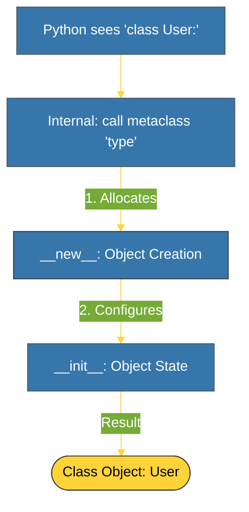

# BK-01: Type and __new__ (Object Factories) [x] Complete

> **"Classes are just objects created by other classes called Metaclasses. The default metaclass is 'type'."**

Buku ini membedah **Metaclasses**, level tertinggi dari abstraksi objek Python. Kita akan mempelajari bagaimana kelas itu sendiri diciptakan melalui fungsi `type`, serta perbedaan krusial antara `__new__` (penciptaan) dan `__init__` (inisialisasi).

---

## 🌐 Source Hub (Authority)
- **Primary Source**: [Python Docs - Metaclasses](https://docs.python.org/3/reference/datamodel.html#metaclasses)
- **Strategic Blueprint**: [RAK-04 Core Mechanics](file:///i:/Workspace/Workspace-Syahputrawork/01-Language-Hubs-Workspace/Python-Knowledge-Base/RAK-04-core-mechanics/README.md)

---

## 🧠 The Essence (Narrative)
Secara teknis, semuanya di Python adalah objek, termasuk "Class". Jika `obj` diciptakan oleh `MyClass`, lalu siapa yang menciptakan `MyClass`? Jawabannya adalah **Metaclass**. Python menggunakan `type` secara default untuk membangun kelas saat runtime. Dengan menggunakan `__new__`, kita bisa mengintervensi proses alokasi memori sebelum objek kelas benar-benar ada. Ini memungkinkan kita melakukan validasi struktur kelas secara otomatis atau menyisipkan atribut secara dinamis sebelum kelas tersebut bahkan bisa digunakan. Inilah dunia **Metaprogramming**.

---

## 🎨 Visual Logic (Class Creation Lifecycle)



---

## 🛠️ Implementation: Simple Metaclass
```python
class UpperAttrMetaclass(type):
    def __new__(cls, name, bases, attrs):
        # Mengubah semua nama atribut menjadi UPPERCASE sebelum kelas dibuat
        uppercase_attrs = {k.upper(): v for k, v in attrs.items()}
        return super().__new__(cls, name, bases, uppercase_attrs)

class MyClass(metaclass=UpperAttrMetaclass):
    bar = 'bip'

# print(MyClass.BAR) -> 'bip' (Asli 'bar' sudah hilang)
```

---

## ⚠️ Pitfalls
- **The Metaclass Complexity**: Metaclass sering kali membuat kode sangat sulit dibaca dan didebug. PEP menyatakan: "Metaclasses are deeper magic than 99% of users should ever worry about. If you wonder whether you need them, you don't."
- **Multiple Metaclass Conflict**: Python tidak mendukung sebuah kelas yang diwarisi dari dua kelas induk dengan metaclass yang berbeda (kecuali satu metaclass mewarisi dari yang lain). Ini sering menyebabkan *Metaclass Conflict* yang fatal.

---
*Back to [SR-04 Metaclasses](../README.md)*
