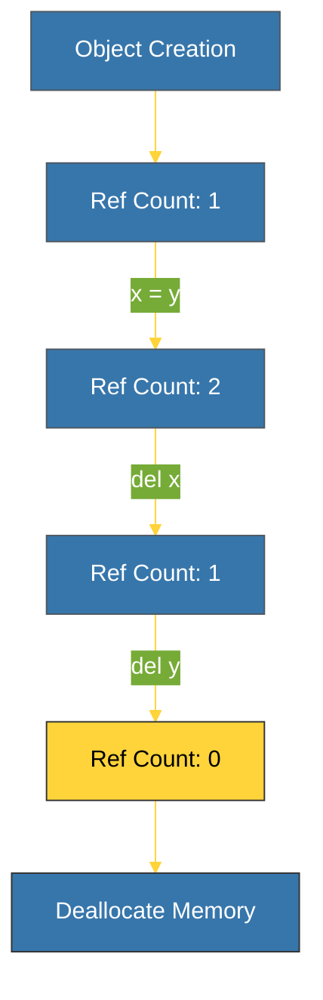

# BK-01: Reference Counting (Reklamasi Instan) [x] Complete

> **"In Python, an object lives as long as it is needed, and not a moment longer."**

Buku ini membedah **Reference Counting**, strategi utama CPython untuk mengelola memori. Kita akan mempelajari bagaimana Python melacak penggunaan objek secara deterministik dan mengapa objek langsung dihapus dari memori saat tidak lagi memiliki referensi yang menunjuk padanya.

---

## 🌐 Source Hub (Authority)
- **Primary Source**: [Python Docs - Garbage Collection Design](https://docs.python.org/3/library/gc.html)
- **Strategic Blueprint**: [RAK-04 Core Mechanics](file:///i:/Workspace/Workspace-Syahputrawork/01-Language-Hubs-Workspace/Python-Knowledge-Base/RAK-04-core-mechanics/README.md)

---

## 🧠 The Essence (Narrative)
Berbeda dengan bahasa seperti Java yang menggunakan *Tracing GC* yang kompleks, CPython menggunakan **Reference Counting** sebagai lini pertahanan pertama. Setiap objek memiliki header `ob_refcnt` (lihat SR-01). Setiap kali Anda melakukan penugasan (`a = b`), jumlah referensi naik. Saat variabel keluar dari scope atau dihapus (`del a`), jumlahnya turun. Saat hitungan mencapai **Nol**, Python segera memanggil fungsi destruktor (`__del__`) dan membebaskan memori tersebut. Ini membuat penggunaan memori Python sangat bisa diprediksi untuk sebagian besar kasus.

---

## 🎨 Visual Logic (Reference Lifecycle)



---

## 🛠️ Inspecting Ref Counts
Anda dapat melihat jumlah referensi asli menggunakan `sys.getrefcount()`:
```python
import sys
a = [1, 2, 3]
print(sys.getrefcount(a)) # Biasanya 2 (a + argumet ke function)
```

---

## ⚠️ Pitfalls
- **The Circular Reference**: Kelemahan fatal dari Reference Counting adalah ia tidak bisa mendeteksi "pulau terisolasi". Jika objek A menunjuk ke B, dan B menunjuk ke A, maka refcount keduanya tidak akan pernah mencapai nol meskipun mereka tidak lagi bisa diakses dari program utama. Untuk mengatasi ini, Python membutuhkan bantuan dari **Cyclic Garbage Collector** (Lihat BK-02).
- **__del__ non-determinism**: Walaupun dealokasi terjadi saat refcount nol, jangan bergantung pada dunder `__del__` untuk menutup file atau socket penting. Selalu gunakan `with` statement (Context Manager) untuk jaminan penutupan sumber daya.

---
*Back to [SR-05 Memory Management](../README.md)*
