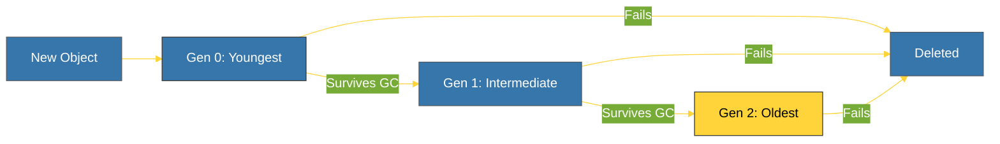

# BK-02: Cyclic GC (Garbage Collection Berbasis Generasi) [x] Complete

> **"Generational Garbage Collection ensures that circular references don't leak memory forever."**

Buku ini membedah **Cyclic Garbage Collector (GC)**, lini pertahanan kedua CPython untuk menangani kebocoran memori yang disebabkan oleh referensi melingkar (Circular References). Kita akan mempelajari bagaimana Python mengelompokkan objek ke dalam generasi dan bagaimana ia memutuskan kapan harus melakukan pembersihan besar-besaran.

---

## 🌐 Source Hub (Authority)
- **Primary Source**: [Python Docs - gc (Garbage Collector Interface)](https://docs.python.org/3/library/gc.html)
- **Strategic Blueprint**: [RAK-04 Core Mechanics](file:///i:/Workspace/Workspace-Syahputrawork/01-Language-Hubs-Workspace/Python-Knowledge-Base/RAK-04-core-mechanics/README.md)

---

## 🧠 The Essence (Narrative)
Reference Counting (BK-01) sangat cepat, namun ia tidak berdaya melawan **Circular References** — kondisi di mana dua atau lebih objek saling menunjuk satu sama lain meskipun objek induknya sudah tidak ada. Untuk mengatasi ini, CPython menjalankan **Cyclic GC** di latar belakang. GC menggunakan algoritma berbasis **Generasi** (Hipotesis: Objek muda cenderung mati lebih cepat). Objek dikumpulkan di **Gen 0**, jika ia bertahan dari satu siklus pembersihan, ia naik ke **Gen 1**, dan akhirnya ke **Gen 2**. Semakin tua generasinya, semakin jarang Python memeriksanya, yang sangat meningkatkan efisiensi performa secara keseluruhan.

---

## 🎨 Visual Logic (Generational Lifecycle)



---

## 🛠️ Inspecting the GC
Anda dapat mengontrol dan melihat ambang batas (threshold) GC menggunakan modul `gc`:
```python
import gc
print(gc.get_threshold()) # Default biasanya (700, 10, 10)
print(gc.get_count())    # Melihat jumlah objek di tiap generasi saat ini
```

---

## ⚠️ Pitfalls
- **Performance Pause**: Setiap kali GC berjalan (terutama Gen 2), program akan mengalami sedikit jeda (*Stop the World-like pause*). Untuk aplikasi dengan latensi sangat rendah, pengembang terkadang melakukan `gc.disable()` dan memanggil `gc.collect()` secara manual di waktu luang.
- **__del__ with Cycles**: Sebelum Python 3.4, objek dengan metode `__del__` yang berada dalam siklus referensi tidak bisa dibersihkan secara otomatis. Namun, di versi modern (PEP 442), ini sudah bisa ditangani dengan aman.

---
*Back to [SR-05 Memory Management](../README.md)*
