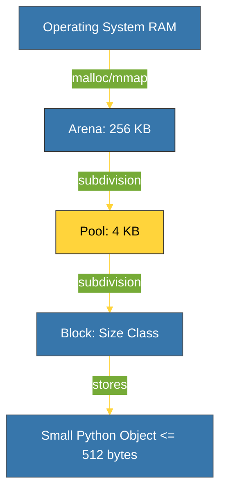

# BK-03: Memory Allocators (Arenas, Pools, & Blocks) [x] Complete

> **"CPython doesn't just use C's malloc; it builds its own memory empire to stay fast."**

Buku ini membedah **Python Memory Allocators (PyMalloc)**, sistem alokasi memori kustom CPython yang dirancang untuk menangani jutaan objek kecil dengan sangat efisien. Kita akan mempelajari hirarki tiga tingkat: **Arenas**, **Pools**, dan **Blocks**.

---

## 🌐 Source Hub (Authority)
- **Primary Source**: [CPython Source - Objects/obmalloc.c](https://github.com/python/cpython/blob/main/Objects/obmalloc.c)
- **Strategic Blueprint**: [RAK-04 Core Mechanics](file:///i:/Workspace/Workspace-Syahputrawork/01-Language-Hubs-Workspace/Python-Knowledge-Base/RAK-04-core-mechanics/README.md)

---

## 🧠 The Essence (Narrative)
Memanggil fungsi sistem `malloc()` untuk setiap objek kecil di Python akan sangat lambat karena overhead *system call*. Solusi CPython adalah **PyMalloc**. Interpreter meminta blok besar memori dari OS (disebut **Arena**, sebesar 256KB). Arena ini dipecah menjadi **Pools** (ukuran 4KB, satu halaman memori). Setiap Pool kemudian dipecah menjadi **Blocks** dengan ukuran tetap (misal: 16 bytes, 32 bytes). Inilah alasan mengapa Python sangat cepat dalam membuat jutaan objek kecil: ia mengelola "perumahan" memorinya sendiri tanpa harus terus-menerus bertanya pada sistem operasi.

---

## 🎨 Visual Logic (The Memory Hierarchy)

---

## 📐 Allocation Strategy (Size Matters)
- **Small Objects (<= 512 bytes)**: Menggunakan hirarki kustom (Arenas -> Pools -> Blocks). Sangat efisien dan minim fragmentasi.
- **Large Objects (> 512 bytes)**: Python menganggap objek ini tidak cukup sering dibuat untuk butuh optimasi kustom, sehingga ia langsung memanggil `malloc()` standar C.

---

## ⚠️ Pitfalls
- **Memory Retention**: Anda mungkin melihat penggunaan RAM di Task Manager tetap tinggi meskipun Anda sudah menghapus jutaan objek. Ini terjadi karena Python tidak bisa mengembalikan **Arena** ke OS kecuali Arena tersebut **benar-benar kosong** (seluruh 256KB tidak terpakai). Jika ada satu pun objek kecil tersisa di salah satu poool dalam arena tersebut, Python akan menjaga arena itu tetap dialokasikan.
- **Fragmentation**: Penggunaan memori yang tidak teratur dapat menyebabkan fragmentasi di dalam pool, di mana ada banyak ruang kosong tetapi tidak cukup untuk satu blok baru. Namun, PyMalloc sangat cerdas dalam meminimalkan hal ini.

---
*Back to [SR-05 Memory Management](../README.md)*
