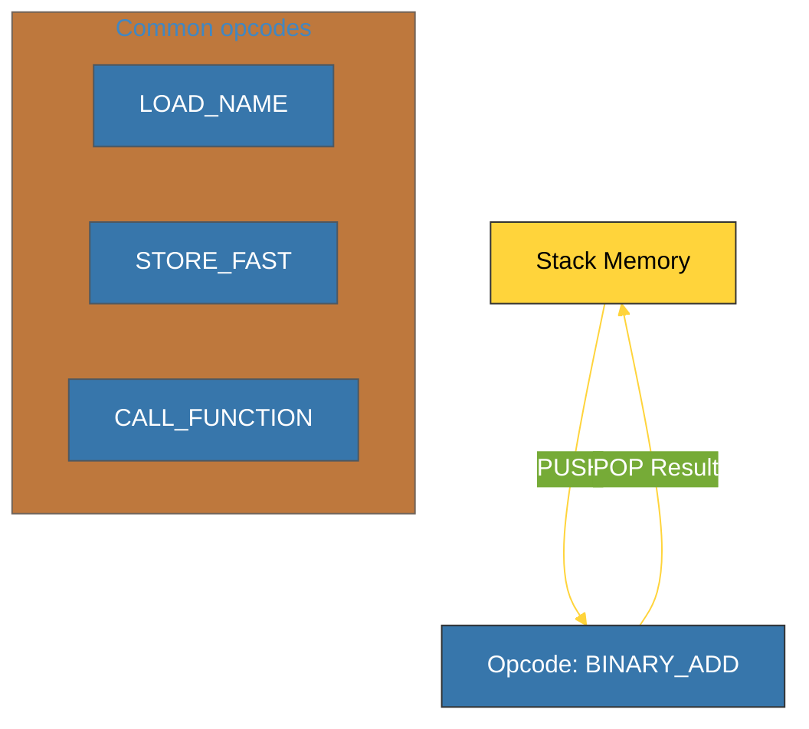

# BK-02: Bytecode Disassembly (Analisis PVM) [x] Complete

> **"Bytecode is the final truth about how Python executes your code."**

Buku ini membedah **Bytecode Disassembly**, teknik untuk membaca "bahasa rakitan" yang dimengerti oleh Python Virtual Machine (PVM). Kita akan menggunakan modul `dis` untuk membongkar misteri eksekusi kode dan memahami mengapa beberapa pola penulisan lebih efisien daripada yang lain di level rendah.

---

## 🌐 Source Hub (Authority)
- **Primary Source**: [Python Docs - dis (Disassembler for Python bytecode)](https://docs.python.org/3/library/dis.html)
- **Strategic Blueprint**: [RAK-04 Core Mechanics](file:///i:/Workspace/Workspace-Syahputrawork/01-Language-Hubs-Workspace/Python-Knowledge-Base/RAK-04-core-mechanics/README.md)

---

## 🧠 The Essence (Narrative)
Python adalah **Stack-based Virtual Machine**. Artinya, setiap operasi dilakukan dengan mendorong nilai ke atas tumpukan (*PUSH*) dan mengambilnya kembali (*POP*). Dengan modul `dis`, kita dapat melihat instruksi nyata yang dihasilkan oleh kompilator. Misalnya, operasi `a + b` diterjemahkan menjadi urutan `LOAD_NAME` (a), `LOAD_NAME` (b), dan `BINARY_ADD`. Memahami bytecode adalah kunci untuk melakukan optimasi mikro serta memahami bagaimana fitur baru (seperti *Structural Pattern Matching*) benar-benar bekerja di jeroan mesin.

---

## 🎨 Visual Logic (PVM Instruction Set Map)



---

## 🛠️ The Disassembler Lab
Gunakan modul `dis` untuk membedah fungsi Anda:
```python
import dis

def add(a, b):
    return a + b

dis.dis(add)
```

---

## ⚠️ Pitfalls
- **Python 3.11+ Specialization**: Sejak Python 3.11 (PEP 659), Python memiliki *Specializing Adaptive Interpreter*. Artinya, bytecode bisa berubah secara dinamis saat runtime berdasarkan tipe data yang sering lewat (Optimasi JIT-like). Jangan kaget jika bytecode yang Anda lihat sedikit berbeda atau memiliki instruksi `RESUME`.
- **Instruction Overload**: Jangan mencoba menghafal setiap instruksi opcode. Fokuslah pada alur (*Flow*) dan bagaimana stack dikelola. Gunakan dokumentasi resmi sebagai kamus saat melakukan bedah kode yang kompleks.

---
*Back to [SR-06 PVM & Bytecode](../README.md)*
