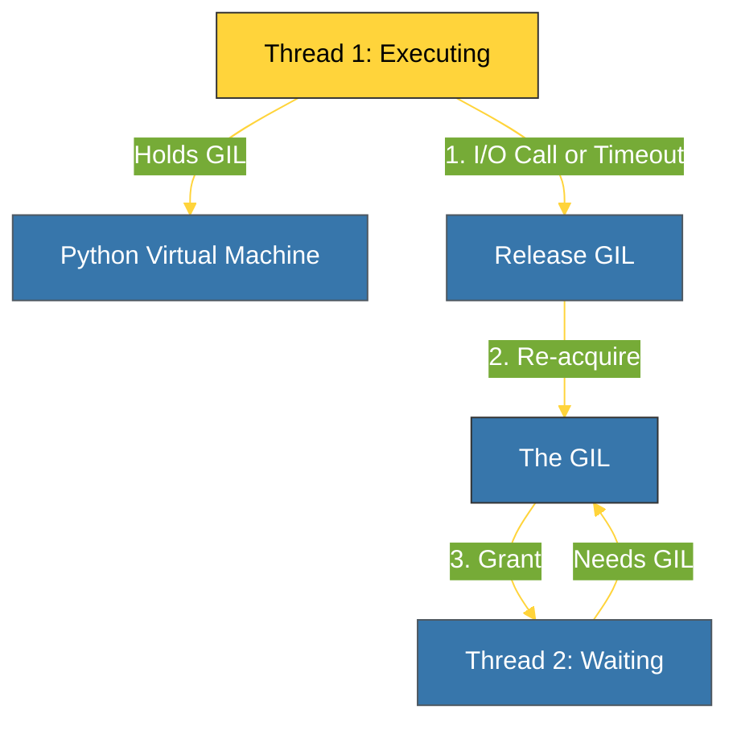

# BK-01: GIL Mechanism (Global Interpreter Lock) [x] Complete

> **"The GIL is the price we pay for CPython's simple and robust memory management."**

Buku ini membedah **Global Interpreter Lock (GIL)**, mekanisme sinkronisasi tingkat rendah yang memastikan hanya satu thread yang dapat mengeksekusi bytecode Python secara bersamaan dalam satu interpreter. Kita akan mempelajari mengapa GIL itu ada, bagaimana cara kerjanya, dan mengapa ia menjadi topik paling diperdebatkan di ekosistem Python.

---

## 🌐 Source Hub (Authority)
- **Primary Source**: [Python Glossary - Global Interpreter Lock](https://docs.python.org/3/glossary.html#term-global-interpreter-lock)
- **Primary Source**: [Python Wiki - GlobalInterpreterLock](https://wiki.python.org/moin/GlobalInterpreterLock)
- **Strategic Blueprint**: [RAK-04 Core Mechanics](file:///i:/Workspace/Workspace-Syahputrawork/01-Language-Hubs-Workspace/Python-Knowledge-Base/RAK-04-core-mechanics/README.md)

---

## 🧠 The Essence (Narrative)
Mengapa Python memiliki GIL? Alasan utamanya adalah **Thread Safety** di level C. Karena CPython menggunakan Reference Counting (SR-05) untuk manajemen memori, ada risiko *Race Condition* di mana dua thread mencoba menaikkan/menurunkan refcount objek yang sama secara bersamaan, yang bisa menyebabkan kebocoran memori atau crash. Daripada menambahkan lock kecil di setiap objek (yang akan memperlambat eksekusi single-thread), CPython memilih satu lock besar untuk seluruh interpreter. Akibatnya: kode Python Anda aman dari *internal corruption*, tetapi tidak bisa memanfaatkan multi-core secara penuh untuk tugas-tugas berat CPU (*CPU-bound tasks*).

---

## 🎨 Visual Logic (GIL Locking Cycle)

---

## 🛠️ When is the GIL released?
Python sangat cerdas dalam melepaskan kunci ini agar program tidak macet:
1.  **I/O Operations**: Saat melakukan baca/tulis file atau jaringan, GIL dilepaskan sehingga thread lain bisa bekerja.
2.  **Timeouts**: Sejak Python 3.2, interpreter rutin mengecek apakah sebuah thread sudah memegang GIL terlalu lama (biasanya 5ms) dan memaksanya untuk melepaskannya.
3.  **Extension Modules**: Kode C (seperti NumPy) dapat melepaskan GIL secara eksplisit untuk menjalankan perhitungan berat secara paralel di multi-core.

---

## ⚠️ Pitfalls & The Future
- **The Multi-core Myth**: Menambah thread pada program Python yang murni melakukan perhitungan matematika (CPU-bound) **tidak akan** mempercepat pengerjaan, bahkan bisa memperlambat karena overhead perpindahan GIL.
- **Python 3.13 (Free-threading)**: Setelah bertahun-tahun, Python 3.13 memperkenalkan opsi eksperimental untuk menjalankan Python **tanpa GIL** sama sekali (PEP 703). Namun, untuk saat ini, GIL tetap menjadi standar industri.

---
*Back to [SR-07 The GIL](../README.md)*
