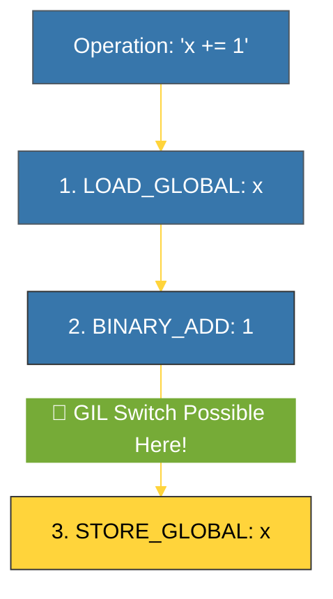

# BK-02: Thread Safety Cost (Kontrol Atomisitas) [x] Complete

> **"The GIL protects Python's internals, but it does NOT protect your application data from race conditions."**

Buku ini membedah **Thread Safety** di Python. Kita akan mempelajari mengapa GIL bukan pengganti mekanisme sinkronisasi seperti *Lock*, serta bagaimana operasi sederhana di level Python berubah menjadi beberapa instruksi bytecode yang tidak atomik.

---

## 🌐 Source Hub (Authority)
- **Primary Source**: [Python Documentation - threadsafe](https://docs.python.org/3/library/threading.html#module-threading)
- **Strategic Blueprint**: [RAK-04 Core Mechanics](file:///i:/Workspace/Workspace-Syahputrawork/01-Language-Hubs-Workspace/Python-Knowledge-Base/RAK-04-core-mechanics/README.md)

---

## 🧠 The Essence (Narrative)
Banyak pengembang menganggap karena ada GIL, mereka tidak butuh *Lock* (Mutex) untuk variabel global. Ini adalah **Kesalahan Fatal**. GIL hanya menjamin interpreter tidak *crash* saat mengakses memori secara bersamaan. Namun, operasi Python seperti `x += 1` sebenarnya memerlukan **tiga langkah bytecode**: 1. Ambil nilai X, 2. Tambah 1, 3. Simpan kembali ke X. Karena GIL bisa dilepaskan di tengah-tengah langkah ini, thread lain bisa masuk dan mengacaukan perhitungan. Inilah yang disebut sebagai **Non-Atomic Operation**, dan satu-satunya cara mengatasinya adalah dengan menggunakan sinkronisasi eksplisit.

---

## 🎨 Visual Logic (Bytecode Atomicity Breakdown)

---

## 🛠️ Comparison: Atomic vs Non-Atomic
- **Atomic Operations (Aman Tanpa Lock)**:
    - `list.append(x)`
    - `dict.update(other)`
    - `variable = other` (Assignment tunggal)
- **Non-Atomic Operations (Butuh Lock)**:
    - `x += 1` (Inplace addition)
    - `if x > 10: x -= 1` (Check-then-act)
    - `x = x + 1`

---

## ⚠️ Pitfalls
- **The "It Works on My Machine" Trap**: Race conditions bersifat probabilistik. Program Anda mungkin berjalan lancar di komputer lokal dengan sedikit thread, namun meledak di produksi saat beban kerja meningkat. Selalu gunakan `threading.Lock()` untuk data yang dibagi antar-thread.
- **Deadlocks**: Jangan menggunakan lock terlalu banyak atau secara bersarang (*Nested Locks*) tanpa strategi yang jelas, karena bisa menyebabkan *Deadlock* di mana semua thread saling menunggu selamanya.

---
*Back to [SR-07 The GIL](../README.md)*
