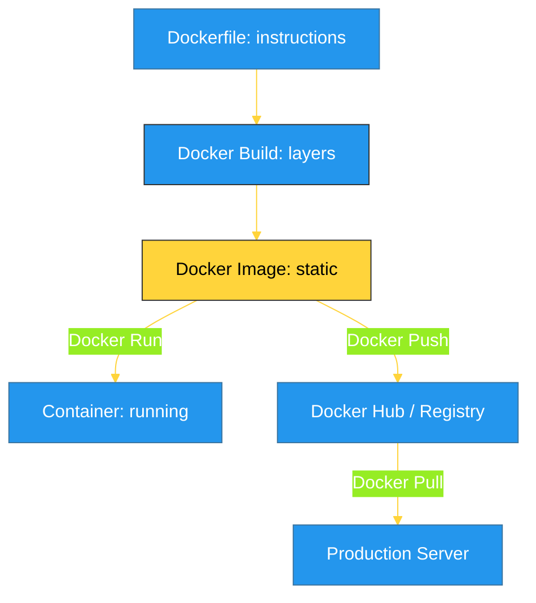

# BK-01: Dockerization (The Container Standard) [x] Complete

> **"If a system is worth building, it's worth containerizing. Portability is the true final step of engineering."**

Buku ini membedah **Dockerization**, standar industri untuk membungkus aplikasi Python beserta seluruh ketergantungannya ke dalam satu unit yang terisolasi (**Container**). Kita akan mempelajari bagaimana memastikan aplikasi Specializations kita dapat berjalan di server mana pun tanpa ada masalah "it works on my machine".

---

## 🌐 Source Hub (Authority)
- **Primary Source**: [Docker Documentation for Python](https://docs.docker.com/language/python/)
- **Best Practices**: [Dockerizing Python Applications Guide](https://testdriven.io/blog/dockerizing-flask-with-postgres-gunicorn-and-nginx/)

---

## 🧠 The Essence (Narrative)
Secara teknis, Docker adalah lapisan abstraksi yang memisahkan aplikasi dari sistem operasi host. Alih-alih menginstal Python dan library secara manual di server, kita membuat **Docker Image**—sebuah "blueprint" statis yang berisi sistem operasi mini, runtime Python, dan kode kita. Intisari dari bab ini adalah **The Layer Principle**: setiap instruksi di Dockerfile menciptakan lapisan baru. Dengan mengoptimalkan urutan instruksi, kita dapat mempercepat waktu pembuataan (*build time*) secara signifikan.

---

## 🎨 Visual Logic (Docker Build & Run Cycle)



---

## 🛠️ Implementation: High-Performance Dockerfile
```dockerfile
# 1. Build Stage (Builder)
FROM python:3.12-slim as builder
WORKDIR /app
COPY requirements.txt .
RUN pip install --user --no-cache-dir -r requirements.txt

# 2. Final Stage (Runner)
FROM python:3.12-slim
WORKDIR /app
# Ambil library dari builder tanpa membawa sampah build
COPY --from=builder /root/.local /root/.local
COPY . .

ENV PATH=/root/.local/bin:$PATH
CMD ["python", "app.py"]
```

---

## ⚠️ Pitfalls
- **The Fat Image**: Menggunakan image basis yang terlalu besar (seperti `python:3.12` standar) dapat menghasilkan image berukuran giga-byte. Selalu gunakan varian `-slim` atau `-alpine` untuk menghemat ruang disk dan waktu transfer.
- **Root User Risk**: Secara default, Docker menjalankan aplikasi sebagai `root`. Ini berbahaya bagi keamanan. Selalu buat user non-privileged di dalam Dockerfile Anda.
- **ENV vs ARG**: Jangan pernah menyimpan rahasia (API Keys) di dalam `ARG` atau `ENV` yang tertulis keras di Dockerfile. Gunakan *Docker Secrets* atau *Environment Variables* yang disuntikkan saat runtime.

---
*Back to [RAK-07 Specializations](../README.md)*
