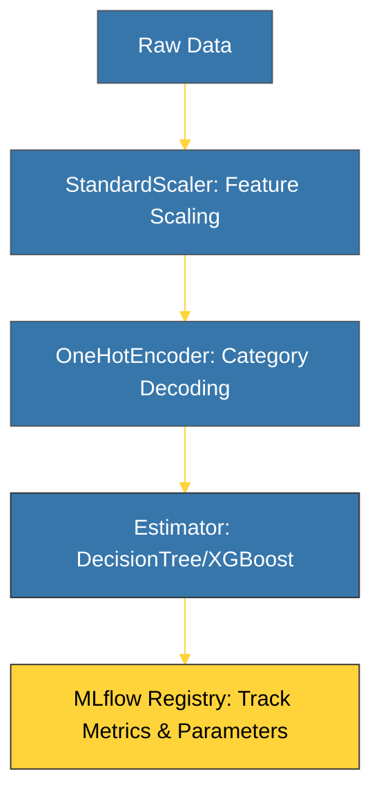

# BK-02: ML Pipelines (From Logic to Production) [x] Complete

> **"A single model is a point in time; a pipeline is a factory that generates value over time."**

Buku ini membedah **ML Pipelines**, kerangka kerja untuk mengotomatisasi seluruh alur pembelajaran mesin—mulai dari prapemrosesan data hingga pelatihan model. Kita juga akan mempelajari bagaimana **MLflow** digunakan sebagai sistem pelacakan (experiment tracking) untuk mencatat setiap parameter dan metriks pelatihan secara profesional.

---

## 🌐 Source Hub (Authority)
- **Primary Source**: [Scikit-learn: Pipelines and Composite Estimators](https://scikit-learn.org/stable/modules/compose.html#pipeline)
- **Tool Standard**: [MLflow: Open Source Platform for the ML Lifecycle](https://mlflow.org/docs/latest/index.html)

---

## 🧠 The Essence (Narrative)
Membangun model ML bukan sekadar latihan memanggil `model.fit()`. Kesalahan terbesar yang sering dilakukan adalah **Data Leakage** (pembocoran data uji ke dalam pelatihan). **ML Pipelines** membantu mengunci seluruh proses transformasi data (scaling, encoding, imputation) menjadi satu kesatuan yang koheren. Intisari dari bab ini adalah **The Lifecycle Logic**: setiap kali Anda mengubah parameter model, Anda mencatatnya di **MLflow** untuk memastikan eksperimen Anda dapat diulangi dan diaudit.

---

## 🎨 Visual Logic (ML Pipeline Flow)



---

## 🛠️ Implementation: Automated Pipeline
```python
from sklearn.pipeline import Pipeline
from sklearn.preprocessing import StandardScaler
from sklearn.linear_model import LogisticRegression
import mlflow

# 1. Start Experiment Tracking
mlflow.set_experiment("Salary Prediction")
with mlflow.start_run():
    # 2. Build Pipeline
    pipe = Pipeline([
        ('scaler', StandardScaler()),
        ('classifier', LogisticRegression())
    ])

    # 3. Fit & Log
    pipe.fit(X_train, y_train)
    mlflow.log_param("C_value", 1.0)
    mlflow.log_metric("accuracy", pipe.score(X_test, y_test))
    mlflow.sklearn.log_model(pipe, "model")
```

---

## ⚠️ Pitfalls
- **Data Leakage**: Melakukan `fit()` pada scaler menggunakan *seluruh* dataset sebelum dipisah menjadi Train/Test adalah kesalahan fatal. Scaler hanya boleh "mempelajari" distribusi data dari **Train set**. Pipeline secara otomatis menangani ini dengan benar.
- **Model Versioning**: Tanpa MLflow, Anda akan berakhir dengan file bernama `model_v1_final_final_v2_fix.pkl`. MLflow memecahkan ini dengan sistem **Model Registry** yang memungkinkan Anda menandai model sebagai "Staging" atau "Production".
- **Parameter Sensitivity**: Tidak semua variabel adalah parameter. Jangan mencatat metadata logis (seperti `random_state`) sebagai parameter performa utama yang akan di-tune.

---
*Back to [SR-02 AI & ML Engineering](../README.md)*
