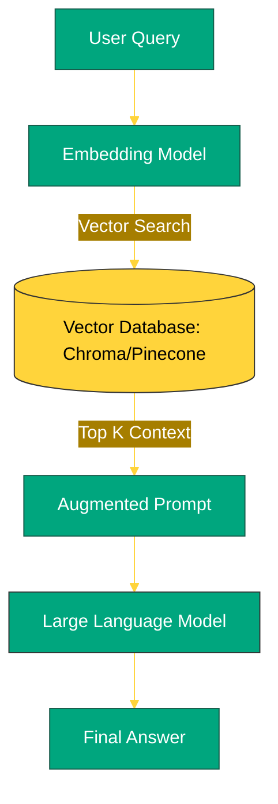

# BK-01: LangChain Orchestration (RAG & Agents) [x] Complete

> **"A Large Language Model is a brain; LangChain is the nervous system that connects it to the world."**

Buku ini membedah **LangChain**, framework orkestrasi paling dominan untuk membangun aplikasi berbasis LLM. Kita akan mempelajari bagaimana cara menghubungkan model bahasa dengan data eksternal Anda sendiri melalui teknik **RAG (Retrieval-Augmented Generation)** dan bagaimana menciptakan **AI Agents** yang mampu mengambil keputusan secara otonom.

---

## 🌐 Source Hub (Authority)
- **Primary Source**: [LangChain Official Documentation](https://python.langchain.com/docs/introduction/)
- **Concept Guide**: [Retrieval-Augmented Generation (RAG) Explained](https://aws.amazon.com/what-is/retrieval-augmented-generation/)

---

## 🧠 The Essence (Narrative)
LLM (seperti GPT-4 atau Llama-3) memiliki pengetahuan statis hingga tanggal pemotongannya. **RAG** memecahkan batasan ini dengan memberikan model akses ke "perpustakaan" data baru Anda saat runtime. Prosesnya melibatkan:
1.  **Ingestion**: Memecah dokumen menjadi potongan kecil (*Chunks*).
2.  **Embedding**: Mengubah teks menjadi koordinat angka (Vektor) yang mewakili makna semantik.
3.  **Retrieval**: Mencari potongan teks yang paling relevan dengan pertanyaan user.
4.  **Augmentation**: Mengirimkan teks relevan tersebut sebagai konteks tambahan ke LLM.
Intisari dari bab ini adalah memahami bagaimana **Chains** menggabungkan komponen-komponen ini menjadi alur kerja yang cerdas.

---

## 🎨 Visual Logic (RAG Architecture)



---

## 🛠️ Implementation: Simple RAG Chain
```python
from langchain_community.document_loaders import TextLoader
from langchain_text_splitters import CharacterTextSplitter
from langchain_openai import OpenAIEmbeddings, ChatOpenAI
from langchain_community.vectorstores import Chroma

# 1. Load & Split
loader = TextLoader("data_internal.txt")
documents = loader.load()
text_splitter = CharacterTextSplitter(chunk_size=1000, chunk_overlap=0)
docs = text_splitter.split_documents(documents)

# 2. Embed & Store
vectorstore = Chroma.from_documents(docs, OpenAIEmbeddings())

# 3. Query
retriever = vectorstore.as_retriever()
chain = RetrievalQA.from_chain_type(llm=ChatOpenAI(), retriever=retriever)
response = chain.run("Apa isi kebijakan cuti tahun ini?")
```

---

## ⚠️ Pitfalls
- **Token Inflation**: Memberikan terlalu banyak konteks ke LLM dapat menghabiskan kuota token dengan sangat cepat. Gunakan teknik *Recursive Character Splitting* untuk meminimalisir teks yang tidak perlu.
- **Hallucinations**: Meskipun menggunakan RAG, LLM tetap bisa berhalusinasi jika konteks yang ditemukan tidak relevan. Selalu gunakan instruksi "Hanya jawab berdasarkan konteks yang diberikan; jika tidak ada, katakan tidak tahu".
- **Semantic Drift**: Embeddings yang buruk akan menghasilkan hasil pencarian yang tidak nyambung secara makna. Pastikan model embedding Anda selaras dengan bahasa dan domain data Anda (misal: Bahasa Indonesia vs Inggris).

---
*Back to [SR-03 GenAI & LLM Ops](../README.md)*
