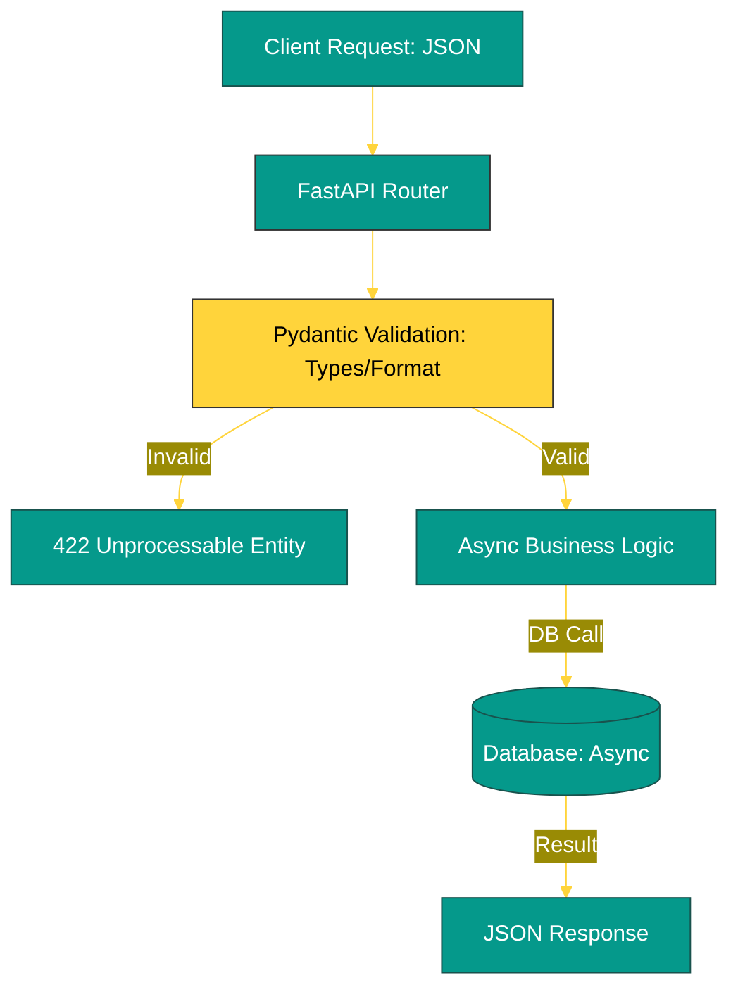

# BK-01: FastAPI Standard (Async & Pydantic V2) [x] Complete

> **"A modern API is a contract between speed, safety, and documentation. FastAPI fulfills all three."**

Buku ini membedah **FastAPI**, framework web tercepat dan paling modern untuk membangun API dengan Python. Kita akan mempelajari bagaimana memanfaatkan **Asynchronous I/O** untuk menangani ribuan koneksi bersamaan dan bagaimana **Pydantic V2** menjamin validasi data yang sangat ketat dan cepat di level sistem.

---

## 🌐 Source Hub (Authority)
- **Primary Source**: [FastAPI Official Documentation](https://fastapi.tiangolo.com/)
- **Data Validation**: [Pydantic V2 Documentation](https://docs.pydantic.dev/latest/)

---

## 🧠 The Essence (Narrative)
Dulu, Python dianggap lambat untuk web karena sifatnya yang *Synchronous* (satu permintaan memblokir yang lain). **FastAPI** memecahkan ini dengan **`async/await`**, memungkinkan server mengerjakan tugas lain saat menunggu I/O (seperti Database atau API luar). Intisari dari bab ini adalah **The Pydantic Shield**: data yang masuk ke API Anda divalidasi dan diubah menjadi objek Python secara otomatis, menghasilkan dokumentasi **OpenAPI (Swagger)** secara cuma-cuma tanpa kode tambahan.

---

## 🎨 Visual Logic (Request Lifecycle)



---

## 🛠️ Implementation: High-Speed Async API
```python
from fastapi import FastAPI, Depends
from pydantic import BaseModel

app = FastAPI()

# 1. Schema Definition (Pydantic)
class User(BaseModel):
    name: str
    email: str
    age: int

# 2. Async Endpoint
@app.post("/users/")
async def create_user(user: User):
    # Simulasi I/O asinkron (misal: simpan ke DB)
    return {"message": f"User {user.name} created successfully"}
```

---

## ⚠️ Pitfalls
- **Blocking the Event Loop**: Jangan pernah memanggil fungsi sinkron yang berat (misal: `time.sleep()` atau operasi file besar tanpa `await`) di dalam fungsi `async def`. Ini akan membekukan seluruh server untuk semua user lain.
- **CORS Vulnerability**: Secara default, FastAPI sangat aman. Anda harus mengonfigurasi `CORSMiddleware` dengan benar agar aplikasi frontend (seperti React/Vue) dapat mengakses API Anda tanpa membuka celah keamanan bagi penyerang.
- **Dependency Overuse**: Meskipun *Dependency Injection* sangat kuat, menggunakannya secara berlebihan untuk hal-hal sepele dapat membuat alur kode menjadi sulit dibaca dan di-*trace*.

---
*Back to [SR-04 Scalable Web Systems](../README.md)*
