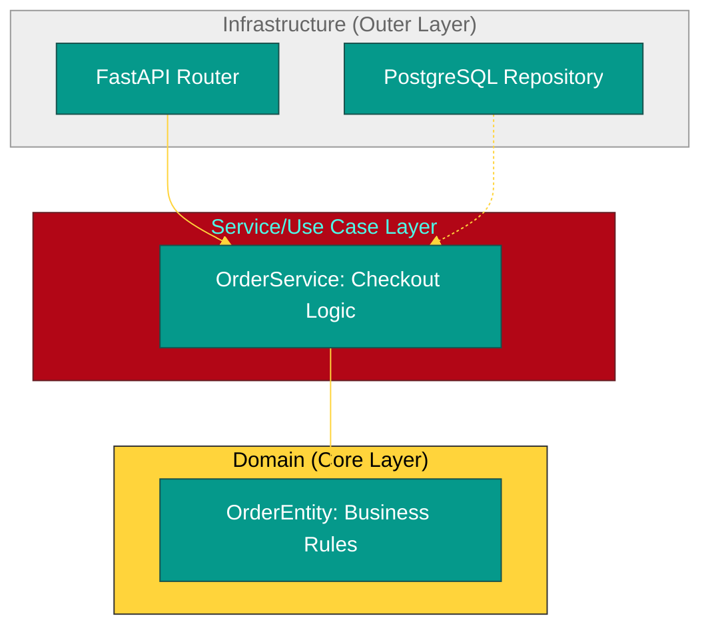

# BK-02: Clean Architecture (Systems that Last) [x] Complete

> **"A good architecture allows major decisions to be deferred. A great architecture allows them to be changed without pain."**

Buku ini membedah **Clean Architecture**, filosofi desain sistem yang memisahkan logika bisnis inti dari detail teknis (seperti Database atau Web Framework). Kita akan mempelajari bagaimana menerapkan **Onion Architecture** dan **Repository Pattern** di dalam Python agar aplikasi Anda mudah diuji, divalidasi, dan dikembangkan dalam jangka panjang.

---

## 🌐 Source Hub (Authority)
- **Primary Source**: [The Clean Architecture (Uncle Bob)](https://blog.cleancoder.com/uncle-bob/2012/08/13/the-clean-architecture.html)
- **Python Standard**: [Architecture Patterns with Python (Cosmic Python)](https://www.cosmicpython.com/)

---

## 🧠 The Essence (Narrative)
Banyak developer mencampuradukkan kode SQL dengan kode API. Saat database berganti, seluruh aplikasi hancur. **Clean Architecture** membagi sistem menjadi lapisan-lapisan konsentris. Lapisan terdalam adalah **Entities** (logika bisnis murni). Lapisan luar adalah **Infrastruktur** (Database, Web API). Intisari dari bab ini adalah **Dependency Inversion**: Logika bisnis tidak boleh bergantung pada database; database-lah yang harus menyesuaikan diri dengan aturan bisnis.

---

## 🎨 Visual Logic (Clean Architecture Layers)



---

## 🛠️ Implementation: Repository Pattern
Dengan Repository Pattern, kita menggunakan **Interface** (abstraksi) untuk mengakses data:
```python
# 1. Abstraksi (Domain)
from abc import ABC, abstractmethod

class UserRepository(ABC):
    @abstractmethod
    def get_by_email(self, email: str):
        pass

# 2. Implementasi (Infrastructure)
class PostgresUserRepository(UserRepository):
    def get_by_email(self, email: str):
        # Logika SQL SQLAlchemy/tortoise di sini
        return "User from Database"

# 3. Penggunaan (Service)
def register_user(repo: UserRepository, email: str):
    # Tidak peduli apakah repo itu Postgres atau Mock !
    user = repo.get_by_email(email)
    return user
```

---

## ⚠️ Pitfalls
- **Over-Engineering**: Untuk proyek kecil (MVP), Clean Architecture mungkin terasa terlalu berat karena banyaknya file "Boilerplate". Gunakan hanya saat Anda tahu sistem akan tumbuh besar secara kompleks.
- **DTO Fatigue**: Terlalu banyak memetakan objek dari satu lapisan ke lapisan lain (Data Transfer Objects) dapat melelahkan dan menyebabkan bug sulit dilacak jika tidak dilakukan dengan hati-hati.
- **The "Repository as a Service" Trap**: Jangan biarkan Repository Anda berisi logika bisnis. Repository hanya boleh berisi "logika penyimpanan" (Simpan/Ambil/Hapus). Logika "Berapa diskonnya?" harus ada di **Service** atau **Entity**.

---
*Back to [SR-04 Scalable Web Systems](../README.md)*
