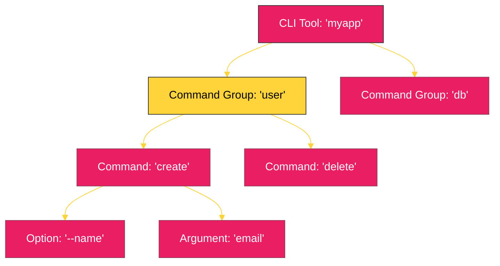

# BK-01: CLI Power Tools (Click & Typer) [x] Complete

> **"A great CLI tool is a silent partner that makes complex tasks feel like a single keystroke."**

Buku ini membedah **Pembangunan Alat Bantu CLI (Command Line Interface)** yang profesional menggunakan Python. Kita akan meninggalkan kerumitan `argparse` standar untuk mengeksplorasi **Click** dan **Typer**—dua framework yang memungkinkan kita membangun utility tools yang intuitif, terdokumentasi secara otomatis, dan menyenangkan untuk digunakan.

---

## 🌐 Source Hub (Authority)
- **Primary Source**: [Click Official Documentation](https://click.palletsprojects.com/)
- **Modern Alternative**: [Typer: Build Great CLIs. Easy to write. Based on Python type hints.](https://typer.tiangolo.com/)

---

## 🧠 The Essence (Narrative)
Python sering digunakan untuk skrip "sekali pakai", tetapi di lingkungan enterprise, skrip tersebut harus menjadi alat yang tangguh. **Click** (Command Line Interface Creation Kit) memberikan kendali penuh atas argumen dan opsi dengan sintaks dekorator yang bersih. **Typer** membawa ini lebih jauh dengan memanfaatkan *Type Hints* Python untuk menghasilkan validasi dan bantuan (help text) secara otomatis. Intisari dari bab ini adalah **The UX of Terminal**: bagaimana membuat alat yang memberikan pesan error yang jelas dan mendukung auto-completion.

---

## 🎨 Visual Logic (CLI Command Structure)



---

## 🛠️ Implementation: Professional CLI with Typer
```python
import typer

app = typer.Typer()

@app.command()
def hello(name: str, formal: bool = False):
    """
    Sapa seseorang dengan nama. 
    Gunakan --formal jika ingin sapaan resmi.
    """
    if formal:
        print(f"Good morning, Mr./Ms. {name}")
    else:
        print(f"Hello {name}!")

if __name__ == "__main__":
    app()
```

---

## ⚠️ Pitfalls
- **The Argument Error**: Menggunakan argumen wajib secara berlebihan dapat membingungkan user. Gunakan **Options** (`--flag`) untuk parameter yang opsional atau memiliki nilai default.
- **Global States**: Menghindari penggunaan variabel global yang berubah di antara perintah CLI jika Anda menggunakan grup perintah yang kompleks.
- **Output Verbosity**: Selalu berikan flag `--verbose` atau `-v` agar user dapat melihat apa yang terjadi di balik layar ("Under the Hood") saat terjadi kegagalan sistem.

---
*Back to [SR-05 Enterprise Automation](../README.md)*
