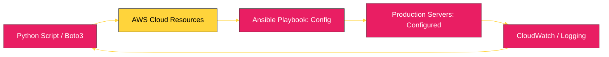

# BK-02: Cloud Infrastructure (Boto3 & Ansible) [x] Complete

> **"Code is the blueprint; Infrastructure is the building. Automation is the construction crew that never sleeps."**

Buku ini membedah **Otomatisasi Infrastruktur Awan (Cloud)** menggunakan Python. Kita akan mempelajari bagaimana mengendalikan sumber daya AWS secara programatik dengan **Boto3** dan bagaimana mengelola konfigurasi server ribuan titik secara terukur melalui **Ansible** (yang dibangun di atas Python).

---

## 🌐 Source Hub (Authority)
- **Primary Source**: [Boto3: The AWS SDK for Python](https://boto3.amazonaws.com/v1/documentation/api/latest/index.html)
- **Tool Standard**: [Ansible Documentation](https://docs.ansible.com/ansible/latest/index.html)

---

## 🧠 The Essence (Narrative)
Mengelola server secara manual melalui dashboard klik-klik di browser adalah resep untuk bencana (human error). **Boto3** memungkinkan kita menulis kode Python untuk menyalakan server, membuat storage (S3), atau mengatur jaringan secara otomatis. **Ansible**, di sisi lain, membantu kita memastikan bahwa server-server tersebut memiliki konfigurasi yang identik (Idempotency). Intisari dari bab ini adalah **Infrastructure as Code (IaC)**: kemampuan untuk membangun seluruh sistem pusat data hanya dengan menjalankan satu skrip Python.

---

## 🎨 Visual Logic (Cloud Automation Loop)



---

## 🛠️ Implementation: AWS S3 with Boto3
```python
import boto3

# 1. Initialize Client
s3 = boto3.client('s3')

# 2. List Buckets (Otomatis menggunakan kredensial di ~/.aws/credentials)
response = s3.list_buckets()

# 3. Output results
print("🚀 Your S3 Buckets:")
for bucket in response['Buckets']:
    print(f"   - {bucket['Name']}")
```

---

## ⚠️ Pitfalls
- **Credential Leak**: JANGAN PERNAH menulis `aws_access_key_id` langsung di dalam kode. Selalu gunakan *Environment Variables* atau file konfigurasi lokal (`~/.aws/credentials`). Kebocoran kredensial di GitHub dapat mengakibatkan tagihan ribuan dolar dalam semalam.
- **API Throttling**: Layanan awan seperti AWS memiliki batasan jumlah panggilan API per detik. Jika skrip otomatisasi Anda melakukan terlalu banyak permintaan dalam waktu singkat, Anda akan terkena *limit/throttling*. Gunakan strategi *Exponential Backoff*.
- **State Drift**: Kadang orang mengubah infrastruktur secara manual di dashboard. Ini akan merusak status yang dicatat oleh Ansible. Disiplin sangat diperlukan: semua perubahan harus melalui kode.

---
*Back to [SR-05 Enterprise Automation](../README.md)*
