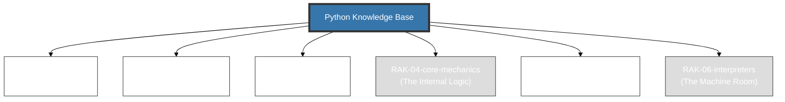

# Python Knowledge Base

> **"From Simple Scripts to AI Data Science."**

## 🏛️ Arsitektur 6-Rak (Universal Standard)
Repositori ini menggunakan **6-Rack Universal Architecture** dengan prinsip **Digital Mirroring** untuk memisahkan antara fondasi penggunaan dengan dekonstruksi arsitektur mesin.

---

## 🗄️ Struktur Perpustakaan

### 1. [RAK-01-anatomy](./RAK-01-anatomy/)
Menelusuri esensi naratif Python, Zen of Python, dan target utamanya.

### 2. [RAK-02-foundation](./RAK-02-foundation/)
Struktur dan sintaks fundamental layaknya membaca Python documentation secara presisi.

### 3. [RAK-03-evolution](./RAK-03-evolution/)
Jejak evolusi PEP (Python Enhancement Proposals) dan pergeseran versi.

### 4. [RAK-04-core-mechanics](./RAK-04-core-mechanics/)
Mekanisme Internal, membedah Python Data Model (Dunder Methods), dan Duck Typing.

### 5. [RAK-05-standard-library](./RAK-05-standard-library/)
Eksplorasi komprehensif Modul Built-in Python dan ekosistem `pip`.

### 6. [RAK-06-interpreters](./RAK-06-interpreters/)
Deep Dive ke dalam Jantung Eksekutor: CPython, Bytecode, GIL, dan PyPy.

---

## 📏 Standar Kualitas (Gold Standard)
Setiap materi mengikuti prinsip **Digital Mirroring** dan standar **PPM V4** yang mewajibkan:
1. **Source-Synced**: Akurasi 1:1 terhadap dokumentasi resmi/spesifikasi (docs.python.org / PEPs).
2. **Experimental Lab**: Kode pembuktian fungsional di folder `examples/` (.py).
3. **Mental Model Visual**: Diagram Mermaid di folder `assets/`.
4. **Narrative Excellence**: Penjelasan mendalam dengan analogi dunia nyata (The Serpent's Core).

*Dokumentasi Lengkap Standar: [docs/standards/architecture.md](./docs/standards/architecture.md)*

---
*Status Pengembangan: [status.md](./status.md)*
