# Python Knowledge Base

> **"Unlocking the Power of Pythonic Excellence: Ready for Senior Architects."**

## Latar Belakang & Visi
Python adalah bahasa yang sangat ekspansif, dari script sederhana hingga AI dan sistem engine C-API. Repositori ini membedah ekosistem Python secara anatomis mengikuti standar **docs.python.org** sebagai sumber kebenaran teknis tunggal.

## Struktur Perpustakaan (12-Rack Architecture)

```mermaid
graph TD
    Root["Python Knowledge Base"]
    
    RAK01["RAK-01-setup<br/>(The Environment)"]
    RAK02["RAK-02-tutorial<br/>(The Handbook)"]
    RAK03["RAK-03-reference<br/>(The Specs)"]
    RAK04["RAK-04-built-ins<br/>(The Essentials)"]
    RAK05["RAK-05-data-processing<br/>(The Data)"]
    RAK06["RAK-06-os-concurrency<br/>(The System)"]
    RAK07["RAK-07-network-web<br/>(The Cloud)"]
    RAK08["RAK-08-howtos<br/>(The Themes)"]
    RAK09["RAK-09-packaging<br/>(The Eco)"]
    RAK10["RAK-10-c-api<br/>(The Low-Level)"]
    RAK11["RAK-11-evolution<br/>(The Pulse)"]
    RAK12["RAK-12-faq-glossary<br/>(The Info)"]
    
    Root --> RAK01 & RAK02 & RAK03 & RAK04 & RAK05 & RAK06 & RAK07 & RAK08 & RAK09 & RAK10 & RAK11 & RAK12
    
    style Root fill:#3776ab,stroke:#333,stroke-width:4px,color:#fff
    style RAK01 fill:#fff,stroke:#333
    style RAK02 fill:#fff,stroke:#333
```

## Roadmap & Status Pengembangan

| Rak | Deskripsi | Status |
| :--- | :--- | :--- |
| `RAK-01-setup/` | Environment & CLI | *Planned* |
| `RAK-02-tutorial/` | Narrative Basics | *Planned* |
| `RAK-03-reference/` | Data & Execution Model | *Planned* |
| `RAK-04-built-ins/` | Functions & Essentials | *Planned* |
| `RAK-05-data-processing/` | Text, Binary, & Math | *Planned* |
| `RAK-06-os-concurrency/` | Systems & Asyncio | *Planned* |
| `RAK-07-network-web/` | HTTP & Protocols | *Planned* |
| `RAK-08-howtos/` | Thematic Guides (Logging, etc.) | *Planned* |
| `RAK-09-packaging/` | PIP, Venv, & Dist | *Planned* |
| `RAK-10-c-api/` | Extending with C/C++ | *Planned* |
| `RAK-11-evolution/` | Release Notes & PEPs | *Planned* |
| `RAK-12-faq-glossary/` | General Q&A | *Planned* |

---
*Dokumentasi Lengkap: [docs/README.md](./docs/README.md)*
