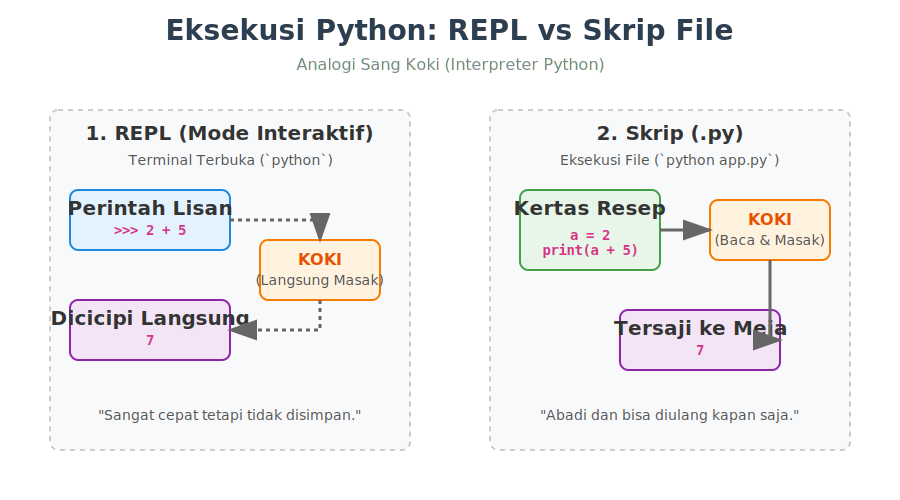

# Bab 01: Getting Started

Chapter Code: CORE-01-01
Version: Core.Fundamentals.01.00
Last Updated: 2026-03-14
Status: Released

> **Deskripsi Singkat**: Bab ini adalah pintu masuk untuk menjalankan kode Python menggunakan dua cara utama: terminal interaktif (REPL) dan Eksekusi Berkas Script (`.py`).

## 1. Analogi (Pendekatan Konsep)

### Analogi Singkat
> "Mempelajari Python pertama kali itu ibarat belajar memasak: **REPL** adalah mencicipi bumbu langsung dari sendok, sementara **Script** adalah menuliskan dan menyajikan resep masakan secara utuh."

### Analogi Panjang / Cerita
Bayangkan Interpreter Python sebagai seorang **Koki Profesional** di dapur Anda.
Saat Anda menggunakan **REPL** (membuka terminal, mengetik `python`, lalu menekan *enter*), Anda sedang berdiri di samping sang Koki. Anda berkata, "Potong bawang!" dan ia langsung memotong bawang serta menunjukkan hasilnya kepada Anda (interaktif). Ini sangat fantastis untuk eksperimen secara instan.
Namun, koki tersebut tidak memiliki daya ingat atas semua perintah lisan Anda sebelumnya.
Jika Anda ingin ia memasak sup ayam besok pagi tanpa harus Anda dikte ualng, Anda tidak memakai perintah lisan. Anda menuliskan resepnya pada selembar kertas—itulah **Teks Script (.py)**. Anda menyerahkan kertas (file `.py`) itu, sang Koki membacanya dari baris paling atas ke bawah tanpa bertanya ulang kepada Anda, mengeksekusinya, lalu menyajikan makanan jadinya langsung ke meja Anda (Output Terminal).

## 2. Istilah Kunci (Key Terms)

| Istilah | Definisi Singkat | Contoh |
|---|---|---|
| Interpreter | Program yang menerjemahkan dan mengeksekusi kode Python. | `python.exe` |
| REPL | *Read-Eval-Print Loop*, lingkungan interaktif tempat Anda mengetik kode yang langsung dieksekusi. | Mengetik `python` di terminal tanpa argumen. |
| Script | File teks berisi sekumpulan instruksi kode yang disimpan untuk dieksekusi sekaligus. | `app.py` |
| Terminal | Jendela perantara untuk mengetikkan perintah teks langsung ke sistem operasi. | Command Prompt, PowerShell, bash |
| Bytecode | Bentuk terjemahan perantara dari kode sumber (`.py`) sebelum dieksekusi CPU. | File berakhiran `.pyc` |

## 3. Konsep Utama
### Verifikasi Instalasi
Pastikan interpreter (Si Koki) sudah ada di dalam sistem operasi Anda.
Buka Command Prompt atau Terminal Anda, dan ketikkan perintah:
```bash
python --version
```
Atau di beberapa sistem (seperti macOS/Linux versi lama):
```bash
python3 --version
```
Jika terminal Anda membalas `Python 3.x.x`, berarti segalanya sudah siap.

### Dua Jalur Mengeksekusi Kode
1. **Mode Interaktif (REPL):** Berarti *Read-Eval-Print Loop*. Anda memasukkan kode per baris, dan Python akan langsung membacanya, mengevaluasi, lalu mencetak hasilnya di layar, lalu memutarnya kembali dari awal. Cara menggunakannya cukup dengan mengetik `python` (tanpa menambahkan nama file) di terminal.
2. **Mode Scripting (File `.py`):** Di sinilah perangkat lunak yang sesungguhnya diciptakan. Anda menulis rentetan baris kode logika ke dalam sebuah file berakhiran `.py` (misal `main.py`). Setelah itu Anda menyuruh Python mengeksekusi keseluruhannya sekaligus dengan mengetik `python nama_file.py`.

## 3. Di Balik Layar (Under the Hood)
Saat Anda mengetik baris kode seperti `print("Halo!")` di file, komputer tidak mengerti arti "print" maupun "Halo!". File teks .py hanyalah setumpuk karakter tanpa arti bagi mesin komputer.
Tugas dari *Interpreter Python* (aplikasi `python.exe`) adalah mengambil file tersebut, menerjemahkannya ke dalam bahasanya sendiri yang disebut bytecode, dan kemudian mengeksekusinya pada CPU operasi Anda. Oleh karena itu, kita **selalu harus memanggil nama `python` diikuti nama skripnya** pada terminal—kita sedang meminta agen penterjemah untuk mulai mendikte instruksi tersebut.

## 4. Peringatan / Jebakan Umum (Gotchas)
- **Hindari ini**: Lupa menyimpan perubahan file (`Ctrl+S`) di code editor Anda lalu mengeluh mengapa skrip Anda di terminal tidak berubah saat di-*run* ulang. Python membaca versi file yang tersimpan di memori hard drive Anda.
- **Ingat bahwa**: Anda harus berada pada *path/folder* yang sama dengan file script Anda di dalam terminal sebelum menjalankan perintah `python nama_file.py`. Jika terminal berada pada `/Dekstop/` namun file Anda di `/Proyek/`, terminal akan menampilkan pesan memilukan: `can't open file ... [Errno 2] No such file or directory`.

## 5. Visualisasi Analogi



## 6. Referensi Kode Praktik
Kode implementasinya dapat dijalankan secara langsung. Silakan lihat skrip lengkapnya pada direktori `examples/` di dalam bab ini.

- `01_basic_script.py`: Contoh sebuah skrip lurus ke bawah standar.
- `02_interactive_input.py`: Contoh skrip interaktif yang meminta interaksi data dari manusia sebelum mengeksekusi baris bawahnya.

Coba eksekusikan sendiri dan ubah-ubah teks di dalamnya!

## 6. Latihan (Validasi)
- [ ] Berhasil memanggil cek versi Python dari terminal Anda.
- [ ] Buka terminal, ketik `python`, lalu masukan `2 + 5` di dalam REPL. Apakah ia mengembalikan nilai 7? (Ketik `quit()` untuk keluar).
- [ ] Jalankan kode skrip `examples/01_basic_script.py` pada terminal Anda.
