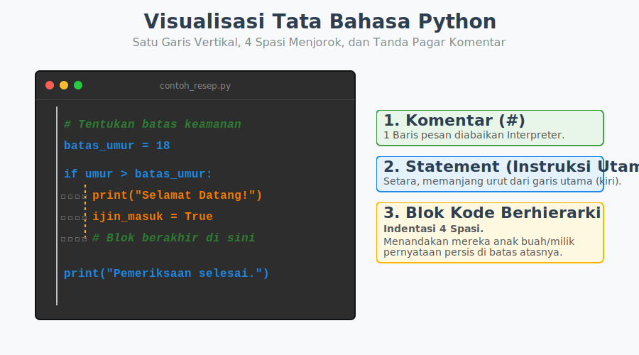

# Bab 02: Python Syntax

Chapter Code: CORE-01-02
Version: Core.Fundamentals.01.00
Last Updated: 2026-03-14
Status: Released

> **Deskripsi Singkat**: Bab ini memperkenalkan Tata Bahasa visual dari Python, yaitu bagaimana cara penulisan baris instruksi (Statement), pengaturan jarak menjorok anak buah balok kode (Indentasi), dan penambahan pesan bantuan (Komentar).

## 1. Analogi (Pendekatan Konsep)

### Analogi Singkat
> "Sintaks Python ibarat **Tata Bahasa (Grammar)** dalam sebuah surat resmi: meskipun surat tersebut memiliki pesan logika yang hebat, jika salah letak baris atau spasinya (indentasi lengser), si penerima (Interpreter) enggan membacanya dan membatalkan pesanan."

### Analogi Panjang / Cerita
Mari kita kembali berimajinasi dengan Koki (Interpreter) yang mengeksekusi Kode Anda. Di dapur restoran mana pun, hierarki organisasi sangat penting agar tidak terjadi kekacauan ("siapa membawahi siapa?").

Di bahasa pemrograman tradisional, Koki biasa mengenali anak buah dengan cara memasukkan mereka ke dalam sebuah **"ruangan yang dibatasi oleh pintu kurung kurawal" `{ ... }`**.
Namun Koki Dapur Python memiliki pendekatan berbeda. Sang Koki menilai relasi 'Bawahan-Atasan' murni melalui **pandangan visual menggunakan baris**. Koki akan melihat seberapa jauh sebuah instruksi *mundur menjorok* dari garis pinggir dinding kertas resep (sebuah sistem yang kita sebut **Indentasi 4 Spasi**).

- Jika Instruksi A dan B **sejajar lurus** rata di sebelah kiri kertas, Sang Koki menganggap mereka instruksi terpisah dan mandiri (Statement tunggal).
- Namun, jika instruksi C ditulis **menjorok 4 ketukan spasi ke dalam** tepat setelah instruksi B, Koki seketika tahu bahwa instruksi C adalah "anak buah" alias balok isi (Blok Kode) yang harus dijalankan sebagai bagian dari eksekusi instruksi B.

Sistem Indentasi baris ini membuat resep masakan Python selalu terlihat rapi, transparan, terstruktur visual, serta memaksa koki-koki yang buruk untuk tidak menulis instruksi dengan baris yang acak-acakan.

## 2. Istilah Kunci (Key Terms)

| Istilah | Definisi Singkat | Contoh |
|---|---|---|
| statement | satu baris instruksi komputasi Python secara mandiri | `x = 10` |
| block | sekumpulan statement dengan indentasi masuk yang seragam | isi turun dari `if`, `for`, `def` |
| indentation | dorongan spasi kosong di awal baris untuk menandakan anak buah/blok | `if umur > 18:\n    print(...)` |
| comment | catatan teks manusia yang sepenuhnya diabaikan oleh koki interpreter | `# Ini komentar untuk mengingatkan saya` |
| whitespace | karakter transparan seperti spasi, tab, atau Enter (baris baru) | ` `, `\t`, `\n` |

## 3. Konsep Utama
### A. Statement: Satu Instruksi, Satu Baris
Tindakan paling kecil dalam Python disebut Statement. Umumnya, satu baris kode di teks sama dengan satu Statement utuh.

```python
x = 10                  # <- Ini Statement 1 (Assignment)
print("Halo Dunia")     # <- Ini Statement 2 (Cetak Hasil)
```
Teks kode di atas **lurus** rata di pinggir baris, artinya mereka berjalan sekuensial satu per satu dari atas ke bawah.

### B. Indentasi: Balok Hierarki Kode
Saat Anda mulai melakukan logika kondisional (percabangan, perulangan, dsb), Anda membutuhkan yang namanya **"Blok Kode"**. Blok Kode di Python **diwajibkan menggunakan indentasi**, yaitu 4 kali spasi berturut-turut di depan kalimat.

```python
if x > 5:
    print("X cukup besar!")    # <- Ini blok milik si 'if'. 
    print("Mari proses x.")    # <- Ini juga milik si 'if' karena sejajar dengan atasnya.

print("Eksekusi program selesai.")  # <- Ini di LUAR jangkauan 'if' karena rata kiri.
```
Spasi di atas bukanlah penunjang estetika; Koki (Interpreter) menjadikan jumlah spasi ini sebagai aturan mutlak struktur logika program.

### C. Komentar: Surat Tidak Boleh Dibaca
Saat menulis file skrip, ada kalanya Anda ingin meninggalkan catatan pengingat bagi diri Anda atau anggota tim Anda, tetapi Anda tidak ingin Interpreter membacanya dan menerjemahkannya agar tidak error. Cukup sertakan tanda pagar `#`. Apapun kalimat di sebelah kanannya dalam 1 baris tidak akan dieksekusi.

## 3. Visualisasi Analogi



## 4. Di Balik Layar (Under the Hood)
Tidak seperti C++, Java, atau HTML yang sepenuhnya **membenci / mengabaikan** spasi putih kosong di file teks *(Whitespace In-sensitive)*, proses Lexical Scanner milik Interpreter CPython secara *built-in* dirancang untuk menganggap Spasi dan Tab (Newline) sebagai sebuah entri bermakna alias Token (`INDENT` dan `DEDENT`). Karena spasi secara teknis ikut dibaca mesin Python, maka ia harus diakui sebagai nyawa sintaks paling inti dan tidak dapat diabaikan keberadaanya sembarangan.

## 5. Peringatan / Jebakan Umum (Gotchas)
- **Hindari ini**: Mencampur pemakaian tekanan tombol **`Tab`** dan ketokan tombol **`Spasi`** bersama-sama. Meski layar mungkin menampilkan baris yang seolah-olah terlihat lurus, Python (sejak Python 3) akan melontarkan pesan gagal eksekusi error yang mengatakan `TabError: inconsistent use of tabs and spaces in indentation`. **Disarankan:** atur program *Text Editor* Anda untuk otomatis mengganti tekanan Tab menjadi 4 Spasi biasa.
- **Ingat bahwa**: Hilang 1 spasi atau kelebihan 1 spasi saja di Python akan menyebabkan Interpreter melontarkan `IndentationError: unexpected indent`. Python meminta Anda rapi secara presisi, bukan rapi kira-kira penglihatan mata.

## 6. Referensi Kode Praktik
Kode implementasinya dapat dijalankan secara langsung. Silakan lihat skrip lengkapnya pada direktori `examples/` di dalam bab ini.

- `01_statement_and_comment.py`: Demonstrasi rentetan baris kode lurus mandiri berhias narasi.
- `02_indentation_block.py`: Latihan visual melihat struktur lekukan spasi dan cara ia mempengaruhi jalan keluar blok tersebut ke aliran utama.

## 7. Latihan (Validasi)
- [ ] Buka dan fahami apa penyebab kode ini menjadi salah: 
  ```python
  pesan = "Halo!"
    print(pesan)
  ```
- [ ] Bukalah skrip Anda pada editor teks *modern* (seperti VS Code), cari letak *setting* indentasi, dan pastikan sudah terkonfigurasi untuk "Insert Spaces" dengan ukuran setara `4`.
- [ ] Rombak sedikit spasi di file `02_indentation_block.py` menjadikannya rata kiri semua dan saksikan Python meneriakkan `IndentationError` lewat Terminal.
