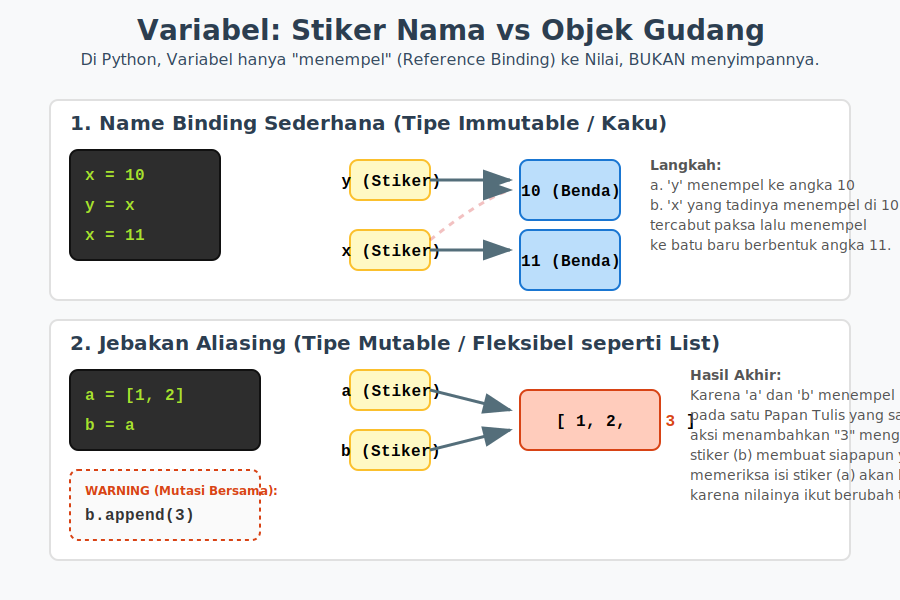

# Bab 03: Variables and Names

Chapter Code: CORE-01-03
Version: Core.Fundamentals.01.00
Last Updated: 2026-03-14
Status: Released

> **Deskripsi Singkat**: Bab ini meluruskan konsep paling mendasar di Python bahwa sebuah Variabel bukanlah "sebuah wadah yang diisi nilai", melainkan sekadar "label nama yang ditempelkan ke sebuah objek di memori penyimpanan".

## 1. Analogi (Pendekatan Konsep)

### Analogi Singkat
> "Variabel di Python ibarat sebuah **Label Nama (Stiker)**, sementara nilainya adalah **Barang Fisik** yang sesungguhnya di dalam sebuah Gudang Barang raksasa."

### Analogi Panjang / Cerita (Sistem Gudang Labeling)
Bayangkan Memori Komputer Anda adalah sebuah **Gudang Penyimpanan Bebas**.
Di bahasa pemrograman tradisional (seperti C/Java), membuat kode `x = 10` itu sama halnya dengan Anda membeli sebuah kotak tebal yang tidak bisa dipindah, menamainya **Kotak X**, lalu memasukkan barang berupa **angka 10** ke dalamnya.

Sayangnya, Koki Python kita tidak bekerja menggunakan kotak kaku. Ia bekerja menggunakan **Sistem Label Stiker (*Name Binding*)**.
Saat Anda menuliskan kalimat `x = 10`, si Koki akan berjalan ke tengah gudang, **memahat batu angka 10** di sana, lalu ia mengambil selembar stiker dan mernuliskannya huruf **"x"**, lalu menempelkannya di atas patung angka 10 tersebut.

**Bagaimana Kekuatan Labeling Beraksi (Aliasing):**
Jika keesokan harinya Anda menuliskan instruksi `y = x`, Koki Python **tidak akan menduplikasi/membuat patung angka 10 baru**. Sungguh membuang-buang tenaga! Alih-alih demikian, ia hanya mengambil stiker kosong, menamainya **"y"**, lalu menempelkannya di patung angka 10 yang sama dengan posisi tertempelnya stiker "x". Kini, satu barang fisik memiliki 2 nama stiker.

**Barang Kaku vs Barang Fleksibel (Immutable vs Mutable):**
- Di dalam gudang Python, ada berang berupa **Patung Batu (Immutable)** seperti angka dan teks. Batu tidak bisa ditebas/diubah wujudnya secara in-place. Jika Anda menyuruh mengubah nilai menjadi 11 lewat instruksi `x = 11`, koki akan memahat batu 11 yang baru sejauh beberapa meter di sana, lalu _MENCABUT_ stiker "x" dari patung angka 10 dan memindahkannya ke patung 11. (Stiker "y" tidak ikut berpindah).
- Di gudang juga ada barang berupa **Papan Tulis (Mutable)** seperti *List* belanja. Isinya bisa dicorat-coret in-place. Coba tebak apa yang terjadi jika Papan Tulis ini ditempeli dua stiker (x dan y) sekaligus? Jika Anda mencoret tulisan di papan mengikuti perintah stiker `y`, maka ketika keesokan harinya Anda menengok barang milik stiker `x` (karena ia merujuk ke papan tulis yang sama) isinya **juga ikut tercoret!** Inilah sihir berbahaya bernama *Aliasing*.

## 2. Istilah Kunci (Key Terms)

| Istilah | Definisi Singkat | Contoh |
|---|---|---|
| name binding | proses menempelkan stiker nama (label) ke sebuah objek di gudang memori | `x = 10` |
| assignment | instruksi di Python (memakai `=`) untuk menamai sebuah objek | `user = "Ana"` |
| mutable | objek "Papan Tulis" yang bisa diubah/diedit secara langsung wujud aslinya | tipe `list`, `dict` |
| immutable | objek statis dari "Batu" yang wujud aslinya selamanya tidak bisa diedit | tipe `int`, `str`, `tuple` |
| aliasing | fenomena ketika dua atau lebih stiker nama menempel persis di satu objek memori yang sama | `a = b` |

## 3. Konsep Utama
### A. Assignment adalah Name Binding
Pembuatan variabel menggunakan tanda sama dengan (`=`) ditujukan murni untuk mengikat referensi.
```python
poin = 100
skor = poin
```
Baris pertama mengikat stiker `poin` ke obyek memori berisi `100`. Baris kedua menempelkan stiker `skor` ke obyek memori **yang persis sama**. Keduanya adalah _Alias_ dari hal yang persis sama.

### B. Objek Tak Berubah (Immutable Types)
Ini mencakup bilangan asli (`int`, `float`), teks (`str`), boolean (`bool`), dan rangkaian terkunci (`tuple`). Ketika variabelnya dikenakan operasi penambahan/perubahan semacam `poin += 1` atau `poin = poin + 1`, Python sama sekali tidak memodifikasi objek 100 yang lama di memori karena "Kotaknya Kaku". Python membuat objek baru bernilai 101, lalu memindah-tempel *pointer* (label) `poin` menunjuk ke alamat 101 tersebut. Objek `100` yang terlantar tak berlabel kemudian akan otomatis dihapus oleh petugas pembersih (_Garbage Collector_).

### C. Objek Berubah In-Place (Mutable Types)
Ini mencakup daftar urutan (`list`), peta berpasangan (`dict`), dan kelompok himpunan unik (`set`).
Isi di dalam balok utamanya dapat dimodifikasi leluasa secara lokal (in-place) tanpa Python harus membuat objek replika utuhnya di alamat memori baru secara berulang-ulang setiap kali isi elemen berubah.

### D. Aliasing Berbahaya: `.copy()` Sebagai Penyelemat
Jika Anda berurusan dengan daftar mutasi:
```python
daftar_A = ["Susu", "Telur"]
daftar_B = daftar_A
daftar_B.append("Roti")

# Hasil: daftar_A akan mengejutkan Anda dengan menampilkan 3 barang!
```
Karena Anda tidak ingin mencemari `daftar_A` sewaktu memodifikasi `B`, Anda harus memaksa Koki membuat Papan Tulis (Objek) cadangan kedua. Perintahkan ini: `daftar_B = daftar_A.copy()`.

## 3. Visualisasi Analogi



## 4. Di Balik Layar (Under the Hood)
Di dalam ekosistem permesinan standar CPython, setiap kali interpreter membaca `x = 10`, yang sebenarnya terjadi di bawah tanah C-API adalah ia merujuk ke kumpulan besar *Struct PyObject* yang telah dialokasikan secara independen.
Hebatnya lagi, untuk menghemat memori, saat mesin pertama kali dihidupkan, Python sudah otomatis *pra-fabrikasi* ribuan patung angka `-5` hingga `256` kecil agar siap dilabeli tanpa harus memahat yang baru. Inilah sebabnya jika Anda menjalankan `a = 15` dan `b = 15` secara mandiri, mereka akan tetap saja otomatis dirujukkan paksa oleh sistem Koki secara ghaib pada objek statis (`15`) yang sama demi performa tingkat rendah.

## 5. Peringatan / Jebakan Umum (Gotchas)
- **Hindari ini**: Memanipulasi *List* (daftar bawaan sistem) langsung lintas nama lewat `x = mylist` dan berasumsi ini sudah membelah datanya menjadi dua tabel mandiri layaknya *Copy Value*. 
- **Ingat bahwa**: Fungsi perbandingan identitas bawaan di Python yaitu menggunakan kata sifat `is` (contoh: `if x is y`) bukan melihat apakan hasil pertambahan mereka setara angkanya, melainkan bertanya ke Interpreter "Hey, apakah Stiker x dan y ini menempel di satu barang ghaib dengan titik kordinat yang 100% sama presisi?". Sedangkan, operator `==` adalah menanyakan "Halo, apakah isi nilai tekstual dari dua barang ini punya kualitas/kuantitas mirip tanpa melihat asalnya?"

## 6. Referensi Kode Praktik
Seluruh kode implementasi bisa dijalankan secara interaktif. Silakan lihat isi logiknya pada direktori `examples/`:
- `01_name_binding.py`: Demonstrasi menggunakan fungsi detektif bawaan Python (yaitu `id()`) untuk melihat lamat kordinat asli benda tersebut di gudang. Ini akan membuktikan di mana stikernya menempel secara forensik sesungguhnya.
- `02_mutable_aliasing.py`: Menjabarkan jebakan _aliasing_ obyek papan tulis (`list`) sekaligus menjajal obat penawarnya dengan metode fungsi ekstensi `.copy()`.

## 7. Latihan (Validasi)
- [ ] Buka Terminal, masuk mode interaktif (Ketik `python`), lalu cobalah menuliskan dereten instruksi skenario `daftar_B = daftar_A` yang terlampir di atas. Lihat bukti nyata alienasi *List* tersebut.
- [ ] Cobalah perintah pengintip memori: Ketikkan teks `a = 500`. Di baris selanjutnya tuliskan `b = 500`. Uji mereka di _Terminal Interaktif_ Anda, dengan menuliskan `a is b` kemudian amati kenapa dia bisa mengeluarkan pernyataan keras `False` padahal 500 = 500.
