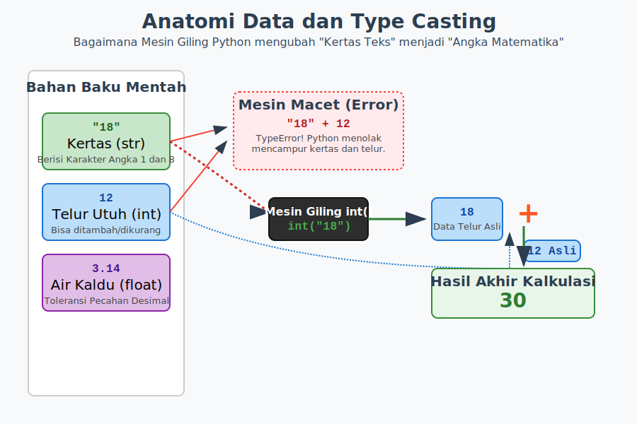

# Bab 04: Basic Data Types

Chapter Code: CORE-01-04
Version: Core.Fundamentals.01.00
Last Updated: 2026-03-14
Status: Released

> **Deskripsi Singkat**: Bab ini mengajarkan pembaca mengenali kelima wujud benda asli di Python (`int`, `float`, `str`, `bool`, dan `None`) serta bagaimana cara me-mutasikan/pindah wujud mereka dengan aman (*Type Casting*).

## 1. Analogi (Pendekatan Konsep)

### Analogi Singkat
> "Tipe data di Python ibarat **Jenis Wadah Kemasan Pasar**: Anda tidak mungkin menyimpan literan air sup panas (Pecahan/Float) di dalam amplop kertas tipis (Teks/String), dan Anda tidak menyimpan lembaran dokumen kertas (Teks) di dalam galon dispenser air (Angka)."

### Analogi Panjang / Cerita (Klasifikasi Bahan Dapur)
Bayangkan Sang Koki (Interpreter Python) sedang mensortir kiriman grosir barang yang baru datang. Ia harus membedakan wujud (Tipe Data) setiap barang agar tidak salah menggunakan alat masak nantinya.

- **Angka Bulat (`int`)**: Bagaikan butiran **telur utuh**. Anda tidak bisa membeli atau menghitung "dua setengah butir telur" ke kasir. Jika ada kalkulasi, telur selalu utuh. (Contoh: `10`, `-3`).
- **Angka Pecahan (`float`)**: Bagaikan **air kaldu murni**. Anda bisa menuangkan `3.14` liter, atau `0.5` kilogram air dengan ketelitian presisi matematika tingkat ahli. Mesin mixer (`+`, `-`, `*`) sangat suka jenis bahan angka mutlak seperti int dan float.
- **Teks (`str`)**: Bagaikan **lembaran kertas resep** bertuliskan alfabet. Kadang ada tulisan *"10"* di kertas tersebut, tapi wujud aslinya tetaplah Kertas, bukan Telur! Jika Anda berusaha menyuruh koki *"Kertas 10"* ditambah *"Kertas 5"*, Koki hanya akan menempelkan lem ujung kedua kertas tersebut ke samping menjadi panjang. Hasilnya *"105"*. (Ini dinamakan Konkatenasi teks).
- **Logika Cerdas (`bool`)**: **Sakelar Lampu** dapur. Hanya mati hidup (`True`, `False`). Di sinilah otak komputer mengambil keputusan kiri atau kanan.
- **Kehampaan Mutlak (`None`)**: Kotak brankas yang murni **kosong**. Perbedaan ini halus namun penting: Brankas ini tidak terisi *String Kosong* (`""`), dan bukan berisi *butiran debu berbentuk angka* (`0`). Brankas ini ibarat hampa udara (Vakum / Ketiadaan Nilai).

**Peralihan Wujud (Type Casting):** 
Biasanya komputer mendapat data dari luar wujudnya dibungkus kardus teks. Tugas Koki adalah memasukkan Teks bertuliskan `"18"` ke dalam *Mesin Penggiling* yang disebut fungsi **`int()`**. Jika sukses, keluarlah wujud Telur asli berjumlah 18. Tapi, jika Anda memaksa memasukkan kulit pisang berupa angka huruf seperti `"Sepuluh"`, mesin giling `int()` seketika meledak dengan pesan layar _ValueError_!

## 2. Istilah Kunci (Key Terms)

| Istilah | Definisi Singkat | Contoh |
|---|---|---|
| `int` (Integer) | tipe nilai angka bilangan bulat | `10`, `-3`, `0` |
| `float` | tipe nilai angka bilangan pecahan desimal | `3.14`, `-0.5` |
| `bool` (Boolean) | tipe logika benar atau salah | `True`, `False` |
| `str` (String) | tipe rangkaian teks, bisa 1 huruf atau 1 buku penuh | `"Python"`, `'A'` |
| `None` (NoneType)| tipe khusus penanda sebuah variabel yang murni tidak punya nilai (kosong) | `None` |
| *Type Casting* | aktivitas mengubah paksa wujud data dari tipe A ke tipe B menggunakan fungsi bawaan | `int("12")` |

## 3. Konsep Utama
### A. Tipe Data Otomatis & Inspektur (`type()`)
Berkat _Dynamic Typing_, di Python Anda tidak disiksa untuk menuliskan nama tipe wadah berbelit-belit saat melakukan Name Binding. Koki langsung bisa tahu apa wujud bendanya dari tatapan mata dan otomatis mengenakan jaket yang cocok. Namun, jika selaku _programmer_ Anda curiga pada wujud asli benda tersebut, panggilah inspektur mesin dengan fungsi detektif: **`type()`**.

```python
poin = 100              # Ini int
suhu = -14.5            # Ini float
nama = "Syahputra"      # Ini str (Diapit tanda kutip ganda/tunggal)
is_aktif = True         # Ini bool (Harus Huruf Kapital di awal)
uang = None             # Ini NoneType (Murni kosong)

print(type(poin))  # Mengembalikan wujud <class 'int'>
```

### B. Konversi Wujud Paksa (Type Casting)
Dalam program nyata yang berguna, terminal dan formulir interaktif selalu menangkap kalimat *ketikan keyboard pengguna* sebagai data mentah berwujud Kertas (String). Jika pengguna mengetik angka usia `20`, maka yang masuk ke variabel secara ghaib adalah string tulisan `"20"`. Anda harus memaksanya berubah dimensi menggunakan mesin penterjemah bawaan Python.

- `int(teks)`: Menngubah string/float ke angka bulat.
- `float(teks)`: Mengubah string/int ke angka pecahan murni desimal.
- `str(angka)`: Membekukan angka ke bentuk teks datar. Sering dipakai untuk menggabungkan tulisan secara berjejer.
- `bool(apapun)`: Menghakimi apakah wujud di dalamnya bermakna Benar/Keberadaan (*Truthy*) atau Salah/Kosong (*Falsy*).

### C. Teori Kebenaran Ilusi (Truthiness)
Ada prinsip kuat di Python saat berhadapan dengan `bool()`.
Semua hal yang "bersih dari nilai", seperti angka `0`, pecahan `0.0`, teks tanpa karakter `""`, daftar kotak kosong `[]`, atau `None`, akan dinilai pengadilan sebagai KEBOHONGAN/MATI (**False**). 
Sebaliknya, apapun yang mengandung walau hanya sekecil debu eksistensi (misal teks tulisan `"False"`, ataupun angka desimal `-0.01`, atau daftar karakter seksi `[0]`) dinilai komputer sebagai benda hidup keberadaannya alias HIDUP (**True**).

## 4. Visualisasi Analogi



## 5. Di Balik Layar (Under the Hood)
Tidak seperti C atau Java (Static Typing), _Python Variables do not have types, only Values do_ (Hanya Kotak Benda yang memiliki tipe fisik material, sementara Stiker/Variabel bebas ditempelkan pada jenis material apapun). Variabel x bisa menempel di int (angka), lalu besoknya stikernya dikopek untuk dilekatkan pada string (teks). Ini adalah fleksibilitas tertinggi CPython yang dinamis. 

## 6. Peringatan / Jebakan Umum (Gotchas)
- **Hindari ini**: Menjumlah silang menggunakan tanda Pluss (`+`) antara ras Angka Asli dengan Kertas Huruf. Python menolak keras diskriminasi konvensi operasi komputasi. `harga = "5000" + 200` akan menghentikan jantung eksekutor dengan muntahan pesan: `TypeError: can only concatenate str (not "int") to str`.
- **Ingat bahwa**: Pastikan angka tulisan (`String`) hanya berisi digit sakral sebelum diumpankan ke mesin pelebur `int()`. Memberi makan umpan palsu berupa koma atau huruf tak terduga ke `int("14.5")` atau `int("20a")` akan menimbulkan `ValueError: invalid literal for int()`.

## 7. Referensi Kode Praktik
Buka folder `examples/` di terminal Anda lalu coba utak-atik interaksi kodenya langsung:
- `01_tipe_dan_inspeksi.py`: Membuktikan klasifikasi benda menggunakan pengintip `type()`, sekaligus menjajaki perilaku berbeda mesin matematika saat diberi umpan Angka Bulat versus Kertas String.
- `02_praktek_casting.py`: Ini adalah struktur aplikasi input minimalis. Skrip ini melatih insting alami cara merebut teks dari terminal lalu memaksanya berwujud *Integer* agar dapat ditambahkan kalkulasi prediksi matematika akurat.

## 8. Latihan (Validasi)
- [ ] Ketik di dalam REPL terikat terminal perintah: `type("False")` dan `type(False)`. Liat apakah Anda paham perbedaannya secara material.
- [ ] Jalankan kedua skrip dalam folder `examples/`, beranikan diri untuk mengotak-atik nilai di baris pertama lalu jalankan ulang hingga skrip berteriak Error. Anda akan jauh lebih hafal dengan *Type Casting*.
- [ ] Pikirkan matang matang, di antara elemen berikut, siapakah yang bernilai KEBENARAN `True` ketika kita konversi dengan fungsi `bool(barang)`?
  1. `bool(" ")` (spasi kosong bertanda kutip)
  2. `bool(0.00000)`
  3. `bool("0")`
