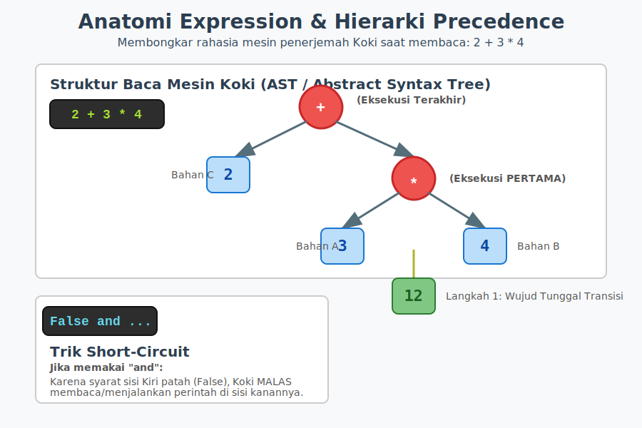

# Bab 05: Operators and Expressions

Chapter Code: CORE-01-05
Version: Core.Fundamentals.01.00
Last Updated: 2026-03-14
Status: Released

> **Deskripsi Singkat**: Bab ini mengajarkan simbol-simbol (Operator) dan penggabungannya untuk melakukan perhitungan matematika, pembandingan nilai, dan perumusan logika ganda secara presisi di dalam Python.

## 1. Analogi (Pendekatan Konsep)

### Analogi Singkat
> "Operator di Python ibarat **Alat Pengolah Masak** (seperti pisau, blender, atau timbangan), sementara *Expression* adalah sekumpulan utuh resep prosesnya. Anda memasukkan bahan (Operand), menyalakan alat pengolahnya (Operator), lalu seketika menghasilkan satu wujud hidangan baru tunggal."

### Analogi Panjang / Cerita (Hierarki Resep Dapur)
Di dapur Python kita, nilai data (`10`, `"Apel"`, `True`) adalah **Bahan Mentahnya** (Operand). Namun bahan mentah tidak akan pernah menjadi santapan jika dibiarkan begitu saja. Koki mutlak membutuhkan **Alat Masak** (Operator) spesifik seperti `+` (Mixer Penambah), `-` (Pisau Pengurang), atau `==` (Timbangan Kesetaraan).

**A. Kelahiran Sebuah Expression**
Ketika Anda menyandingkan bahan dan mesin pengolah dalam satu baris instruksional: `Bahan A + Bahan B`, barisan ini secara utuh disebut **Expression** (Resep Pengolahan).
*Tugas mutlak sebuah Expression adalah: Ia SELALU harus diakhiri dengan menghasilkan satu nilai/wujud tunggal yang matang.* Mesin tidak hanya berputar; ia selalu mengeluarkan sesuatu. Expression `3 + 2` secara hakikat adalah ilusi dari sosok angka `5`.

**B. Prioritas Alat Masak (Precedence Hierarki Koki)**
Jika Koki melihat resep kompleks yang berbunyi `Tepung + Telur * Gula`, Koki secara refleks profesional akan mengalikan (memblender) sisi kanan terlebih dahulu! Mengapa? Karena mesin `*` *(kali)* memiliki pangkat kekuasaan hierarki (Precedence) yang jauh lebih tinggi dibandingkan dengan mesin `+` *(tambah)*.
Jika Anda si pembuat resep menentangnya dan ingin *Tepung* dan *Telur* dikocok `(+)` lebih dulu *sebelum* dicampur Gula `(*)`, Anda harus menggunakan kotak pelindung prioritas tak terbantahkan: **Tanda Kurung `( )`**. Tanda kurung adalah teriakan *"KERJAKAN INI LEBIH DULU KOKI!"*.

## 2. Istilah Kunci (Key Terms)

| Istilah | Definisi Singkat | Contoh |
|---|---|---|
| operator | simbol khusus yang digunakan untuk melakukan operasi pada nilai | `+`, `==`, `and` |
| operand | data/nilai yang sedang dioperasikan oleh operator | `2`, `"Teks"`, `True` |
| expression | kombinasi *operand* dan *operator* yang setelah dihitung membalikkan 1 nilai matang tunggal | `a + b * 2` |
| precedence | urutan prioritas level eksekusi sang koki saat menjumpai operator gandengan bertumpuk | `*` dievaluasi sebelum `+` |
| short-circuit | kebiasaan efisiensi koki untuk berhenti mengevaluasi operasi `and`/`or` prematur jika hasil putusannya sudah jelas | `False and ...` (Sisi kanan diabaikan mutlak) |
| augmented obj | *assignment* singkat hasil mutasi tanpa harus menulis ulang nama aslinya | `x += 1` |

## 3. Konsep Utama
### A. Timbangan Aritmatika Tradisional
Hukum matematika standar bekerja layaknya kalkulator. Kita punya komplotan dasar `+` (Tambah), `-` (Kurang), `*` (Kali), `**` (Pangkat Ganda).
Adapun khusus urusan Pembagian, Python punya pisau mesin yang unik:
- **Pisau `/` (True Division):** Selalu menghasilkan Cairan Berpresisi (`float`). Contoh `10 / 2` menghasilkan `5.0`.
- **Pisau Pisau `//` (Floor Division):** Sengaja memotong buang sisa desimalnya agar menghasilkan Telur Bulat (`int`). Contoh `10 // 3` mengembalikan `3`, bukan `3.33`.
- **Sisa Remahan `%` (Modulo):** Mengembalikan sisi pembuangan/sisa baginya. `10 % 3` menghasilkan angka `1`.

*Augmented Assignment*: Alih-alih menulis berbelit `point = point + 10`, Python menawarkan sintaks pintasan ringkas merangkap operator penugasan: `point += 10`.

### B. Operator Pembanding (Comparison)
Tugas mesin pembanding selalu menghasilkan kepastian Hukum Mutlak berupa tipe boolean: `True` atau `False`. Mesin ini vital untuk mekanisme *Control Flow* (If-Else) pada bab selanjutnya.
Anggota timbangan komparasi ini adalah: `>`, `<`, `>=`, `<=`, `!=` (Tidak Sama Dengan), dan mesin timbangan wujud paling populer `==` (Sama Dengan).

### C. Pemikir Ganda (Logical Operators)
Python tidak mengeksekusi simbol pelik seperti `&&` atau `||`, ia memakai murni bahasa Inggris manusia:
- **`and` (HARUS KEDUANYA BENAR):** Jika Anda menyuruh `hadir and sehat`, hasilnya cuman `True` HANYA JIKA kedua sisi sama-sama `True`.
- **`or` (SALAH SATU SAJA SUDAH CUKUP):** Pada baris `makan or minum`, cukup salah satu saja disodori material Truthy, maka keseluruhan nilainya sudah meledak menjadi `True`.
- **`not` (SANG PEMBALIK FAKTA):** `not True` berubah seketika menjadi `False`.

**Sihir *Short-Circuiting***: Jika Python memandu expression pengecekan dari kiri-ke-kanan: `False and fungsi_berat_kompleks()`, Python dengan angkuh akan MEMBATALKAN/MENOLAK mengeksekusi perintah kanan. Python beralasan: "Hey, di kiri saja sudah `False`. Karena ini syarat alat `and`, ngapain buang tenaga baca yang kanan? Hasilnya sudah pasti gagal total!".

### D. Prioritas Evaluasi (Precedence)
1. Tanda Kurung `( )` menguasai kastanya.
2. Pemangkatan `**`.
3. Perkalian / Pembagian `*`, `/`, `//`, `%`.
4. Pertambahan / Pengurangan `+`, `-`.
5. Timbangan Komparasi `==`, `!=`, `<`, `>`.
6. Operator Logis `not`, lalu `and`, lalu paling bontot `or`.

## 4. Visualisasi Analogi

## 5. Di Balik Layar (Under the Hood)
Di balik terangnya bahasa tingkat tinggi Python, segenap simbol operator ini `+`, `-`, `==` hakikatnya hanyalah perwujudan muka ilusi belaka (*Syntactic Sugar*). Karena di pedalaman jeroan mesin CPython, saat ia menjumpai `a + b`, ia sebetulnya sedang diam-diam memanggil metode instansiasi sakti tersembunyi berformat _Dunder Method_ yang tak kasat mata di dalam inti objek tersebut, yakni metode siluman yang berteriak: `a.__add__(b)`. Jika material wujud benda tersebut diselami dan ia tertangkap basah tidak memiliki cetak biru siluman `__add__` (contoh pada object list ditambahkan int), CPython seketika akan menembakkan rudal mematikan `TypeError`.

## 6. Peringatan / Jebakan Umum (Gotchas)
- **Hindari ini**: Terbawa amnesia dari bahasa lain dan menyamakan `=` dengan `==`. Simbol penugasan Stiker Label tunggal (`=`) fungsinya adalah "TOLONG TEMPELKAN STIKER". Sedangkan fungsi timbangan dua lengan (`==`) adalah kalimat tanya: "APAKAH WUJUD MEREKA MIRIP?". Menulis `if x = 10:` adalah dosa besar yang mencederai mesin _Interpreter SyntaxError_.
- **Ingat bahwa**: Tanda Kurung bersarang selalu tidak merugikan. `(a and b) or c` selalu lebih bijaksana, ramah ke manusia, dan terhindar dari bias salah pemahaman logika ketimbang menyetirkannya barbar: `a and b or c`.

## 7. Referensi Kode Praktik
Seluruh kode simulasi komputasi dapat Anda acak-acak pada direktori `examples/`:
- `01_mesin_matematika.py`: Laboratorium untuk menguji perbedaan mesin `/` Float presisi versus mesin `//` Floor pemecah bulat telur; ditutup dengan teknik _augmented assignment_ minimalis.
- `02_mesin_logika.py`: Implementasi dunia nyata pada aplikasi penilaian Universitas, di mana kita mengoplos mesin Komparasi (`>`) berselimut _Short-Circuit_ Operator Logika Ganda (`and`). 

## 8. Latihan (Validasi)
- [ ] Tebak sebelum menekan *run*! Menurut pengetahuan *Precedence*, apa hasil mentah dari letupan sakelar: `4 + 5 * 2 == 14`?
- [ ] Bukalah REPL terminal Anda. Coba jalankan `True and print("Python Keren")`. Kemudian secara buas jalankan sakelar kebalikannya `False and print("Python Keren")`. Amatilah betapa di baris kedua tulisan itu GAGAL muncul akibat tersambar trik *Short-Circuit* koki pintar.
- [ ] Ciptakan aplikasi kalkulator pajak! Bebankan Harga Dasar lewat instruksi terminal `input()`, di-_casting_ ke wujud `float`, lalu Anda ekspresikan perhitungannya dengan ditambah pajak konstan 11%. Minta Python mencetaknya (`print`).
