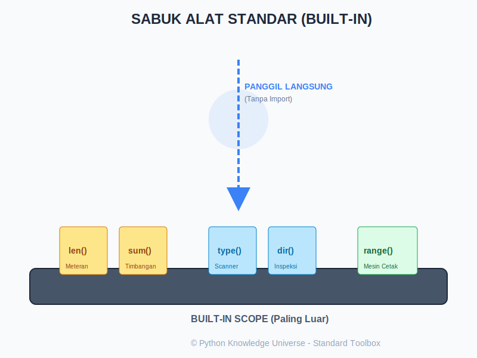

# Bab 07: Built-in Functions (Fungsi Bawaan)

Chapter Code: CORE-01-07
Version: Core.Fundamentals.01.00
Last Updated: 2026-03-14
Status: Released

> **Deskripsi Singkat**: Bab ini membahas koleksi fungsi "sakti" yang sudah terpasang otomatis di Python. Anda bisa langsung memakainya kapan saja tanpa perlu mengimpor modul apapun.

## 1. Analogi (Pendekatan Konsep)

### Analogi Singkat
> "Built-in Functions adalah **Kotak Peralatan Standar** yang sudah menempel di pinggang Anda. Anda tidak perlu pergi ke toko (import) untuk mengambil meteran (`len`) atau pemindai (`type`); alat-alat dasar ini selalu siap pakai kapan saja."

### Analogi Panjang / Cerita (Sabuk Alat Tukang Ahli)
Bayangkan Anda adalah seorang Tukang Ahli (Programmer) yang sedang bekerja di sebuah proyek konstruksi raksasa.

- **Built-in Functions (Sabuk Alat Serbaguna)**: Di pinggang Anda, terdapat sabuk berisi alat-alat yang paling sering Anda butuhkan. Anda tidak perlu memanggil kurir logistik (Import) untuk alat-alat ini karena mereka adalah bagian dari seragam standar Anda.
- **`len()` (Meteran)**: Setiap kali Anda ingin tahu seberapa panjang kayu atau berapa banyak paku dalam kotak, Anda mencabut meteran ini. `len([1, 2, 3])` memberikan hasil 3.
- **`max()` & `min()` (Alat Seleksi)**: Anda memiliki mata yang sangat tajam untuk memilih kayu paling panjang atau baut paling kecil dalam sekejap dari tumpukan material.
- **`sum()` (Alat Timbang Massa)**: Cukup letakkan seluruh koleksi material di atas alat ini, dan ia akan memberikan total beratnya tanpa Anda perlu menghitung satu per satu.
- **`type()` (Pemindai Material)**: Anda ragu apakah sebuah benda itu Kayu atau Plastik? Gunakan alat pemindai ini untuk mengetahui "tipe data"-nya secara instan.
- **`range()` (Mesin Pencetak Pola)**: Jika Anda butuh menandai titik-titik setiap 1 meter sepanjang 10 meter, alat ini akan memberikan daftar koordinatnya untuk Anda.

## 2. Istilah Kunci (Key Terms)

| Istilah | Definisi Singkat | Contoh |
|---|---|---|
| Built-in | Sesuatu yang sudah ada di dalam bahasa sejak awal tanpa tambahan | `print`, `int` |
| Argument | Data yang kita masukkan ke dalam "mulut" fungsi | `len("halo")` -> "halo" |
| Return Value | "Hasil kerja" yang dilemparkan kembali oleh fungsi | `len()` -> 4 |
| Iterable | Koleksi benda yang bisa dihitung satu per satu (seperti tas) | List, Tuple, String |
| Built-in Scope | Wilayah terdalam di mana Python mencari nama fungsi | `__builtins__` |

## 3. Konsep Utama

### A. Alat Ukur dan Statistik (Measuring Tools)
Python sangat mahir dalam mengolah data koleksi dengan sangat cepat:
- **`len(x)`**: Berapa banyak isinya?
- **`sum(iterable)`**: Berapa total jumlahnya? (Hanya untuk angka).
- **`max(x)` / `min(x)`**: Mana yang paling ekstrem nilainya?
- **`abs(n)`**: Mengubah angka negatif menjadi positif (Nilai Mutlak).

### B. Alat Identifikasi (Identification Tools)
Agar kode Anda tidak salah langkah, kenali material Anda:
- **`type(obj)`**: Mengecek kelas dari objek tersebut.
- **`dir(obj)`**: Mengintip "kemampuan" atau atribut apa saja yang dimiliki benda tersebut.
- **`help(fungsi)`**: Membaca buku manual instruksi dari alat tersebut.

### C. Alat Perapi dan Manipulasi (Organization Tools)
- **`sorted(koleksi)`**: Membuat salinan baru yang sudah rapi berurutan. (Originalnya tidak berubah).
- **`reversed(koleksi)`**: Membalik urutan dari belakang ke depan.
- **`any(koleksi)`**: Bertanya, "Apakah ADA minimal satu yang benar (True)?"
- **`all(koleksi)`**: Bertanya, "Apakah SEMUANYA benar (True)?"

### D. Alat Iterasi (Looping Tools)
Alat-alat ini adalah sahabat setia perulangan `for`:
- **`range(start, stop, step)`**: Mencetak generator angka.
- **`enumerate(iterable)`**: Memberikan "Nomor Antrian" sekaligus isinya.
- **`zip(a, b)`**: Memasangkan dua list seperti menyatukan resleting (zipper).

## 4. Visualisasi Analogi

## 5. Di Balik Layar (Under the Hood)
Saat Anda mengetik `print()`, Python mencarinya melalui aturan **LEGB** (Local, Enclosing, Global, Built-in). **Built-in** adalah pemberhentian terakhir. Jika Python tidak menemukannya di folder Anda sendiri, ia akan mengecek sabuk alat standarnya. Karena ditulis dalam bahasa C (C-Python), fungsi-fungsi ini berjalan jauh lebih cepat daripada fungsi yang Anda buat sendiri secara manual.

## 6. Peringatan / Jebakan Umum (Gotchas)
- **Shadowing (Menutup Alat)**: Jangan pernah menamai variabel Anda dengan nama fungsi bawaan. Jika Anda menulis `list = [1, 2, 3]`, maka alat `list()` (untuk konversi) akan rusak atau "tertutup" oleh variabel Anda.
- **`sorted` vs `.sort()`**: Ingat! `sorted(list)` memberikan hasil baru, sedangkan `list.sort()` merusak dan merubah list aslinya di tempat. Jangan tertukar!
- **`all()` pada List Kosong**: Secara teknis, `all([])` adalah `True`. Ini sering membingungkan pemula (Prinsip *Vacuous Truth*).

## 7. Referensi Kode Praktik
Simulasi penggunaan sabuk alat tersedia di folder `examples/`:
- `01_meteran_statistik.py`: Mengolah data angka secara instan.
- `02_scanner_identitas.py`: Cara mengintip isi dan tipe data.
- `03_alat_perapi.py`: Bermain dengan urutan data.
- `04_super_looping.py`: Gabungan sakti antara penomoran dan pemasangan data.

## 8. Latihan (Validasi)
- [ ] Hitunglah rata-rata dari sebuah list angka menggunakan gabungan `sum()` dan `len()`.
- [ ] Gunakan `enumerate()` untuk mencetak daftar belanjaan Anda lengkap dengan nomor urutnya.
- [ ] Cobalah gunakan fungsi `zip()` untuk menggabungkan list nama siswa dan list nilai ujian mereka menjadi satu tampilan.
- [ ] Cari tahu apa yang terjadi jika Anda memasukkan string ke dalam fungsi `max()`. Apa yang menjadi penentu "nilai tertinggi"?
