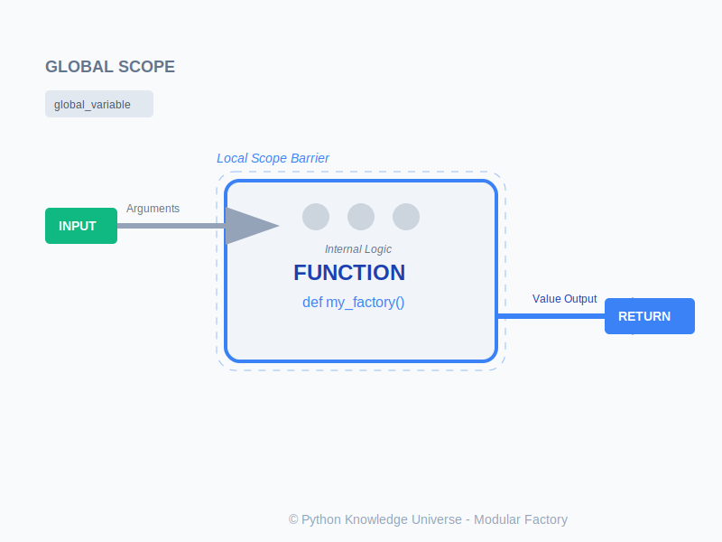

# Bab 01: Functions

Chapter Code: CORE-02-01
Version: Core.Fundamentals.02.00
Last Updated: 2026-03-14
Status: Draft

> **Deskripsi Singkat**: Bab ini mengajarkan cara membungkus sekumpulan instruksi menjadi satu unit bernama **Fungsi**. Ini adalah langkah pertama untuk membuat kode yang rapi, tidak redundan (DRY), dan mudah dikelola.

## 1. Analogi (Pendekatan Konsep)

### Analogi Singkat
> "Fungsi adalah sebuah **Pabrik Mini** atau **Blender Otomatis**. Anda memasukkan bahan baku (Argument), menekan tombol (Call), dan pabrik tersebut mengeluarkan barang jadi (Return Value) tanpa Anda perlu tahu kerumitan mesin di dalamnya."

### Analogi Panjang / Cerita (Stasiun Masak Spesialis)
Bayangkan dapur restoran yang sangat sibuk. Awalnya, Koki (Interpreter) melakukan semuanya sendirian: memotong wortel, mengiris daging, hingga merebus sup (Script linear satu arah). Saat menu bertambah banyak, Koki mulai kewalahan.

Solusinya? Membangun **Stasiun Masak Spesialis (Unit Fungsi)**.

- **`def` (Membangun Stasiun)**: Ini adalah instruksi untuk membuat unit baru. Misal: "Stasiun Pemotong Daging". Kita membangun unitnya hanya sekali di pojok dapur.
- **Parameters (Lubang Input)**: Stasiun ini memiliki sebuah lubang di bagian atas bertuliskan "Daging Mentah". Ini adalah tempat masuknya bahan baku yang akan diproses.
- **Function Call (Menyalakan Mesin)**: Selama kita belum memanggil namanya, stasiun itu hanya akan diam. Saat kita berteriak "Oi Masak!", mesinnya baru mulai berputar.
- **Return Value (Nampan Output)**: Setelah mesin selesai bekerja, ia meletakkan hasil potongannya di atas nampan output. Anda bisa mengambil isi nampan tersebut untuk disajikan ke pelanggan atau dibawa ke stasiun masak lainnya.
- **Scope (Dinding Kaca)**: Setiap stasiun memiliki dinding kaca yang rapat. Apa yang dilakukan di dalam stasiun (variabel lokal) tidak bisa dilihat oleh orang di luar. Ini menjaga agar kekacauan di satu stasiun tidak merembet ke stasiun lainnya.

## 2. Istilah Kunci (Key Terms)

| Istilah | Definisi Singkat | Contoh |
|---|---|---|
| Define (`def`) | Membuat atau mendeklarasikan sebuah fungsi baru | `def sapa():` |
| Call | Memerintahkan fungsi untuk dijalankan saat itu juga | `sapa()` |
| Parameter | Variabel "penampung" yang didefinisikan saat membuat fungsi | `def tambah(a, b):` |
| Argument | Nilai nyata yang dimasukkan ke fungsi saat dipanggil | `tambah(5, 10)` |
| Return | Mengirimkan sebuah nilai keluar dari fungsi ke pemanggilnya | `return hasil` |
| Scope | Batasan wilayah di mana sebuah variabel bisa diakses | `Local scope` vs `Global scope` |

## 3. Konsep Utama

### A. Anatomi Fungsi
Fungsi dimulai dengan kata kunci `def`, diikuti nama, tanda kurung, dan titik dua. Segala instruksi di dalamnya **Wajib Menjorok (Indented)**.

```python
def sapa_pagi(nama):
    """Fungsi ini menyapa orang di pagi hari."""
    return f"Selamat pagi, {nama}!"

# Memanggil fungsi
pesan = sapa_pagi("Budi")
print(pesan)
```

### B. Parameter vs Argument
Seringkali orang tertukar, namun perbedaannya sederhana:
- **Parameter**: Adalah "Wadah Kosong" yang Anda tulis saat **mendefinisikan** fungsi.
- **Argument**: Adalah "Isi Nyata" yang Anda kirimkan saat **memanggil** fungsi.

### C. Pentingnya `return`
Tanpa kata kunci `return`, fungsi Anda hanya akan melakukan tugasnya lalu "menghilang". Jika Anda ingin memindahkan hasil perhitungan fungsi ke variabel lain, Anda **Wajib menggunakan `return`**. Fungsi tanpa `return` secara otomatis akan mengembalikan nilai ghaib bernama `None`.

### D. Lingkup Variabel (Scope)
Variabel yang diciptakan di dalam fungsi disebut **Local Variable**. Ia hanya hidup selama fungsi dijalankan dan mati saat fungsi berakhir. Ia tidak bisa dipanggil dari luar. 

### E. Parameter Default
Anda bisa memberikan "Nilai Cadangan" jika pemanggil fungsi lupa memberikan data.

```python
def pesan_kopi(jenis="Hitam"):
    print(f"Menyiapkan kopi {jenis}")

pesan_kopi()          # Output: kopi Hitam
pesan_kopi("Latte")   # Output: kopi Latte
```

## 4. Visualisasi Analogi



## 5. Di Balik Layar (Under the Hood)
Saat Anda memanggil fungsi, Python meletakkan pekerjaan tersebut ke dalam sebuah tumpukan piring yang disebut **Call Stack**. Python akan menyelesaikan pekerjaan piring yang paling atas dulu, lalu membuangnya (membersihkan memori lokal fungsi tersebut), dan kembali melanjutkan piring pekerjaan di bawahnya (pemanggil asli). Inilah alasan variabel lokal "hilang" setelah fungsi selesai—piring lokasinya sudah dicuci dan disimpan!

## 6. Peringatan / Jebakan Umum (Gotchas)
- **None Returns**: Hati-hati tertukar antara `print()` di dalam fungsi dengan `return`. Jika Anda menulis `x = print("Halo")`, maka `x` akan bernilai `None`.
- **Mutable Defaults**: Jangan pernah menggunakan list kosong `[]` sebagai default parameter (misal: `def tambah(item, daftar=[])`). Karena "piring" parameter diciptakan hanya sekali saat program start, daftar tersebut akan terus bertambah isinya setiap fungsi dipanggil, yang biasanya bukan hasil yang Anda inginkan!
- **Shadowing**: Menamai variabel lokal di dalam fungsi sama persis dengan variabel global. Ini bisa membingungkan pembaca kode.

## 7. Referensi Kode Praktik
Lihat cara kerja "Stasiun Masak" di folder `examples/`:
- `01_pabrik_pesan.py`: Fungsi sederhana tanpa input/output.
- `02_mesin_hitung_pajak.py`: Fungsi dengan parameter dan `return`.
- `03_koki_default.py`: Menggunakan default values.
- `04_detektif_scope.py`: Eksperimen lingkup lokal vs global.

## 8. Latihan (Validasi)
- [ ] Buatlah fungsi bernama `hitung_luas_persegi` yang menerima satu parameter `sisi` dan me-`return` hasil kali sisi tersebut.
- [ ] Coba panggil variabel yang diciptakan di dalam fungsi dari baris paling bawah program Anda. Lihat pesan error yang muncul.
- [ ] Buatlah fungsi `cek_genap` yang me-`return` nilai `True` jika angka yang dimasukkan adalah genap, dan `False` jika ganjil.
