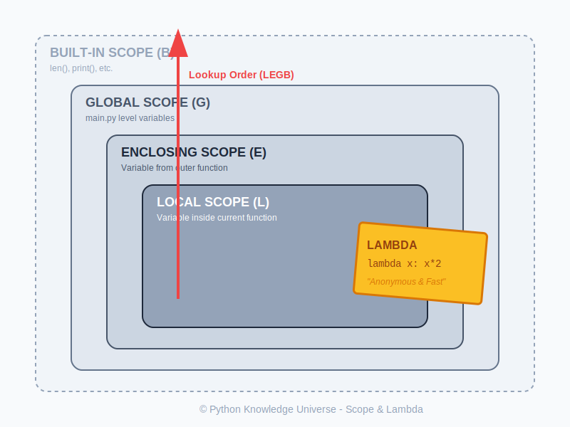

# Bab 02: Lambda Functions & Scope

Chapter Code: CORE-02-02
Version: Core.Fundamentals.02.00
Last Updated: 2026-03-14
Status: Draft

> **Deskripsi Singkat**: Memahami fungsi anonim sekali pakai (`lambda`) dan aturan bagaimana Python mencari nilai variabel di berbagai tingkatan (`scope`).

## 1. Analogi (Pendekatan Konsep)

### Analogi Singkat
> "**Lambda** itu seperti *post-it note* (catatan tempel) untuk perhitungan cepat, sedangkan **def** adalah buku resep resmi di rak. **Scope** ibarat radius suara; apa yang dibisikkan di kamar (Local) tidak terdengar di luar rumah (Global)."

### Analogi Panjang / Cerita (Scope & LEGB)
Bayangkan Anda tinggal di sebuah **Rumah (Global)**.
1. Di dalam **Kamar (Local)** Anda, Anda punya barang pribadi. Hanya Anda yang bisa melihatnya.
2. Kamar Anda berada di dalam **Area Keluarga (Enclosing)**. Jika Anda berada di kamar dan butuh sesuatu yang tidak ada di sana, Anda mengecek area keluarga.
3. Jika di area keluarga tidak ada, Anda mengecek **Seluruh Rumah (Global)**.
4. Jika di rumah tidak ada, Anda mencari di **Toko Lingkungan (Built-in)** yang menyediakan barang standar untuk semua orang.
Python mencari variabel dengan urutan yang sama: **L**ocal -> **E**nclosing -> **G**lobal -> **B**uilt-in (Aturan LEGB).

## 2. Istilah Kunci (Key Terms)

| Istilah | Definisi Singkat | Contoh |
|---|---|---|
| Lambda | Fungsi anonim tanpa nama yang hanya terdiri dari satu baris ekspresi. | `lambda x: x * 2` |
| Anonymous Function | Fungsi yang didefinisikan tanpa menggunakan kata kunci `def`. | (Sama dengan Lambda) |
| Scope | Wilayah di dalam kode tempat sebuah variabel dapat diakses. | Global vs Local |
| LEGB Rule | Urutan pencarian variabel oleh Python: Local, Enclosing, Global, Built-in. | - |
| Immutable Scope | Secara default, fungsi tidak bisa mengubah variabel global tanpa izin khusus. | `global x` |

## 3. Konsep Utama

### Lambda Functions
Lambda digunakan untuk fungsi sederhana yang hanya dipakai sekali (biasanya sebagai argumen fungsi lain).
**Sintaks:** `lambda arguments: expression`

```python
# Fungsi biasa
def tambah(a, b):
    return a + b

# Fungsi lambda
tambah_lambda = lambda a, b: a + b
```

### Aturan LEGB (Scope)
Python menentukan "siapa bisa melihat apa" berdasarkan lokasi variabel didefinisikan:
1. **Local (L)**: Di dalam fungsi saat ini.
2. **Enclosing (E)**: Di dalam fungsi yang membungkus fungsi lain (nested functions).
3. **Global (G)**: Di level teratas file `.py`.
4. **Built-in (B)**: Fungsi bawaan Python seperti `len`, `print`.

## 4. Visualisasi Analogi



## 5. Peringatan / Jebakan Umum (Gotchas)
- **Hindari ini**: Menggunakan lambda untuk logika yang kompleks (lebih dari satu baris). Jika sulit dibaca, gunakan `def`.
- **Ingat bahwa**: Variabel di dalam fungsi (Local) akan hilang setelah fungsi selesai dijalankan, kecuali dikembalikan (`return`).

## 5. Referensi Kode Praktik
Silakan lihat skrip lengkapnya pada direktori `examples/` di dalam bab ini.

```python
# Contoh Lambda dalam Sorting
daftar_nama = ["Budi", "Ani", "Citra"]
daftar_nama.sort(key=lambda x: len(x)) # Urut berdasarkan panjang nama

# Contoh Scope
x = "Global"
def fungsi():
    x = "Local"
    print(x) # Mencetak "Local"

fungsi()
print(x) # Mencetak "Global"
```
