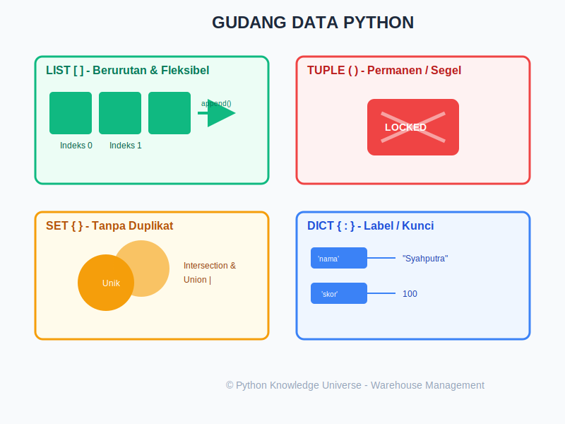

# Bab 03: Basic Data Structures

Chapter Code: CORE-02-03
Version: Core.Fundamentals.02.00
Last Updated: 2026-03-14
Status: Draft

> **Deskripsi Singkat**: Bab ini memperkenalkan empat sistem penyimpanan data utama di Python: `List` (Berurutan), `Tuple` (Permanen), `Set` (Unik), dan `Dictionary` (Label Nama).

## 1. Analogi (Pendekatan Konsep)

### Analogi Singkat
> "Struktur Data adalah **Berbagai Jenis Rak/Wadah** di gudang Anda. Ada yang raknya berurutan (List), ada yang permanen tidak bisa diganti (Tuple), ada yang otomatis membuang barang duplikat (Set), dan ada yang menggunakan label nama untuk mencari barang (Dictionary)."

### Analogi Panjang / Cerita (Manajemen Gudang Pusat)
Bayangkan Anda adalah manajer gudang logistik raksasa. Untuk menyimpan jutaan barang, Anda memiliki 4 unit penyimpanan dengan fungsi berbeda:

- **`List` (Rak Antrean Karung)**: Bagaikan rak panjang di mana setiap barang diletakkan berjejer dan diberi nomor urut (Indeks 0, 1, 2...). Anda bebas menambah barang di ujung, menyisipkan di tengah, atau menukar barang lama dengan yang baru. Ini adalah wadah paling populer karena sangat fleksibel.
- **`Tuple` (Kotak Brankas Tersegel)**: Bagaikan kotak yang begitu diisi dan ditutup, segelnya tidak boleh dirusak. Isinya permanen. Jika Anda ingin mengubah isinya, Anda harus menghancurkan kotak lama dan membuat kotak baru. Sangat cocok untuk data rahasia atau kordinat lokasi yang tidak boleh berubah secara tidak sengaja.
- **`Set` (Keranjang Sortir Logistik)**: Keranjang ajaib yang tidak peduli urutan barang. Hebatnya, keranjang ini punya sensor anti-duplikat. Jika Anda memasukkan dua buah "Susu", ia otomatis hanya menyimpan satu. Sangat efisien untuk membersihkan data sampah dan mengecek keberadaan barang secara instan.
- **`Dictionary` (Loker Berlabel Nama)**: Anda mencari barang bukan pakai nomor urut, tapi pakai **Kunci (Key)**. "Mana loker milik 'Budi'?" -> Keluar isinya "Sepatu". Tidak boleh ada dua loker dengan nama kunci yang persis sama.

## 2. Istilah Kunci (Key Terms)

| Istilah | Definisi Singkat | Contoh |
|---|---|---|
| Mutable | Obyek yang isinya bisa diubah langsung di tempat | `list`, `dict`, `set` |
| Immutable | Obyek yang isinya permanen dan tidak bisa diedit | `tuple` |
| Index | Nomor posisi urutan item (dimulai dari 0) | `my_list[0]` |
| Slicing | Teknik memotong sebagian isi urutan | `my_list[1:3]` |
| Key-Value Pair | Pasangan kunci unik dan nilainya pada kamus | `'nama': 'Ana'` |
| Hashing | Proses ghaib mengubah data menjadi kode unik untuk pencarian cepat | Jantung dari `dict` dan `set` |

## 3. Konsep Utama

### A. List (`[]`): Sang Serba Bisa
List adalah urutan yang bisa berubah.
- **Penambahan**: `.append(item)` (ujung) atau `.insert(indeks, item)` (tengah).
- **Penghapusan**: `.pop()` (ambil ujung) atau `.remove(nilai)` (buang berdasarkan isi).

### B. Tuple (`()`): Sang Penjaga Amanah
Tuple adalah urutan yang TIDAK bisa berubah. Mengapa butuh? Karena lebih hemat memori dan aman dari perubahan tak sengaja.
- **Unpacking**: `x, y = (10, 20)`. Cara cepat memecah isi kotak ke variabel.

### C. Set (`{}`): Sang Pembersih
Kumpulan unik tanpa urutan.
- **Operasi Matematika**: `A | B` (Gabungan), `A & B` (Irisan/Kesamaan).
- **Kecepatan**: Mengecek `if "Ana" in group_set` jauh lebih cepat daripada mencarinya di List yang sangat panjang.

### D. Dictionary (`{key: value}`): Sang Pengarsip
Mencari data berdasarkan label. Kuncinya (Key) haruslah benda yang *Immutable* (seperti string).
- **Akses**: `my_dict['kunci']`.
- **Pengamanan**: Gunakan `.get('kunci', 'Default')` agar program tidak error jika kuncinya tidak ada.

## 4. Visualisasi Analogi

## 5. Di Balik Layar (Under the Hood)
Pernahkah Anda bertanya mengapa Dictionary bisa mencari satu kata di antara jutaan kata secara instan? Ternyata Dictionary dan Set tidak menggunakan antrean. Mereka menggunakan sistem **Hash Table**. Python mengambil 'Kunci' Anda, mengubahnya menjadi angka unik (Hash), dan angka itu langsung menunjuk ke alamat koordinat memori tempat barang berada. Tanpa perlu menoleh ke kiri-kanan, Python langsung menuju sasarannya.

## 6. Peringatan / Jebakan Umum (Gotchas)
- **Teka-teki Kurung Kurawal `{}`**: Menulis `x = {}` akan menghasilkan **Dictionary kosong**, bukan Set kosong. Untuk membuat Set kosong, Anda wajib menulis `x = set()`.
- **Index Dimulai dari 0**: Selalu ingat bahwa item pertama di List/Tuple adalah indeks 0, bukan 1.
- **Mutable di dalam Immutable**: Hati-hati menaruh List di dalam Tuple. Walau Tuplenya tidak bisa diganti, List di dalamnya tetap bisa Anda ubah-ubah isinya!

## 7. Referensi Kode Praktik
Laboratorium gudang tersedia di folder `examples/`:
- `01_rak_belanja_list.py`: Simulasi mengelola daftar belanja.
- `02_kordinat_tuple.py`: Penggunaan tuple dan teknik unpacking.
- `03_kantong_unik_set.py`: Eksperimen membuang duplikat dan irisan data.
- `04_buku_telepon_dict.py`: Manajemen kontak menggunakan key-value.

## 8. Latihan (Validasi)
- [ ] Buatlah sebuah List berisi 3 buah favoritmu, lalu tambahkan 1 buah lagi di urutan paling depan.
- [ ] Dari List `angka = [1, 2, 2, 3, 4, 4, 5]`, ubahlah menjadi Set untuk melihat angka uniknya saja.
- [ ] Buatlah Dictionary yang menyimpan data "Harga" barang-barang di toko Anda, lalu coba ambil harga barang yang tidak ada tanpa merusak program (pakai `.get()`).
