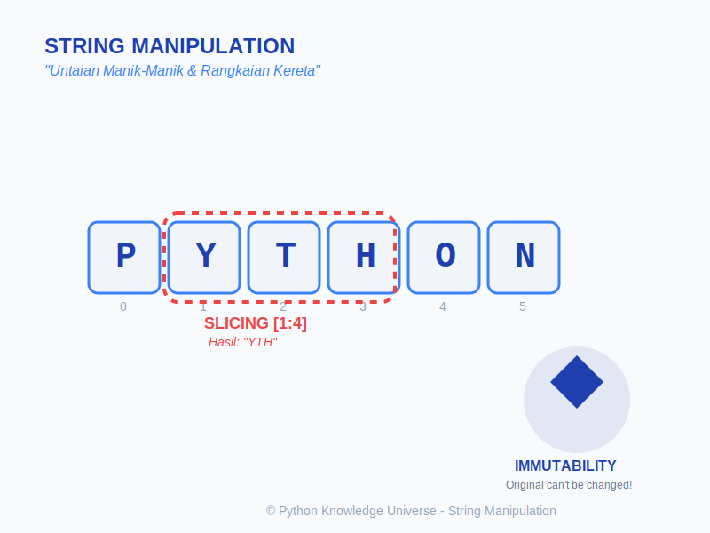

# Bab 04: String Manipulation

Chapter Code: CORE-02-04
Version: Core.Fundamentals.02.00
Last Updated: 2026-03-14
Status: Draft

> **Deskripsi Singkat**: Menguasai teknik manipulasi teks mulai dari pemotongan (*slicing*), pencarian, hingga pemformatan tingkat lanjut menggunakan *f-string*.

## 1. Analogi (Pendekatan Konsep)

### Analogi Singkat
> "String itu seperti **untaian manik-manik**: Anda bisa melihat setiap manik (karakter), memotong sebagian untaian (*slicing*), tapi Anda tidak bisa mengubah manik di tengah untaian tanpa merangkai ulang semuanya (**Immutability**)."

### Analogi Panjang / Cerita (Slicing)
Bayangkan sebuah string adalah **Rangkaian Kereta Api**. Setiap gerbong punya nomor urut (Indeks) mulai dari 0.
- Jika Anda ingin gerbong ke-2 sampai ke-4, Anda melakukan **Slicing** `[2:5]`.
- Jika Anda ingin melompat setiap dua gerbong, Anda menggunakan **Step** `[::2]`.
- Kereta ini bersifat "Sekali Pakai"; jika Anda ingin mengecat satu gerbong, Anda harus memesan kereta baru dengan warna baru tersebut.

## 2. Istilah Kunci (Key Terms)

| Istilah | Definisi Singkat | Contoh |
|---|---|---|
| Indexing | Mengakses satu karakter berdasarkan posisinya (dimulai dari 0). | `s[0]` |
| Slicing | Mengambil potongan teks dari posisi A ke B. | `s[1:4]` |
| Immutability | Sifat objek yang isinya tidak bisa diubah setelah dibuat. | `TypeError` saat `s[0] = 'A'` |
| Concatenation | Menggabungkan dua atau lebih string menjadi satu. | `"A" + "B"` |
| f-string | *Formatted String Literals*, cara termudah memasukkan variabel ke teks. | `f"Halo {nama}"` |

## 3. Konsep Utama

### Slicing & Indexing
Cara mendapatkan potongan data dari string: `string[start:stop:step]`
- `start`: Indeks awal (inklusif).
- `stop`: Indeks akhir (eksklusif).
- `step`: Lompatan (default 1).

### String Methods Penting
- `split()`: Memecah teks menjadi list.
- `join()`: Menggabungkan list menjadi teks.
- `strip()`: Menghapus spasi di awal/akhir.
- `replace()`: Mengganti potongan teks.

### Formatting (f-string)
Sejak Python 3.6, ini adalah standar industri:
```python
harga = 5000
print(f"Harga barang adalah Rp{harga:,}") # Output: Rp5.000
```

## 4. Visualisasi Analogi



## 5. Peringatan / Jebakan Umum (Gotchas)
- **Hindari ini**: Mencoba mengubah isi string secara langsung (e.g., `text[0] = 'X'`). Anda akan mendapat error. Gunakan `replace()` atau buat string baru.
- **Ingat bahwa**: Indeks `stop` pada slicing tidak disertakan dalam hasil. `[0:3]` hanya mengambil indeks 0, 1, dan 2.

## 5. Referensi Kode Praktik
Silakan lihat skrip lengkapnya pada direktori `examples/` di dalam bab ini.

```python
msg = "  Belajar Python  "
clean_msg = msg.strip().upper() # "BELAJAR PYTHON"
print(clean_msg[0:7]) # "BELAJAR"
```
